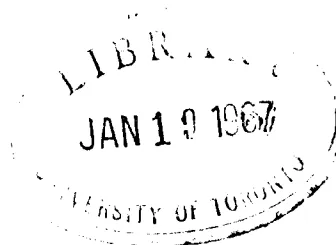

# Abhandlungen

für die

## Kunde des Morgenlandes

herausgegeben von der

**Deutschen Morgenländischen Gesellschaft**

unter der verantwortlichen Redaktion

des Prof. Dr. H. Stumme.

---

**Dreizehnter Band.**

**Leipzig 1917**

---

Genehmigter Nachdruck  
KRAUS REPRINT LTD.  
Nendeln, Liechtenstein  
1966## Inhalt.

---

No. 1. Die Hermeneutik des Aristoteles in der arabischen Übersetzung des Ishāq Ibn Ḥonein. Herausgegeben und mit einem Glossar der philosophischen Termini versehen von **Isidor Pollak**.

No. 2. Neuaramäische Märchen und andere Texte aus Ma'lūla. Hauptsächlich aus der Sammlung E. Prym's und A. Socin's herausgegeben von **G. Bergsträsser**.

No. 3. Neuaramäische Märchen und andere Texte aus Ma'lūla in deutscher Übersetzung. Hauptsächlich aus der Sammlung E. Prym's und A. Socin's herausgegeben von **G. Bergsträsser**.

No. 4. Vāmanabhaṭṭabāṇa's Pārvatīpariṇayanātakam. Kritisch herausgegeben und mit Anmerkungen versehen von **Richard Schmidt**.

## HERMENEUTIK DES ARISTOTELES

---# DIE HERMENEUTIK DES ARISTOTELES

IN DER ARABISCHEN ÜBERSETZUNG

DES

ISHĀK IBN ḤONAIN

**Abhandlungen**

für die

**Kunde des Morgenlandes**

herausgegeben von der

Deutschen Morgenländischen Gesellschaft.

**XIII. Band.**

*No. 1.*

---

HERAUSGEGEBEN UND MIT EINEM  
GLOSSAR DER PHILOSOPHISCHEN  
TERMINI VERSEHEN

VON

**ISIDOR POLLAK**

---

**LEIPZIG 1918**

---

Genehmigter Nachdruck  
KRAUS REPRINT LTD.  
Nendeln, Liechtenstein

1966B  
439  
A8I8  
1966

An oval-shaped library stamp from the University of Toronto. The text "LIBRARY" is at the top, "JAN 19 1967" is in the center, and "UNIVERSITY OF TORONTO" is at the bottom.

SEINEM HOCHVEREHRTEN LEHRER  
**HERRN PROF. DR. MAX GRÜNERT**

ALS GERINGES ZEICHEN  
GROSSER DANKESSCHULD  
ZUGEEIGNET.## Vorwort.

Vor einigen Jahren gewährte mir die Munifizenz der Prager „Gesellschaft zur Förderung deutscher Wissenschaft, Kunst und Literatur in Böhmen“ die Möglichkeit, einen Urlaubsmonat in Paris zu verbringen. Ich benützte die mir zur Verfügung stehende (durch die Osterferien der Nationalbibliothek unterbrochene) Arbeitszeit zum Studium des berühmten arabischen Aristoteles-Kodex, mußte mich aber auf die Abschrift des Buches *περὶ ἐρμηνείας* beschränken. In der Hoffnung, die Handschrift später doch noch einmal sehen zu können, verschob ich dann die Veröffentlichung des Textes; leider hat sich diese Hoffnung bisher nicht erfüllt, und auch die Kunst der Photographie erwies sich den stark vergilbten, dunkeln Blättern gegenüber als machtlos.

Nun möchte ich, bevor ich an die Herausgabe arabischer Kommentare zur Hermeneutik gehe, doch den Text des Buches vorher veröffentlichen. Bis auf ganz offenbare Schreibfehler habe ich den Konsonantentext des Originals beibehalten, da sich bei dem unklassischen, oft geradezu barbarischen Stil der Übersetzung kaum feststellen läßt, was auf Rechnung event. schlechter Textüberlieferung, und was auf die des Übersetzers selbst zu setzen ist. Dem Texte habe ich die üblichen Zeichen, gelegentlich auch Vokale und zum besseren Verständnis zahlreiche Interpunktionszeichen hinzugefügt. Dem letzteren Zwecke soll auch das Glossar, ein kleiner Beitrag zu einem künftigen Lexikon der philosophischen Terminologie im Arabischen, dienen. Die Hs. selbst ist fast ganz unvokalisiert, die diakritischen Punkte sind sehr flüchtig gesetztoder fehlen gänzlich. Die genaue Vergleichung des arabischen mit dem syrischen Texte, bzw. mit dem griechischen Original soll Gegenstand einer besonderen Studie sein.

Der „Deutschen Morgenländischen Gesellschaft“ bin ich für die Aufnahme meiner Arbeit in ihre „Abhandlungen“ zu großstem Dank verpflichtet, ebenso der eingangs genannten Gesellschaft für ihre Subvention.

Meinen besten Dank sage ich dem Redakteur der Abhandlungen, Herrn Prof. Stumme; ferner Herrn Prof. Goldziher und Herrn Dr. A. Wiener (Charlottenburg) für die freundliche Durchsicht der Korrekturbogen und ihre Bemerkungen dazu, endlich der Verwaltung der Bibliothèque Nationale für ihre Liberalität. Meinem verehrten Lehrer, Herrn Prof. Grünert, bin ich in so vielfacher Hinsicht Dank schuldig, daß ich dies hier nur pflichtgemäß erwähnen, nicht aber näher ausführen kann.

Prag, im Januar 1913.

Dr. Isidor Pollak.

## Einleitung.

### I. Die Handschrift.

Die Pariser Nationalbibliothek besitzt in dem Manuskript 882 A (anc. fonds; jetzt Nr. 2346) das einzige uns erhaltene vollständige Exemplar der alten arabischen Übersetzung des so viel studierten und kommentierten aristotelischen Organons, nämlich der Kategorien, der Hermeneutik, der ersten und der zweiten Analytika, der Topik und der Sophistik, mit Hinzufügung der Isagoge des Porphyrius als Einleitung und der Rhetorik und Poetik als Abschluß. In seiner Preisschrift „Die arabischen Übersetzungen aus dem Griechischen“1) hat Steinschneider das bibliographische Material dargestellt. Auf dieses Werk, welches das Thema nach Maßgabe der dem Autor zur Verfügung gestandenen Hilfsmittel fast ganz erschöpft, sei in Bezug auf alle Einzelheiten hier ein für allemal hingewiesen. St. erklärt (S. 35 des Abschn. „Philosophie“) „die Seltenheit der Texte des Aristoteles daraus, daß die Summarien der Araber und ihre Kommentare (welche zuweilen den ganzen Text enthalten; die Araber nennen sie „gemischte“) mehr dem Bedürfnis und dem Geschmack der Leser entsprachen“. Dem wäre hinzuzufügen, daß namentlich die harte, ungelene Sprache der ersten Übersetzungen (besonders wenn diese auf sklavisch wörtliche syrische Übertragungen zurückgehen) es veranlaßt haben mag, daß man die gut

1) Allgemeine Einleitung: Centralblatt für Bibliothekswesen, Beiheft 5, Leipzig 1889. Philosophie: Ibid. Beiheft 12, 1893. Mathematik: ZDMG. Bd. 50, 1896, S. 337—370. Medizin: Virchow's Archiv f. Pathologie. Bd. 124, 1891. Allg. Index: ZDMG., 50, S. 371—417.arabisch geschriebenen Paraphrasen und Kommentare der späteren Erklärer den alten Originalübersetzungen vorzog.

Die Bemerkung St.'s (l. c. Philos. S. 35): „Man kennt nur 2 Mss., die das ganze Organon enthalten; Ms. Escorial 891 ist am Anfang unvollständig; Casiri (I, 317) sagt nicht, welche Bücher sich darin finden“ beruht auf einem Irrtum Casiri's, der l. c. als Nr. 3 der genannten Oktavhandschrift „*Aristotelis Tractatus De Organo, cuius principium desideratur*“ angibt1). Der Liebenswürdigkeit der Bibliotheksverwaltung des Escorial verdanke ich photographische Aufnahmen einiger Seiten dieses Ms., welche zeigen, daß es sich hier überhaupt nicht um eine logische Schrift, sondern um das Ende des IV. Buches der aristotel. Physik handelt2). Casiri verwechselt auch an einer andern Stelle seines Katalogs (I, 243 col. 2, wo er Ibn Al-Kifti über Alexander von Aphrodisias zitiert) die 8 Bücher des „Organon“ mit den 8 Büchern „De auscultatione physica“, ein Irrtum, den St. l. c. § 28, S. 51 berichtigt.

Danach ist auch Klamroth's Angabe (ZDMG. 1887, Bd. 41, S. 439 Anm. 1), daß das vollständige arabische Organon noch heute außer Paris 882 A noch Esc. 891 und Leyden 2820 vorhanden sei, richtig zu stellen. Die Leydener Hs. enthält nicht den aristotelischen Text, sondern den „mittleren Kommentar“ des Averroës3).

Ein Fragment der arabischen Hermeneutik (Anfang bis 17b, 14 ed. Bekker) hat Joh. Georg Ernst Hoffmann aus dem Berliner syrischen Cod. Petermann 9 (Sachau Nr. 88, Bl. 68b—72b) in seinem vorzüglichen Buche „De Hermeneuticis

1) Wenrich (De auctorum Graecorum versionibus etc., S. 133) bemerkt auf Grund dieser kurzen Titelangabe Casiri's: „*Librorum omnium ad logicam pertinentium, sive totius organi versio Arabica obvia est in biblioth. Escur. cod. 891*“.

2) Ende (pag. 60v der Hs.): تمب المعالمة الرابعة من كتاب السماع الطبعي لارسطو.

3) Siehe De Goeje, *Catalogus codicum oriental. Bibl. Lugduno-Batavae* V, S. 328.

apud Syros Aristoteleis“ (Leipzig 1873) herausgegeben. Die Abweichungen dieses dem griechischen Original oft näherstehenden Textes von Paris 882 A habe ich S. 1—11 notiert.

Obwohl seit Wenrich (1842) mehrfach — insbesondere von französischen Gelehrten wie Renan1) und Munk2) — auf den Wert der Pariser Handschrift aufmerksam gemacht wurde, sind bis heute nur zwei Stücke derselben herausgegeben worden und zwar die Kategorien von Zenker3) und die Poetik von D. S. Margoliouth4).

Eine anonyme handschriftliche Beschreibung des Kodex, die sich mit den (vielfach fehlerhaften) Angaben des 1. Pariser Katalogs (*Catalogus codicum manuscriptorum Bibliothecae regiae, Paris 1739 Tom. I. Pag. 455*) im großen und ganzen deckt, lautet:

„Hoc ms arabicum in fol. ac vetustissimum est mediocriter anno hegyrae 418 ad minimum scriptum est, cum dicatur praedicto anno correctum fuisse; continet vero aliquae Aristotelis Stag. opera, nimirum *rethoricam* per duos tractatus similiter *Analyticam* per alios duos tractatus traductore *Jehia Aëdensis filio*; item *poeticam* quae in fine mutila est eodem traductore; item *decem chategorias*, quae principio carent traductore *Isa ben Isaac ben Zarûa*. item librum *Beriernhenias* [sic!] dictum traductore *Jehia ben*

1) De philosophia peripatetica apud Syros commentatio, Paris 1852. S. 61.

2) *Mélanges de Philosophie Juive et Arabe*. Paris, Franck 1859.

3) *Aristotelis Categoriae Graece cum versione Arabica Isaaci Honeini filii* . . . ed. Julius Theodorus Zenker. Lipsiae, Engelmann 1846.

4) *Analecta Orientalia ad Poeticam Aristotelem* edidit D. Margoliouth. Londini, Nutt 1887. Enthält nebst einer ausführlichen Einleitung und anderen Beigaben des Herausgebers den arabischen Text der Poetik, den Abschnitt Poetik aus dem Kitab *aš-Šifa'* des Ibn Sina und denselben Abschnitt aus dem syrischen „*Butyrum Sapientiae*“ des Barhebraeus. Dem arab. Texte ließ Margoliouth 1911 eine genaue lateinische Übersetzung etc. folgen, in seinem Buche: „*The Poetics of Aristotle Translated from Greek into English and from Arabic into Latin, with a revised text, introduction, commentary, glossary and onomasticon*“. London, Hodder & Stoughton.*Honain*. item *Analiticam ultimam* quae est de demonstratione per duos tractatus, traductore *Matheo Abi Baschar filii Iona Kibensis*1), item *Topicam* per octo tractatus, quorum septem priores sunt ex traductione cuiusdam Mahometani nomine *Abi ossman Sajid ben Jacob*, patria vero Damasceno, octavi autem traductor appellatur *Abraham ben Abdalla* scriba. Demum *Sophisticam*, quae quadruplici textu iuxta traductorum numerum hic apposita legitur. nomina vero traductorum haec sunt, nimirum, *Jehia Abu-Zacchariae Adensis*, *Isa ben Zarüa*, *Teophilus* atque *Naümensis* citatur etiam quidam *Anonymus*, qui hos omnes multo tempore praecessit, unde vetustissimus est, cum caeteri quasi omnes eodem tempore floruissem nempe quarto et quinto hegyrae saeculo nonnulli enim fuerunt tempore quo hic codex correctus fuit ipsis presentibus.

Liber vetustissimus est atque rarissimus et forsitan unicum: ubi advertendum est, non ex idiomatico graeco, sed Syriaco traductum fuisse2).

Der Katalog von 1739 gibt dieselbe Inhaltsangabe mit etwas anderen Worten und bemerkt eingangs: „Codex bombycinus, longe praestantissimus, ex Aegypto in bibliothecam regiam illatus“.

Der neue Pariser Katalog3) enthält betreffs unserer Handschrift nicht viel mehr als was Munk angibt4). Der Kodex enthält 380 Blatt, 42×30 cm, (Schrift 30×18 cm) zu 21 bis 25 Zeilen und besteht aus mehreren Stücken.

Blatt 1b—65b. Rhetorik.

Bl. 21, 25, 28—33, 35, 41—46, 48, 51—56, 61 beschädigt, einzelnes nicht mehr lesbar. Schrift fast ganz ohne diakritische Punkte, gelegentlich Randglossen (jüngere Hand) mit schwarzer und roter Tinte.

1) Hierzu die Fußnote: „Voy. sur ce personnage l'histoire arabe des philosophes, p. 263 et la chronique arabe d'Abulfarage. — Reinaud.

2) Catalogue des manusc. arabes par le Baron de Slane, Paris 1883—95.

3) S. Munk, Mélanges etc. Pag. 318f. — Auch zitiert von Steinschu., Philos. S. 36.

Blatt 66a—130b. Analytica priora.

Besser erhalten als das Vorige. Mehr diakr. Zeichen und namentlich am Anfang zahlreiche Randbemerkungen. Ladiert Bl. 107, 127—130.

Blatt 131a—146b. Poetik1).

Andere, flüchtigere Hand. Bl. 134, 137, 143—146 ladiert, der Schluß (ca. 14 Zeilen) fehlt.

Blatt 147a—156b. Porphyrs Isagoge.

Der Anfang fehlt, sonst ist dieses Stück, wie die beiden folgenden, gut erhalten. Zahlreiche Randglossen.

Blatt 157a—178b. Kategorien2).

Kommentierende Randglossen von حسن بن سوار.

Blatt 179a—191b. Hermeneutik.

Randglossen, zum Teil von حسن بن سوار bes. am Anfang.

Blatt 192a—241b. Analytica posteriora.

Dieselbe Hand wie Kategorien und Hermeneutik. Die ersten 10 Blätter und 209—218, 218—219, 222, 225—229, 239 ladiert.

Blatt 241b—327a. Topik.

Der am besten erhaltene Teil des Kodex.

Blatt 327b—380b. Sophistik.

Die Schrift ist durchwegs altertümlich; die ältere hat noch teilweise kufischen, die jüngere magrebinischen Charakter. Das Papier ist stark vergilbt und brüchig, die schwarze Tinte ist an vielen Stellen verbläßt oder, wo sie dick aufgetragen war, abgelöst. Der Kodex ist nicht datiert; er stammt aus dem Anfang des 11. Jahrhunderts, der Abschnitt über die Rhetorik ist im Jahre 418 d. H. (= 1027 n. Chr.) revidiert und verbessert worden3).

1) Herausgegeben von Margoliouth, s. S. XI, Anm. 4.

2) Herausgegeben von Zenker, s. S. XI, Anm. 3).

3) Margoliouth, Analecta P. 14: „Forma codicis est maxima, manus multae; adeo recte observavit Zenker (pag. V) fasciculos alium alio tempore fuisse scriptos; ut notitiam illam qua Codex anno Sal. 1024 correctus fuisse traditur, nonnisi ad illam partem (Rheticam...) ad cuius calcem posita est, referre liceat, tamen nullum fasciculum saec. XI initio recentiore esse et manus et charta arguunt. Quod vero vir d. queritur parum facile ad legendum eam manum quae Categorias scripsit, id in Poeticam multo magis cadit“ etc. Vgl. Margoliouth, On the Arabic version of Aristotle's Rhetoric. In: „Semitic Studies in memory of Alexander Kohut“. Berlin 1897. S. 376ff.## II. Das aristotelische „Organon“ in der arabischen Überlieferung.

Zu dem oben erwähnten grundlegenden Werke Steinschneider's „Die arabischen Übersetzungen aus dem Griechischen“ kommen noch hinzu Lippert, Studien auf dem Gebiete der griechisch-arabischen Übersetzungslitteratur I. (Braunschweig 1894) und besonders Baumstark, „Syrisch-arabische Biographien des Aristoteles“ in seinem Werke „Aristoteles bei den Syrern“, Bd. I. (Leipzig 1900). Baumstark, der allen Quellen bis auf den Grund nachspürt, gelingt es, Ordnung in die vielfach verworrenen Traditionen zu bringen und (S. 36, 60 u. 117) die Stemmata der arabischen Überlieferung über Leben und Schriften des Stagiriten festzustellen.

Das später fast kanonisch gewordene Verzeichnis der — inkl. der Rhetorik und Poetik — acht „Organon“1) genannten Schriften lautet nach dem Fihrist: قَاطِغِورِياسَ معناه المفولات بأرى ارمانياس معناه العبارة 2) أناطوطيقا [الأول] معناه تخليل القياس أبوظطيقا وهو أناطوطيقا الثاني ومعناه البرهان طويقا ومعناه الجدل سوفسطيقا ومعناه المغالطين ريتوريقا معناه الخطابة أبوطيقا ويقال بوطيقا معناه الشعر.

Älter als der Fihrist des Muhammad b. Ishāk b. Abī Ja'kūb an-Nadīm († 995) ist das Geschichtswerk des Al-Ja'kūbī (Ahmad ... b. Waḍīḥ, ca. 880), dessen über die griechischen Schriftsteller handelnden Stücke Klamroth (nach Houtsma's Ausgabe des Originals, Leiden 1883) in der ZDMG. Bd. 40

1) الآلة s. St. Farabī S. 130 oben, Ibn Al-Kifār S. 284 جعلها آلة للعلم النظرية ... الآلة المستعملة في علوم الفلسفة Usaibi'a I, 573 u.

2) عبارة מלוצא interpretatio, im Sinne von, adequater sprachlicher Ausdruck, hier spez. des Urteils („Elocutio conceptae rei interpres est“). Als Lehre vom Urteil wird unser Buch auch كتاب القضايا, de propositionibus, de enunciatione, de praedicatis und minder genau auch كتاب التفسير ספר תפארתין oder דבייאר genannt.

—42 auszugsweise übersetzt hat. Al-Ja'kūbī's Darstellung und Terminologie weicht von der später stereotyp gewordenen ab1). In seinem Verzeichnis der logischen Schriften (I, 145 ff., ZDMG. 41, 422 ff.) nennt er die Hermeneutik كتاب التفسير, die Analytica I النقاائص, die Anal. II (Apodeiktika) الأصلح, für die übrigen Bücher hat er die griechischen Namen nebst einer diese umschreibenden Erklärung.

Über den „zweiten Lehrer“, Al-Fārābī († 950) — der erste ist Aristoteles — und seine literarische Tätigkeit als Aristoteliker handelt Steinschneider's ausführliche Monographie (Al-Fārābī etc. Petersburg 1869, Mémoires de l'Acad. impér. des sciences de St.-Pétersbourg, VII. Sér. tome XIII, n° 4) und Horten, Das Buch der Ringsteine Fārābī's (Beiträge zur Gesch. d. Philos. V, 3 Münster 1906, S. XVIII ff.).

Der Aristoteles-Bericht des Fihrist von Ibn an-Nadīm (ed. Flügel I, 246—252) ist, von August Müller übersetzt und erläutert2), auch dem Nichtarabisten zugänglich; ebenso der Bericht des Al-Mubaššīr (nach 1050), den Lippert in den oben genannten „Studien“ ediert und übersetzt hat. Dieser Bericht geht wahrscheinlich auf den des christlichen Arztes und Aristoteles-Interpreten Abū 'l-ḥair al Ḥasan b. Suwār, genannt Ibn al-Ḥammār († 991) zurück, der von Ishāk b. Ḥunain und mittelbar von Ptolemaios Chennos abhängt3).

Aristoteles und dessen Schriften erwähnt ferner (um 1070) Abū 'l-Kāsim Šā'id b. Ahmad b. Šā'id, Richter in Toledo, in seinem Geschichtswerk über „die Klassen der Völker“4). In der Gelehrtengeschichte des 13. Jahrh. nimmt Aristoteles natürlich ebenfalls den ihm gebührenden Raum ein. Die beiden wichtigsten Werke sind das biographische Lexikon — ta'rīḥ al-ḥukamā — des Ġamal ad-Dīn abū 'l-Ḥasan 'Alī b.

1) Beispiele ZDMG, 41, 424 Anm. 1f.

2) „Die griechischen Philosophen in der arabischen Überlieferung“, Halle 1878. S. 9 ff.

3) Baumstark, S. 21. 60. Steinschneider, ZDMG. 50, 896.

4) Éd. par Cheikho, Beyrouth 1912. — Brockelmann, Arab. Lit. I, 343 f.Jūsuf b. al-Ķiftī1) († 1248), hrsgg. v. Lippert, (Leipzig 1903) (der Artikel Aristot. S. 27—53) und die Ärztegeschichte — ‘*ujūn al-anbā’ fi tabakāt al-aṭibbā*’ — des Ibn abī Uṣaibi’a († 1270)2), hrsgg. v. August Müller (Königsberg 1884), deren Aristoteles-Artikel (S. 54—69) im Auszuge von Klamroth (ZDMG. 41, S. 435—438) übersetzt ist. Über das Schriftenverzeichnis in diesen beiden Werken handelt Baumstark l. c. S. 53 ff.

### III. Die Übersetzer des Organon3).

Kategorien und Hermeneutik sind laut der Nachschrift im Kodex von Ishāḳ b. Ḥonain († 910 oder 911)

أبو يعقوب إسحاق بن حنين العبدي النصارى

übersetzt.

F. und K. geben als Übersetzer der Kategorien wohl Ḥonain b. Ishāḳ an, doch ist mit Zenker (Vorrede zu seiner Ausgabe der K.) und St. (Ph. S. 36) gegen Müller (Die griech. Philos. S. 49, Anm. 24) wohl Ishāḳ als der eigentliche Übersetzer oder Vollender der arab. Übersetzung anzusehen. Über ihn s. Br. I, 206 und St. I. 398 (für Katg. u. Hermen. Ph. § 19, 21).

Quellen: F. 285 = 298 u. Bd. II, S. 135 Anm. 9. — K. 80. — Uṣ. 200 f.

Die ersten Analytika hat Jahjā b. ‘Adī († 974) übersetzt. أبو زكرياء يحيى بن عدي بن حميد المنطقي ein jakobitischer Christ, Schüler des Abū Biṣr Mattā und des Al-Fārābī, übersetzte und erklärte eine große Anzahl aristotelischer Schriften (St., I 373) und verbesserte die schon vorhandenen Übersetzungen der 1. Periode4).

Nach dem Fihrist, der in seinem Berichte über die Schriften der griechischen Philosophen sehr häufig Ibn ‘Adr’s literar-historische Be-

1) Ibid. I, 325.

2) Ibid. I, 325 f.

3) Ich zitiere die Quellen: Fihrist (F.), Ibn al-Ķiftī (K.), Ibn abī Uṣaibi’a (Uṣ.). Die späteren Quellen (Ibn Ḥallikān, Abū-l-faraḡ, Hāḡḡī Ḥalifa) und die bekannten Werke Wenrich’s, Wüstenfeld’s u. a. sind im II. Bd. des Fihrist an den zit. Stellen angegeben. St., Ph. = Steinschneider, Philosophie (Zentralbl. für Bibliothekswesen, Beiheft 12. — St., I. derselbe, Index (ZDMG. 50, 371 ff.). Br. = Brockelmann, Arabische Literaturgeschichte.

4) قال يحيى بن عدي . . . اصطحنت عبارات النقلة لهذين (F. 249 20).  
التفسيرين

merkungen zitiert (248 23. 249 17. 251 14. 21 ff. 252 27 ff. etc.), scheint er auch ein eifriger Bibliophile gewesen zu sein1). Ein Katalog der von ihm erworbenen Werke wird als Quellenschrift erwähnt (251 22. 252 1. 2).

Dem Fihrist zufolge, hat Ibn ‘Adī vom Organon die Kategorien, die Topik, die Sophistik (nach Theophilos) und die Poetik aus dem Syrischen übersetzt; Übersetzer der I. Analytik ist nach dieser Quelle ‘Theodoros’ (vor Ḥonain, s. St. Ph. S. 41). Über Verwechslungen des Logikers mit dem Grammatiker Jahjā (*an-nahwi*, Johannes Philoponus) s. St., Al-Fārābī 154 f. und Ph. S. 103 ff. § 55.

Quellen: F. I, 264, II, 120 (zu 264). K. 361—364. Uṣ. 235.

Die zweiten Analytika (Apodeiktika) übersetzte Abū Biṣr Mattā († 940. — Br. I, 207 u. St. I. S. 398).

أبو بشر متى بن يونس النصارى المنطقي من اهل دير قننى  
übers. nach dem Fihrist (249 12) die 2. Analyt aus dem Syrischen des Ishāḳ b. Ḥonain, die Sophistik in das Syrische (249 28), die Poetik aus dem Syrischen in das Arabische (250 4), ferner übersetzte, resp. erklärte er andere Schriften des Aristoteles und seiner griechischen Erklärer (Themistius, Alexander Aphrodis. u. Olympiodoros). Über Mattā siehe Margoliouth, Analecta § 2, S. 10—21 und die daselbst genannten Quellen, bes. F. I 263, II 120 Anm. 7. K. 323. Uṣ. 235.

Die Topik wurde nach dem F. von Ishāḳ ins Syrische und dieser Text von Jahjā b. ‘Adī ins Arabische übersetzt. „Auch hat ad-Dimiṣki 7 Bücher davon, Ibrāhīm ibn ‘Abdallāh das achte übersetzt; dies existiert auch in einer alten Übersetzung“ (F. 249 16).

أبو عثمان سعيد بن يعقوب الدمشقي  
(um 910) ausdrücklich als einer der berühmten Übersetzer erwähnt, übersetzte Schriften des Aristoteles und Alexander Aphrod., ferner mathematische und medizinische Werke (Euklid, Pappos, Galen, Magnus v. Emessa). St., I. 405 f., Zeitschr. f. Mathem. X. 1865. S. 489. ZDMG. 18, S. 168, 25 S. 401. Br. II, 694.

Quellen: F. I 298, II 144 Anm. 6. K. 409. Uṣ. 234.

أبرهيم بن عبد الله النافذ النصارى  
Der Übersetzer des 8. Buches (K. 54 10) wird F. 250 2 auch als Ü. der Rhetorik genannt. In seinem Nachlaß sah Jahjā b. ‘Adī den Text der Sophistik, Rhetorik und Poetik, die Kommentare Alexanders zur 2. Analytik und Physik, ohne daß er sich, wie er beabsichtigt hatte, diese Bücher verschaffen konnte (F. 252 28, Müller’s Übers. S. 23 f.). (St., I, 392. Die Quellen widmen Ibr. keinen eigenen Artikel).

1) Vgl. auch Baumstark, l. c. S. 55, Anm. und Graf, Die Philosophie und Gotteslehre des Jahjā Ibn ‘Adī (Münster 1910) § 1.Der Text der Sophistik in unserem Kodex bedarf noch einer genauen Untersuchung.

Der alte Pariser Katalog nennt als Übersetzer: Jahjā b. 'Adī (†974), Isa ben Zer'a, ابو علي عيسى بن اسحق بن زرعة, †1008. Br., I.208, St., I.412, Theophil (St., Ph. S.47), Ibn Naima Emessenus (عبد الله المحصي بن ناعمة بن عبد الله المحصي, um 840. Br. I, 208, St. I, 400) und einen Anonymus, der lange vor diesen Übersetzern gelebt haben soll. Munk sagt: „Le livre des Réfutations des sophistes se présente, dans notre manuscrit, dans quatre traductions différentes“. Zu einer vollständigen vierfachen Übersetzung reicht aber der Umfang von 58 Blatt nicht aus. Die Angaben des Katalogs beruhen wohl auf einem Mißverständnis der Quellen. Nach F. 24927 übersetzte Jahjā b. 'Adī den Text من تيفيلي (nach Theophil?) aus dem Syrischen ins Arabische; als ein zweiter Übersetzer, ebenfalls aus dem syr. Text, wird 26427 Isa b. Zer'a genannt. Ibn Naima (und Mattā) übersetzte die Sophistik in das Syrische, auf Grund dieses syr. Textes gab Ibrāhīm b. BKS.1) (St., I.392, Far. 160 Note 17) eine arabische Emendation heraus.

Zum „Organon“ zählen die Araber auch noch die Rhetorik und die Poetik.

Der Übersetzer der ersteren wird in unserem Kodex nicht genannt; nach F. 250 soll sie von Ishāq und Ibrāhīm b. 'Abdallāh ins Arabische übersetzt worden sein2).

Die Poetik wurde von Abū Bišr Mattā und Jahjā b. 'Adī übersetzt (F. 2504)). Den arabischen Text des ersteren hat Margoliouth3) im Original und jüngst in einer genauen lateinischen Übersetzung herausgegeben4).

#### IV. Zur Literatur.

Die Literatur über das Organon, bzw. die Hermeneutik ist in *Ueberweg-Heinze*, Grundriß der Geschichte der Philosophie (10. Aufl. Berlin 1909) S. 195 u. 74\* und in *Windelband*, Geschichte der antiken Philosophie (8. Aufl. München 1912) S. 215 zusammengestellt. Neben der Berliner akad. Ausgabe (Bekker) kommen die kommentierte Ausgabe von Th. Waitz (Leipzig 1844), die griech.-lateinische Ausgabe (Paris, Didot

1) Bakuš?, nach Sachau „Bacchus“ (K. 37, Note b).

2) Vgl. Margoliouth, On the Arabic version of Aristotle's Rhetoric. (Semitic Studies, Berlin 1897).

3) Siehe oben S. XI, Anm. 4.

4) Über die Übers., ins Hebräische s. Steinschneider, Die hebr. Übersetzungen des Mittelalters und die Juden als Dolmetscher. Berlin 1898.

1848) und die griech.-deutsche von Prantl etc. (Leipzig 1854—1879) in Betracht. Deutsche Übersetzungen enthält die Metzler'sche Klassikersammlung (Stuttgart 1836, v. ZeU), die Kirchmann'sche Philos. Bibl. (Leipzig 1876, No. 70, Kommentar No. 71 von Kirchmann) und die Langenscheidt'sche Bibl. (Berlin, übers. v. Bender). Einen vorzüglichen Kommentar bietet Hur. Maier, Die Syllogistik des Aristoteles, (Tübingen 1896) Bd. 1. Abschn. 3: Das Wesen und die Arten des Urteils. Erwähnt sei noch Prantl, Geschichte der Logik (Leipzig 1855) und Barthélémy Saint-Hilaire, De la Logique d'Aristote (Paris 1838).

Die Literatur über philos. Terminologie ist in der Vorrede zu Eisler's „Wörterbuch der philos. Begriffe“ (8. Aufl. Berlin 1910) enthalten. Ein Aristoteles-Lexikon ist im 5. Bd. der Berliner Ausgabe (Bonitz Index Aristotelicus) und ein latein. Register im 5. Bd. der Pariser Edition enthalten; ein kleines Lexikon hat Kappes (Paderborn 1894) herausgegeben. Viel Material enthält auch Steinthal, Gesch. d. Sprachwissenschaft bei d. Griechen und Römern (Berlin 1890).

Von arabischen Terminologien nenne ich das bekannte *kitāb at-ta'rifāt* des Ġurğānī (ed. Flügel, Leipz. 1845), *k. mafātih al-'ulūm* des al-Ĥuārasmi (ed. van Vloten, Leyden 1895) und A. Dictionary of the technical terms etc. ed. Sprenger (Calcutta 1854—1862).

Mehr weniger ausführliche Glossare enthalten Hoffmann's De Hermeneuticis etc., Schmolder's Documenta philosophiae Arabum (Bonn 1836) S. 125 ff., Dieterici, Logik... d. Araber (Leipz. 1868) S. 174 ff., und namentlich Horten, Theologie des Islam (Leipzig 1912) Anhang I und II. S. 123—365. (Vgl. auch die daselbst angeführten Quellen.)

Im 1. Bd. der „Denkschriften“ der Wiener Akademie (1850) veröffentlichte Goldenthal, „Grundzüge zu einem sprachvergleichenden rabbinisch-philosoph. Wörterbuche“, die auch das Arabische berücksichtigen; über den „Sprachgebrauch des Maimonides“ (I. Arab.-deutsches Lexikon) schreibt I. Friedländer (Frankfurt a. M. 1902). Viel Material ist in den Registern zu Steinschneider's großen bibliogr. Werken, in D. Kaufmann's Attributenlehre (Gotha 1877), in Schreiner's und in Horten's Schriften zur Geschichte der islamischen Philosophie enthalten.بسم الله الرحمن الرحيم

[فصل ١]

كتاب ارسطوطالس باري ارمنيئاس اى في العبارة

Kap. I. 170 a 1  
16 a 1 (١) قال يَنْبَغِي أَنْ نَصَحَ أُولَا (٢) مَا الأَسْمَ وَمَا الْكَلِمَةُ ثُمَّ نَصَحَ (٣)

٢ بَعْدَ ذَلِكَ مَا (٤) الأَجَابَ || وَمَا السَّلْبَ وَمَا الْحُكْمَ وَمَا الْقَوْلَ (٥) ،  
 ٣ فَنَقُولُ أَنْ مَا يُخْرَجُ بِالصُّوتِ || دَائِلٌ عَلَى الْأَثَارِ الَّتِي فِي النَّفْسِ وَمَا  
 ٤ يُكْتَبَ دَائِلٌ (٦) عَلَى مَا يُخْرَجُ بِالصُّوتِ [٥] وَكَمَا أَنْ || الْكِتَابَ لَيْسَ (٧) هُوَ  
 وَاحِدًا بَعْضُهُ لِلْجَمِيعِ (٨) كَذَلِكَ لَيْسَ مَا يُخْرَجُ بِالصُّوتِ وَاحِدًا ||  
 ٥ بَعْضُهُ لَهُمْ (٩) إِلَّا أَنْ (١٠) الْأَشْيَاءُ الَّتِي مَا يُخْرَجُ بِالصُّوتِ دَائِلٌ (١١) عَلَيْهَا  
 ٦ أُولَا (١٢) وَهِيَ أَثَارُ النَّفْسِ || وَاحِدَةٌ بَعْضُهَا لِلْجَمِيعِ وَالْأَشْيَاءُ الَّتِي أَثَارُ  
 ٧ النَّفْسِ أَمْتَلَأَةٌ لَهَا (١٣) وَهِيَ (١٤) الْمَعَانِي || يُوَجِّدُ أَيْضًا وَاحِدَةٌ لِلْجَمِيعِ (١٥)

Cod. (syr.) Berolin. Petermann 9, Fol. 68 ff. edid. Joh. G. E. Hoffmann,  
De Hermeneuticis apud Syros Aristoteleis. Editio II. Leipzig 1878.  
Pag. 55-61.

Kap. I.

١) ينبغي أولا ان نصح. ٢) Fehlt. نصح. ٣) ما هو.

٤) والسلب والحكم والقول. ٥) دليل.

٦) ليس واحد للجميع.

٧) وكذا الاصوات ليست باعياتها واحدة.

٨) وهي واحدة للجميع اعني اثار النفس وكذلك الاشياء التي

٩) هذه امتلاء لها.

١٠) الامور فانها ايضا واحدة باعياتها.8 11لكن هذا المعنى من حق صناعة غير هذه وقد نكلمنا || فيه في  
 10 كتابنا في النفس 11وكما 12أن في النفس [10] ربما كان الشيء معقولاً  
 9 من غيره || صدق ولا كذب وربما كان الشيء معقولاً قد لزمه ضرورة  
 10 أحد هذين الامرين || كذلك الامر فيما يُخرج بالصوت 13فإن  
 11 الصدق والكذب انما هما في التركيب || والتفصيل 14فالاسماء والكلم  
 12 انفسها تشبه المعقول 15من غير تركيب ولا تفصيل || مثال ذلك  
 15 قولنا [15] انسان أو بياض متى لم يستثن مع بشي 16فانه  
 13 ليس هو بعد || حقاً ولا باطلاً الا انه دال على المشار اليه به فان  
 14 قولنا ايضاً عنز ابل قد يدل على معنى ما لكنه ليس هو بعد  
 15 حقاً ولا كذباً 17ما لم يستثن مع بوجود او غير || وجود مطلقاً  
 أو في زمان

Kap. II.

في الاسم

179b 1

2 18فالاسم هو نقطة دالة يتواطئ [20] مجرداً 19من الزمان وليس  
 3 واحد || من اجزائها دالة على إنفراده وذلك أن قلبس اذا أفرَد

والقول في هذا قد قيل حيث الكلام في النفس إذ كان (11)  
 ذلك من حق صناعة أخرى.

وكما انه قد يحصل المعنى في النفس وقت ما من غير صدق ولا (12)  
 كذب وفي وقت اخر قد يلحقه احدهما ضرورة فكذلك في الاصوات

فان في التركيب والتفصيل يكون الكذب والصدق (13)

فالاشيا اذا والكلم تشبه المعاني (14)

لم يزد عليهما شي (16) قولنا (15) Fehlt.

فليسا يدلان على صدق ولا كذب وكذلك قولنا عنز (17)

ابل فانه قد يدل على شي الا انه ليس صدقا ولا كذبا

Kap. II.

19) ان. فالاسم اذا هو صوت دال بتواطئ مجرداً (18)

4 منه ايس لم يدل بانفراده على شيء كما يدل في قولك 20قالوس  
 5 ايس 21اي قرس فارء 22|| وليست الحال ايضاً في الاسماء المركبة 23  
 6 كالحال في الاسماء البسيطة 24|| وذلك أن الجزء من الاسم انبسط 25  
 7 ليس يدل [25] على شيء أصلاً، وأما الاسم || المركب فمن شأن الجزء  
 25 منه أن يدل 26على شيء 27لكن ليس على الانفراد 28مثل || قولك  
 فيلوسوفس اي مؤثر الحكمة 29، فأما 30قولنا يتواطئ فمن قبل 31انه  
 9 ليس || 32من الاسماء اسم 33بالتبع 34الا اذا صار دليلاً، فان الاصوات  
 10 ايضاً 35التي لا تثبت || بحدها فتدل 36مثل اصوات البهائم 37الا  
 11 انه ليس شيء منها اسماً [30] وأما قولنا 38لا انسان 39فليس باسم  
 ولا وضع له ايضاً 40اسم ينبغي أن يستثن به 41ولذلك انه ليس ||  
 12 يقول 42ولا سالبه 43تليكن 44اسما غير محصل، فأما 45الاسم اذا  
 13 نصب أو خفف [1] أو غير تغييراً آخر مما أشبه ذلك فليس يكون  
 16b 1 أسماء لكن تصريفها من تصاريف الاسم 46|| وحده الاسماء المصرفة  
 15 هو 47ذلك الحد الذي للاسم اذا لم 48تصرف بعينه الا || أن الفرق  
 بين تلك وبين هذه انه اذا اضيف الى الاسماء المصرفة كان  
 16 او يكون || او هو الآن لم تصدق ولم 49تكدب والاسم

المركبة (23) . البسيطة (22) . Fehlt. (21) . قول (20)

وأما (27) . Fehlt. (26) . Fehlt. (25) . الاسماء البسيطة (24)

شي من الاسما هو اسم (29) . اجل (28) . Fehlt. (30)

كاصوات الحيوانات (33) . تدل (32) . Fehlt. (31)

ايضاً (35) . Fehlt. (34) . Fehlt. (36)

ايضاً (38) . وليس هو ايضاً قول (37) . اذ (39)

فأما قولنا يزيد ونزيد وما اشبه ذلك فليست أسماً لكنها (40)

تكون تصاريفها للاسم (41) . فهو (42)

تتصرف الا انها اعني المصرفة اذا قرن بها قولنا هو او يكون (42)

او قد كان لم يصدق ولم يكذب17 (48) اذا أضيف اليه || واحد من هذه كان ابدا صادقا او كاذبا  
18 ومثال ذلك || فلان باخفص كان او لم يكن، فإن هذا القول ليس  
19 هو بعد [5] صادقا ولا كاذبا.

5

Kap. III.

فى الكلمة

180 a

1 وأما الكلمة فهي ما يدل مع ما تدل عليه على زمان  
2 وليس (44) واحد من أجزاءه (45) يدل على انفردته وهي أبدا دليل ما  
يقال على غيرها (46) ومعنى قوله (47) أنه [تدل] مع ما تدل عليه يدل (47) ||  
8 على زمان هذا المعنى (48) الذي انا واصفه (49) أما قولنا صحة فاسم  
4 وأما قولنا صحة (49) اذا عنيينا الآن (49) فكلمة (50) وذلك أن هذه القطعة  
5 تدل مع ما تدل عليه على ان || الصحة قد وجدت الذي قيل  
6 فيه أنه صح في [10] الزمان الحاضر (50) والكلمة دائما (51) || دليل ما  
10 يقال على غيره كأنك قلت (52) ما يقال على الموضوع أو ما يقال ||  
7 في الموضوع (53) وأما قولنا لا صح (54) او قولنا لا مرض (54) فليس  
8 اسميه (55) كلمة || فإنه وان كان يدل (56) معما يدل عليه على زمان (56)

48 Die Schluss-  
worte fehlen. وأما الاسم غير المصرف فإنه بخلاف ذلك (48)

44 وليس ولا واحد (44)

45 وأعنى بقولي (46) اجزائها (45)

47 أنها تدل مع ما تدل عليه على (47) . . . .

48 Fehlt. 49 Fehlt. 50 Fehlt.

51 وهي أبدا (51) أنها دليل (52) Hinzugefügt

53 على شي موضوع او في الموضوع (53)

54 ولا أعيا (54) أيضا على زمان (56) أشبه (55)

9 فكان ايضا دائما على شي (57) إلا أنه ليس لهذا الصنف اسم  
10 موضوع (58) فلتسم (59) كلمة غير محصلة [15] وذلك أنها || يقال (60) على  
15 (شيء من الاشياء (61) موجودا كان او غير موجود (62) على مثال ||  
11 واحد (62) وعلى هذا المثال (63) قولنا صح (64) الذي يدل به على  
12 الزمان الماضي (64) او يصح || الذي يدل به على الزمان المستأنف (65)  
13 ليس بكلمة لكن (67) تصريف من تصاريف || الكلمة (67) والفرق  
بين هذين وبين الكلمة أن (68) الكلمة تدل على الزمان (69) الحاضر  
14 وهذين || وما اشبهما تدل على الزمان الذي حوله (69) وأقول إن  
15 الكلام (70) اذا قيلت على || انفردتها (71) فهي تجرى الأسماء [20] [20]  
16 (72) فتدل على شي (73) وذلك أن القاتل لها (74) ينفذ || بذهنه عليه  
وإذا سمعه منه السامع قنع به (74) إلا أنها (75) لا تدل بعد على أن  
17 الشيء (76) [هو] او ليس هو || فان ولا لو قلنا كان او يكون (76) دللنا

ويقال على شي ما (57)

فليكن (59) لكنه لم يوضع له اسم (58)

على شي ما (61) ايضا (60) Hinzugefügt. (62) Fehlt.

يعنى في الماضي (64) وكذلك ايضا (63)

فليس (66) وقولنا يصح أي في المستقبل (65)

لكنه صرف كلمة (67)

ويخالف الكلمة من قبل أن (68)

أعنى (أعنى) (69) للحاضر الآن على مثال واحد (69) (von H ergänzt)

وأما هذان فعلى الأمانة التي حوله.

فأنها كالاسما محلها (71) الكلمات (70) (Sic)

ما ثابت (73) Hinzugefügt. لأنها تدل (72)

يفهم منها شيئا وكذلك السامع ايضا يفتتح بذلك الشيء (74)

(75) Fehlt.

او ليس. لا يدل على ذلك ولا لو قلنا كان او يكون فقد (76)8 لا على || طريق الآلة(98) لكن كما(94) قلنا على طريق المُوَاطِأَة(94)  
9 وليس كل قول بجازم(96) وأتاما || للجازم القول الذي وجد فيه الصدق  
10 او الكذب(96) وليس ذلك(96) بموجود || في الأقاويل كلها ومثال ذلك(96)  
11 الدُعَاء فأنه(97) قول ما(98) لكنه ليس(98) بصادف || ولا كاذب(98) فاما(99)  
12 سائر الأقاويل غير ما قصدنا له منها فنحن تاركوها(99) اذ || كان  
النظر فيها أولى(100) بالنظر في [5] الخطب او الشعر(100)، وأما(101) 5  
Kap. V. القول للجازم || فهو قصدنا في هذا النظر(102) فاقول أن القول  
14 الواحد الأول(103) للجازم || هو الأجَاب(104) ثم(104) من(104) بعده السلب  
15 وأما سائر الأقاويل(106) كلها(107) فأنما تصير || واحدا برباط  
10 يربطها(106) وقد(108) يجب [10] ضرورة في كل قول جازم أن يكون ||  
16 جازما(108) عن كلمة او عن(109) تصريف من تصاريف كلمة(110) وذلك  
17 أن(111) قول الانسان || ما لم يستثن معه(112) أنه الآن او كان او  
18 يكون او شيء من نظائر هذه فليس هو بعد || جازما(112) وأنها

98 Hinzugefügt. أيضا. 94) قيل.

95) ألا من طريق أنه صادق او كاذب.

96) موجودا في كل قول فان

97) هو. 98) صدقا ولا كذبا.

99) قلنترك سائر الأقاويل الأخرى.

100) الموضوع. 101) فاما. 102) بالمشعر والخطابة.

Kap. V.

103) بعد ذلك. 104) فالقول الأول.

105) فاما. 106) Fehlt. 107) فأنها.

108) يجب أن يكون كل قول جازم.

109) الكلمة. 110) إصرف. 111) حد.

112) أن هو . او ليس . او سيكون او قد كان من قبل او ما

اشبه ذلك فانه لم يكن بعد قولا جازما.

77) على المعنى(78) وكذلك قولنا لم يكن او لا يكون(78) فلا لو قلنا ||  
18 أن مجردا على حيبائه دللنا عليه(79) وذلك أنه في نفسه ليس  
19 هو شيئا لكنه يدل معما(80) يدل || عليه على تركيب ما(81) وهذا  
25 التركيب(81) لا سبيل الى فهمه [25] دون الاشياء المركبة(83)،

Kap. IV.

في القول

180 b

2 وأما القول(88) فهو لفظ(88) دال(84) الواحد من أجزاءه قد يدل(84)  
3 على إنفراده على طريق أنه || لفظة لا على طريق أنه أجَاب(84) واعني  
4 بذلك أن قولي انسان مثلا قد يدل على شيء لكنه || ليس يدل  
30 على أنه موجود(86) او غير موجود(85) لكنه يصير [30] أجابا او سلبا  
5 أن أضيف(86) اليه || شيء آخر، فاما(87) المُفْتَعُّع الواحد من مقاطع  
6 الاسم فليس يدل لكنه حينئذ || صوت فقط وأما في الاسماء  
7 المُضَعَّعَة(88) فقد يدل(90) المقطع من مقاطعها(90) || لكن(91) دلالة  
ليس بداته على ما تقدم من قولنا(91)، [1] وكل قول(92) فداال 1 17a

77) البتة على معنى. 78) Fehlt.

79) أنه مجردا على انفراده.

80) مع ما. 81) لكن. 82) المركبه.

Kap. IV.

83) فانه صوت.

84) يوجد كل واحد من اجزايه دالا.

85) او ليس. 86) الى. 87) القطع.

88) المصاعفه. 89) قد. 90) Fehlt.

91) Irrigerweise (s. Zeile 6) hinzugefügt صوت فقط.

92) (فداال (statt ... فهو ذلك.صار (118) قولنا حتى مشاء ذو رجلين واحدا (113) لا كثيرا (114) لأنه  
 19 يدلّ || على واحد (115) لا من قبل (116) أنه قيل على تقارب بعضه  
 20 على أثر بعض (118) إلا أن هذا المعنى من غير || ما [15] قصدنا  
 له (119)، فالقول الجازم يكون واحدا متى (120) كان دالاً (121) على واحد (122)  
 181 a 1 او كان بالرباط || واحدا ويكون كثيرا متى (123) كان دالاً (124) على  
 2 كثيرا لا على واحد (125) او لم يكن || مرتبطا (126) فيحصل الآن أن  
 3 كل واحد من الاسم والكلمة لفظة (127) فقط اذ كان || ليس لقاتل  
 أن يقول (128) أنه يدلّ (129) في لفظ (130) على شيء يحكم به (131) أما في  
 4 جواب (132) سائل || (133) وأما في (134) غير ذلك مما يبتديه [20] (135) الانسان  
 5 من (136) تلقاء نفسه (137)، وأما للحكم || البسيط الكائن (138) من  
 6 هذه (139) فيمترزله ايقاع شيء على شيء او انتزاع || شيء من شيء

صار شيئا واحدا قولنا حتى مشا ذو رجلين (113).

وليس (114). Fehlt. (115)

ليس من اجل (116).

على (117). Fehlt

صار كذلك اعنى واحدا (118). Zugefügt

لكن ذلك النظر من فن اخر غير هذا (119).

أما على شيء واحد (121). Zugefügt (120)

وان (123). دل على ... (122)

فلاسم اذا وكذلك الكلمة تكون لفظة (124).

يتمكن ان يقول قائل (125).

فيكون (127). Fehlt. (126)

القابل (180). او (129). مسئله (128)

فالحكم (182). Fehlt. (183)

أنما هو يمتزله (135). هذا اذا (134)

7 والمؤلف من هذه فيمتزله (187) القول الذي قد صار || مركبا (188)  
 8 غير موحده (140) على حسب قسمته (142) الأزمان (141) أو  
 وللحكم البسيط (189) لفظ دال (189) على أن الشيء (140) موجود او

### في الايجاب والسلب

Kap. VI.

10 وأما الايجاب فانه الحكم بشيء على شيء (144) والسلب  
 11 [25] هو (145) الحكم (146) ينفي شيء عن شيء (146) || واذا كان قد  
 25 يمكن أن يحكم على ما هو موجود الآن بأنه (149) ليس بموجود  
 12 وعلى ما ليس || بموجود (150) بأنه موجود وعلى ما هو موجود بأنه  
 13 موجود وعلى ما ليس بموجود (150) بأنه ليس || بموجود (151) وفي الأزمان (151)  
 14 ايضا الخارجة الزمان [30] الذي هو الآن (152) قد يتمكن || مثل  
 30 ذلك (153) فقد يتمكن (154) في كل ما أوجب موجب أن يسلب (155) وفي  
 15 كل ما سلبه || أن يوجب (155) فمن البين إذا أن لكل ايجاب سلبا

الشيء المركب (187). وأما المؤلف (136).

اي الصوت الدال (139). من الحكم البسيط (138).

شيئا موجود او ليس هو بموجود (140).

اعنى (142). Zugefügt (141). الأزمنة (142).

Kap. VI.

فهو (145). وأما السلب (144). فأما (143).

يمكننا ان نحكم (148). ولما (147). ايضا برفع شيء من شيء (146).

أنه (150). غير موجود (149).

وكذلك في الأزمنة (151).

الخارجة الزمان الذي هو الآن ايضا (152).

إذا (154). Zugefügt (154). Fehlt. (155).16 (156) قِبَالَتَهُ وَلَكُل سَلْبَ || اِجَابَ (157) قِبَالَتَهُ قَلِيلُكَ التَّنَاضُ هُوَ هَذَا  
 17 اعنى اِجَابًا وَسَلْبًا مَتَقَابِلَيْنِ (158) واعنى || بِالْمَتَقَابِلِ أَنْ (160) يَقَابِل  
 [35] الواحد بعينه (161) في المعنى الواحد بعينه (161) ليس على طريق 35  
 18 الاتفاق في الاسم || وسائر ما أشبه ذلك مما (162) استثنينا به (163) كلمة  
 [فصل ب] 19 لِمَطَّاعِينَ (163) الْمَغَالِطِينَ، || [الفصل الثاني] ولما كانت (164) المعنى بعضها  
 181 b 1 كليًا وبعضها جزئيًا (164) واعنى بقولي كليًا ما من شأنه || أَنْ يُحْمَدَ  
 2 على (165) أكثر من واحد (165) [40] واعنى بقولي جزئيًا ما ليس 40  
 2 (167) ذلك (168) من شأنه، ومثال || ذلك أَنْ قولنا انسان من المعاني  
 3 [1] الكلية وقولي زيد من الجزئيات (168) فواجب (169) ضرورة || (170 a) مني 17 b  
 4 حُكْمَنَا بوجود او غير وجود أَنْ يكون (171) ذلك أَجِيَانًا (172) المعنى  
 4 من المعاني الكلية || وَأَحِيَانًا لمعنى من المعاني لجزئية (174) (175) مني  
 5 كان الحكم كليًا على (176) كَلَى (177) فان له (178) شَيء || موجودا او  
 5 غير موجود (178) كان الحكمان مُتَضَادَيْنِ [5] واعنى بقولي، (179) حكما  
 6 كليًا على معنى || كَلَى، (179) مثل (180) قولك كَلَ انسان أبيض

بدلك (159) اعنى (158) Fehlt. (157) مقابلا له (156).  
 (الواحد بعينه) في المعنى نفسه (161) قابل (160).  
 قباله مَطَّاعِينَ (163) نستثنيه (162).

Kap. VII.

من المعاني ما هو كَلَى ومنها ما هو شَخْصِي (164).  
 كذلك (167) شَخْصِي (166). كثيرين (165).  
 168 Fehlt. 169 Zugefügt. أذًا (170) Fehlt. 170 a على معنى (172) حينًا (171). أنا مني (170 a).  
 ومني (175) الشخصيه (174). وحينًا اخر (173).  
 بانه (177) (على) شَيء كَلَى (176).  
 شَيء او بان ليس هو (178).  
 قولنا (180) على معنى كَلَى يكون الحكم كليًا (179).

7 (181) قولك ولا انسان واحد أبيض، ومنى كان || الْحُكْم على  
 7 معنى كَلَى ولم يَكُنْ هو كَلَى لِم يَكُنْ الْحُكْمَانِ (182) في انفسهما  
 8 مُتَضَادَيْنِ، (184) غير أَنْ || المعنيين اللذين يستندل عليهما بهما (184) قد  
 9 يمكن (185) أَجِيَانًا ان يكونا (186) مُتَضَادَيْنِ، واعنى || بقولي (187) الْحُكْم  
 غير الكَلَى على المعنى الكَلَى (187) (188) مثل قولك (189) الانسان هو  
 10 [10] أبيض (190) الانسان ليس هو أبيض، || (191) فان قولنا انسان  
 10 وَأَنْ كان (192) كَلَى (193) غير ان الْحُكْم عليه لم يستعمل كَلَى وذلك  
 11 أَنْ || كُل يَدَلَّ على ان الْحُكْم كَلَى لا المعنى متى كان كَلَى  
 12 وَأَمَّا في المَحْمُول فان || حمل الكَلَى كَلَى ليس بحق، وذلك أنه ليس  
 13 يكون أَجِيَانًا (194) [....] ومثال ذلك قولك كل انسان 15  
 14 هو كُل حَيوان،،، فاقول || الآن أَنْ الإِجَاب والسلب يكونان متقابلين  
 15 على طريق التناقض متى كان يَدَلَّ في || الشَيء الواحد بعينه أَنْ

181 Fehlt. الأُمُور الكَلِيَّة (182) 183 Fehlt.

184 Fehlt. 185 Fehlt. 186 Zugefügt ما في وقت.

ان يُحْكَم حكما غير كَلَى على معنى كَلَى (187).

يوجد انسان ابيض (189) كقولنا (188).

ليس يوجد ابيض انسان (190).

وهو (192) وذلك ان (191).

فقد أَخْدَنَاه بحكم غير كَلَى وحكمنا عليه حكما غير كَلَى (193).  
 فان قولنا كُل لم يَدَلَّ على ان المعنى كَلَى أَلَّا أنه حكم عليه كَلَى  
 وذلك ان الْمَحْمُول الذي يُحْمَل حَمَلًا كَلَى على الموضوع الكَلَى  
 لم يكن حَمَلَه حقا وليس يكون [منه] ايضا اِجَاب واحد.

اِجَابا محمول فيه في الْمَحْمُول كَلَى محمول كَلَى (194) Ccd.: (sic!)

... اِجَابًا حَقًا الَّذِي يُحْمَل حَمَلًا كَلَى على الموضوع الكَلَى  
 οὐδεμία γὰρ κατάφασις ἀληθῆς ἔσται, ἐν ᾧ τοῦ κατη-  
 γορουμένου καθόλου τὸ καθόλου κατηγορεῖται.16 الكَلِيّ ليس بكَلِيّ، ومثال ذلك كل انسان أبيض ليس كل انسان  
 17 أبيض، ولا انسان واحد أبيض قد يكون انسان واحد [20] أبيض،  
 18 ويكونان متقابلين || على طريق التصاد متي كان فيهما الإيجاب  
 19 الكَلِيّ والسلب الكَلِيّ، ومثال ذلك كل انسان أبيض || ولا انسان  
 20 واحد أبيض، ومن قبل ذلك صارت هاتان لا يمكن أن يكونا معاً  
 21 صادقتين || فأمّا المقابلتان لهما فقد يمكن [25] ذلك فيهما في المعنى  
 22 الواحد بعينه، مثل قولك || ليس كل انسان أبيض وقد يكون  
 23 انسان واحد أبيض، فما كان من المناقضات || الكلية كلياً فواجب  
 24 ضرورة أن يكون احد الحكمين من كل مناقضة منها || صادقاً والآخر  
 25 كاذباً، وكذلك ما كان منها في الاشخاص ومثال ذلك زيد || أبيض  
 ليس زيد أبيض، وما كان منها في معاني كلية وليس بكَلِيّ  
 30 [80] فليس ابداً يكون احد || الحكمين من المناقضه صادقاً والآخر  
 كاذباً، وذلك أنه قد يمكن أن نقول || قولاً صادقاً معاً أن الانسان  
 5 أبيض وليس الانسان أبيض وأن الانسان جميل وليس || الانسان  
 جميلاً، وذلك ان ما صار قبيحاً فليس جميلاً وما كان متكوّنًا فليس ||  
 بموجود، وقد يسبق الى النظر على ظاهر النظر أن هذا خلف  
 35 من قبل أنه قد [85] يظهر || أن قولنا ليس الانسان أبيض يدلّ  
 8 معاً على هذا القول ايضاً وهو ولا انسان || واحد أبيض، فليس ما  
 9 يدلّ عليه هذا هو ما يدلّ عليه دالّ ولا هما ضرورة معاً، || ومن  
 البين أن السلب الواحد أنما يكون لإيجاب واحد، وذلك أن السلب  
 40 أنما يجب أن || يسلب ذلك الشيء بعينه الذي اوجب [40] الإيجاب،  
 11 ومن شيء واحد بعينه || من المعاني الجزئية كان [1] او من المعاني  
 18 a 1 الكلية، وكلياً كان او جزئياً، واعني بذلك || ما انا مثله زيد  
 18 أبيض ليس زيد أبيض، فأمّا أن كان الشيء مختلفاً او كان || واحداً  
 11 بعينه ألا أنه من شيء مختلف لم يكن مقابلاً لكنه يكون || لدالّ  
 آخر غيره، والمقابل لقولنا كل انسان أبيض [9] ليس كل انسان ||

15 أبيض، ولقولنا انسان ما أبيض ولا انسان واحد أبيض، ولقولنا  
 16 الانسان هو أبيض الانسان ليس || هو أبيض، فقد حصل من قولنا  
 أن الإيجاب الواحد أنما يكون مقابلاً على جهة المناقضة لسلب ||  
 17 واحد، وذكرنا ما هما وأن المتضادين [10] غيرهما، وأنه ليس كل  
 18 مناقضة فهي صادقة او كاذبة، ومن قبل || أي شيء ومتى تكون  
 صادقة او كاذبة، والإيجاب او السلب يكون واحداً متي دلّ الشيء  
 Kap.VIII. 19 واحد على شيء واحد || أمّا كَلِيّ على معنى كَلِيّ وإمّا لا على  
 15 مثال واحد، مثل ذلك كل [15] انسان أبيض ليس كل انسان  
 20 أبيض، الانسان || هو أبيض الانسان ليس هو أبيض، ولا انسان واحد  
 21 أبيض قد يكون انسان ما أبيض، هذا أن كان قولنا || أبيض أنما  
 يدلّ على معنى واحد، فأمّا أن كان قد وضع لمعنيين اسم واحد  
 182 b 1 ضمن قبل المعنيين اللذين || لهما صار ليس بواحد لا يكون الإيجاب  
 2 واحد، مثل ذلك أنه أن وضع واضح || للفرس [20] والانسان اسماً  
 3 واحداً كقولك ثوب مثلاً، فان قوله حينئذ أن الثوب أبيض || لا  
 يكون إيجاباً واحداً ولا سلباً واحداً، وذلك أنه لا فرق حينئذ  
 4 بين هذا القول وبين قوله || الفرس والانسان أبيض ولا فرق بين هذا  
 5 القول وبين قوله الفرس أبيض والانسان أبيض || واذا كان هذان  
 يدلان على أكثر من واحد وكانا أكثر من واحد فمن البين أن  
 6 القول || [25] الأول ايضاً أمّا ان يكون كثيراً وإمّا ألا يكون يدلّ على  
 25 شيء، وذلك أنه ليس انسان من || الناس فرسا فواجب ألا يكون  
 8 في مثل ذلك ايضاً احد ما في المناقضة صادقاً || والآخر كاذباً،  
 ونقول إن المعاني الموجودة الآن او التي قد كانت فيما مضى ||  
 Kap. IX. 9 فواجب ضرورة أن يكون الإيجاب او السلب فيهما أمّا صادقاً وإمّا  
 10 كاذباً، || أمّا في [80] الكلية على معنى كَلِيّ فاحدهما ابداً صادق  
 30 والآخر كاذب وكذلك في || الاشخاص على ما قلنا، وأمّا الكلية التي

(a) Cod. مصا.موجودا والشيء الذي من المحال ألا يصير موجودا فواجب ضرورة  
12 أن يكون [15] جميع الاشياء اذا الدعة بالوجود فواجب ضرورة  
13 أن تكون || فليس يكون إذا شيء من الاشياء على اتي الامرين  
14 اتفق ولا بالاتفاق، وذلك أنه إن كان || شيء بالاتفاق فليس كونه  
15 واجبا ضرورة، وايضا فليس يجوز أن يقال || أنه ليس ولا واحد من  
16 القولين حقا كذلك قلت القول بأن الشيء سيكون والقول || بأن  
الشيء ليس يكون، أما أولا فلانه يلزم من ذلك أن يكون اليجاب  
17 وهو كذب || سلبه غير صادق والسلب وهو كذب [20] ايجابه غير  
18 صادق، ثم مع ذلك فانه إن كان القول || في الشيء بأنه أبيض  
وبأنه أسود صادقا فيجب أن يكون الشيء الامرين جميعا وإن كان  
19 القول || فيه بأنه يصير كذلك في غد صادقا فواجب أن يصير كذلك  
20 في غد، وإن كان القول || فيه بأنه لا يصير كذلك فليس لا يصير  
كذلك في غد حقا فليس هو على اتي الامرين اتفق || ومثال ذلك  
لحرب فانه يجب لا أن تكون حريا ولا ألا [25] تكون،، فهذا ما  
2 يلزم من || الامور الشفاعة وغيره مما اشبهه إن كان كل ايجاب سلب  
3 أما مما يقال كليًا على معنى || كلي وأما مما يقال جزئيًا فواجب  
4 ضرورة أن يكون فيه احد المتقابلين صادقا || والأخر كاذبا، ولم يكن  
[30] فيما يحدث ما يكون خدوه على اتي الامرين اتفق بل الاشياء ||  
5 جميعا وجدها كونها واجب ضرورة، وعلى هذا القياس فليس  
6 بنا || حاجة الى أن نرى في شيء ولا أن نستعد له، أو تأخذ  
7 آقنة كاتًا أن فعلنا ما || يجب كان ما يجب وإن لم نفعل ما  
8 يجب لم يكن ما يجب، فانه ليس مانع يمنع || من أن يقول قائل  
في شيء من الاشياء أنه يكون الى عشرة ألف سنة مثلا ويقول  
9 آخر || أنه لا يكون [35] فيصح لا محاله احد الامرين اللذين كان  
10 القول حينئذ بأنه يكون صادقا، || وايضا خلاف في هذا المعنى بين  
11 أن يقال المتافضة وبين ألا يقال وذلك أنه || من البين أن الأمور

لا تقال على معنى كلي فليس ذلك || واجبا فيها وقد قلنا في هذه  
13 ايضا، فلما المعاني الجزئية المستقبلة || فليس تحرى الامر فيها على  
14 هذا المثال، وذلك أنه إن كان كل ايجاب او سلب || أما صادقا  
وأما كاذبا [35] فواجب في كل شيء أن يكون موجودا او غير موجود ||  
15 فإن قال قائل في شيء من الاشياء أنه سيكون وقال آخر فيه بعينه  
لا فمن البين أنه || يجب ضرورة أن يصدر احدهما إن كان كل  
16 ايجاب صادق او كاذب، وذلك || أنه لا يمكن أن يكون الامران  
17 جميعا في ذلك وما اشبهه فإن قولنا في شيء أنه أبيض || او غير  
[1] أبيض أن صادقا فواجب ضرورة أن يكون هو أبيض او غير  
18 أبيض، وإن كان || الشيء أما أبيض وأما غير أبيض فقد كان  
19 ايجابنا او سلبنا فيه صدقا، وإن لم يكن فكذبا || وإن كان كذبا  
فليس هو فواجب اذا ضرورة أن يكون اليجاب او السلب اما صادقا ||  
21 [5] وأما كاذبا، فليس شيء من الاشياء اذا مما يتكون او مما هو  
2 موجود يكون بالاتفاق او بأحد || الامرين اللذين لا يتحلو لشيء  
منهما أيهما كان ولا شيء من الاشياء مزع بان يكون || او لا يكون  
على هذه الجهة بل الأمور كلها ضرورية فليس يكون شيء منها على ||  
3 اتي الامرين اتفق، وذلك أن الموجب يصدر فيها او السالب ولم  
4 تكن كذلك || لكان كونها وغير كونها على مثال واحد وذلك ان الشيء  
5 الذي يقال فيه أنه || يكون على اتي الامرين اتفق فليس هو بأحد  
الامرين أولى منه بالأخر ولا يصير كذلك، || وايضا إن كان شيء من  
7 الاشياء أبيض [10] في الوقت لظهور فقد كان القول فيه من || قبل  
بأنه سيصير أبيض صادقا، فيجب أن تكون القول في شيء من  
8 الاشياء مما يتكون || إليها كان بأنه سيكون قد كان دائما صادقا،  
9 وإن كان القول في شيء بأنه في هذا || الوقت او سيكون فيما بعد  
10 كان دائما حقا فليس يمكن أن يكون هذا غير || موجود ولا يصير  
11 موجودا، وما كان لا يمكن ألا يصير موجودا فمن المحال || ألا يصيريَجْرِي مجاريها وَإنْ لمْ يوجب موجب شِبْها منها طَم يَسْلِبُه ۥ أَوْ 12  
 وَنَلْكَه أَنْ الشَّيْءُ لَيْسَ أَنفَا يَكُونُ أَوْ لَا يَكُونُ مِنْ قَبْلِ أَنَّهُ قَدْ 13  
 أَوْجَبَ أَوْ قَدْ سَلِبَ وَلَا ۥ حُكْمُهُ بَعْدَ [1] عَشْرَةَ أَلْفِ سَنَةٍ غَيْرَ حُكْمِهِ 19a  
 بَعْدَ زَمَانٍ آخَرَ كَمْ كَانَ مِقْدَارُهُ، فَإِنَّ كَانَتْ ۥ حَالُهُ فِي الزَّمَانِ كُلُّهُ 14  
 حَالًا يُصْدَقُ فِيهِ مَعَهَا أَحَدُ الْقَوْلَيْنِ دُونَ الْآخَرِ فَوَاجِبُ ۥ صُرُورَةٍ أَنْ 15  
 يَكُونُ نَلْكَه الصَّدَقَ حَتَّى يَكُونُ كُلُّ وَاحِدٍ مِنْ الشَّيْءِ الَّتِي 16  
 تَكُونُ حَالُهُ ابْنَدًا ۥ حَالًا مَا يَكُونُ صُرُورَةً، وَنَلْكَه إِنْ مَا كَانَ الْقَوْلُ فِيهِ 17  
 بَيْنَهُ [5] سَيَكُونُ صَالِحًا فِي وَقْتٍ مِنْ الأَوْقَاتِ ۥ فَلَيْسَ يُمْكِنُ إِلَّا يَكُونُ 5  
 وَمَا يَكُونُ قَطَعَ كَانَ الْقَوْلُ فِيهِ بَيْنَهُ سَيَكُونُ صَالِحًا ابْنَدًا، فَإِنْ كَانَتْ ۥ 18  
 هَذِهِ الشَّيْءُ حُلًّا، لِأَنَّهَا قَدْ نَزَى أَمُورًا جَدَدَتْ مَبْدَأُهَا مِنْ الزَّوْدِيَّةِ 19  
 فِيهَا وَأَخَذَ الْهُبَّةَ لَهَا ۥ وَقَدْ يَجِدُ بِالْجَمْلَةِ فِي الشَّيْءِ الَّتِي لَيْسَتْ 20  
 مِمَّا يَفْعَلُ دَائِمًا الْأُمُكَانُ [10] لِأَنَّ الشَّيْءَ وَتَرْكَهُ فَعْلُهُ ۥ عَلَى مِثَالٍ 10  
 وَاحِدٍ حَتَّى يَكُونُ فِيهَا الْأَمْرَانِ جَمِيعًا مُمَكِّنَيْنِ أَعْنَى أَنْ يَكُونُ 21  
 الشَّيْءُ وَلَا يَكُونُ ۥ وَهَاهُنَا اشْتِبَاهُ كَثِيرَةٌ بَيْنَ مِنْ أَمْرِهَا أَنَّهُا بِهَذِهِ 22  
 الْحَالِ، وَمِثَالُ نَلْكَه أَنْ هَذَا التَّوَرُّفُ ۥ قَدْ يُمْكِنُ أَنْ يَتَمَرَّقَ غِلًّا يَتَمَرَّقَ 184a  
 بِلَا يَسْبِقُ الْبَيْعَ الْبِلَى وَصَلَى نَلْكَه الْمِثَالُ قَدْ يُمْكِنُ إِلَّا ۥ يَتَمَرَّقَ [15] فَاتَّهَ لَمْ يَكُنِ الْبِلَى لَيْسَبِقَ التَّمَرِّيْقَ إِلَيْهِ لَوْلَمْ يَكُنِ إِلَّا يَتَمَرَّقَ، 15  
 وَنَلْكَه ۥ تَجَرَّى الْأَمْرُ فِي سَائِرٍ مَا يَتَكَوَّنُ مِمَّا يَقَالُ عَلَى هَذَا الصَّرَبِ 2  
 مِنْ الْقَوَّةِ، فَظَاهَرَ ۥ إِذَا أَنَّهُ لَيْسَ جَمِيعُ الشَّيْءِ فَوْجُورُهُ أَوْ كُونُهَا 3  
 صُرُورَةً بِلَا بَعْضِ الشَّيْءِ يَجْرِي عَلَى ۥ أَيْ الْقَوْلِ لَيْسَ ۥ يَتَمَرَّقَ وَلَيْسَ 4  
 الْإِيجَابُ بِآخَرٍ مِنْ [20] السَّلَبِ بِالصَّدَقِ فِيهَا، وَيَعِصُّهَا أَحَدُ 20  
 الْأَمْرَيْنِ دُونَ الْآخَرِ آخَرَى فِيهَا وَآكَثَرُ، إِلَّا أَنَّهُ قَدْ يُمْكِنُ أَنْ يَكُونُ 5  
 الْأَمْرُ الْآخَرُ وَلَا يَكُونُ نَلْكَه،، ۥ فَتَقُولُ الذَّنَّ إِنْ الْوُجُودُ لِلشَّيْءِ أَوْ 6  
 كَانَ مَوْجُودًا صُرُورَى ۥ وَإِذَا لَمْ يَكُنِ مَوْجُودًا فَتَقَى الْوُجُودَ عَنْهُ صُرُورَى، 7  
 وَلَيْسَ كُلُّ مَوْجُودٍ فَوْجُورُهُ صُرُورَى ۥ وَلَا كُلُّ [25] مَا لَيْسَ مَوْجُودٌ 25  
 فَعَدَمُ الْوُجُودِ لَهُ صُرُورَى، وَنَلْكَه أَنَّهُ لَيْسَ تَوَلُّنًا إِنْ وَجَدَ ۥ كُلَّ

مَوْجُودٍ فَهُوَ صُرُورَةٌ أَوْ وَجَدَ هُوَ الْقَوْلُ بِأَنَّ وَجُورُهُ صُرُورَةٌ عَلَى 10  
 الْأَطْلَاقِ ۥ وَنَلْكَه أَيْضًا مَا لَيْسَ مَوْجُودٌ وَهَذَا بَعِينُهُ قَوْلُنَا فِي 11  
 الْمُنَاقِضَةِ أَيْضًا وَنَلْكَه أَنْ كُلَّ ۥ شَيْءٍ فَوْجُورُهُ الذَّنَّ أَوْ غَيْرَ وَجُورُهُ 12  
 وَاجِبُ صُرُورَةٍ وَوُجُورُهُ فِيمَا يَسْتَقْبِلُ أَوْ غَيْرَ ۥ وَجُورُهُ وَاجِبُ صُرُورَةٍ، 13  
 غَيْرَ أَنَّا إِذَا فَصَلْنَا قَوْلَنَا أَحَدَ الْأَمْرَيْنِ لَمْ يَكُنِ وَاجِبًا ۥ صُرُورَةٍ، وَمِثَالُ 80  
 نَلْكَه أَنْ قَوْلَنَا [80] إِنْ لِلْحَرْبِ سَتَكُونُ غَدَا أَوْ لَا تَكُونُ وَاجِبُ 14  
 صُرُورَةٍ، ۥ فَإِمَّا قَوْلَنَا إِنْ لِلْحَرْبِ سَتَكُونُ غَدَا فَلَيْسَ بِوَاجِبِ صُرُورَةٍ وَلَا 15  
 قَوْلَنَا أَنَّهُا لَا تَكُونُ ۥ غَدَا بِوَاجِبِ صُرُورَةٍ، لَكِنْ الْوَاجِبُ صُرُورَةٌ أَنَّهُا 16  
 هُوَ أَنْ يَكُونُ أَوْ لَا يَكُونُ، ۥ فَجَبِبَ مِنْ نَلْكَه إِذْ كَانَتْ الْأَقَاوِيلُ 17  
 الصَّادِقَةُ أَنَّهُا تَجَرَّى عَلَى حَسَبِ مَا عَلَيْهِ الْأَمْرُ، فَمِنْ ۥ الْبَيْنِ أَنْ 18  
 مَا كَانَ مِنْهَا تَجَرَّى عَلَى أَيْ الْقَوْلِ لَيْسَ ۥ يَتَمَرَّقَ وَتَحْتَمِلُ الصَّدَقَيْنِ 85  
 [35] فَوَاجِبُ صُرُورَةٍ ۥ أَنْ تَكُونُ الْمُنَاقِضَةُ أَيْضًا تَجَرَّى فِيهِ نَلْكَه التَّجَرِّي، 19  
 وَهَذَا شَيْءٌ بِلَنْزِمٍ فِيمَا لَيْسَ وَجُورُهُ دَائِمًا ۥ أَوْ فِيمَا لَيْسَ قَطَعُهُ دَائِمًا 20  
 فَإِنَّ مَا جَرَى هَذَا التَّجَرِّي فَوَاجِبُ صُرُورَةٍ أَنْ يَكُونُ أَحَدُ جَرُورَى ۥ 21  
 النَّقْصِ فِيهِ صَالِحًا أَوْ كَلَانِبًا غَيْرَ أَنَّهُ لَيْسَ هُوَ وَاحِدُ الْمَشَارِ إِلَيْهِ 184b  
 بَعِينُهُ بِلَا أَنَّهُمَا ۥ يَتَمَرَّقَ، وَرَيْبًا كَانَ أَحَدُ الْمُنَاقِضَيْنِ آخَرَى بِالصَّدَقِ 1  
 إِلَّا أَنَّهُ لَيْسَ نَلْكَه بِمَوْجُوبٍ أَنْ يَكُونُ ۥ صَالِحًا أَوْ كَلَانِبًا، قَطَعَ بِلَا 2  
 نَلْكَه [1] أَنَّهُ لَيْسَ كُلُّ إِيجَابٍ وَسَلَبٍ مُتَقَابِلَيْنِ فَاحِدُهُمَا ۥ صَالِحٌ 19b  
 صُرُورَةٍ وَالْآخَرُ كَلَانِبُ صُرُورَةٍ، وَنَلْكَه أَنَّهُ لَيْسَ تَجَرَّى الْأَمْرَ فِيمَا لَيْسَ 3  
 مَوْجُودٍ إِلَّا أَنَّهُ مُمْكِنٌ أَنْ يَكُونُ وَلَا يَكُونُ تَجَرَّاهُ فِيمَا هُوَ مَوْجُودٌ، 4  
 بِلَا الْأَمْرِ تَجَرَّى فِيهِ عَلَى ۥ مَا وَصَفْنَاهُ، 5  
 [5] وَإِمَّا كَانَ الْإِيجَابُ دَلِيلًا عَلَى أَنْ شَيْئًا يَقَالُ عَلَى شَيْءٍ 5  
 وَهَذَا الشَّيْءُ هُوَ ۥ أَسْمٌ أَوْ مَا لَا أَسْمَ لَهُ وَكَانَ يَجِبُ أَنْ يَكُونُ مَا 6  
 يَقَالُ فِي الْإِيجَابِ وَاحِدًا عَلَى وَاحِدٍ ۥ وَكَفَّا قَدْ وَصَفْنَا الْأَسْمَ وَمَا لَا 7  
 أَسْمَ لَهُ فِيمَا تَقَدَّمُ، فَقَوْلَنَا أَنَّا لَا نَسْتَمِي قَوْلَنَا لَا انْسَانُ أَسْمًا ۥ بِلَا 2  
 نَسْمِيهِ أَسْمًا غَيْرَ مُخْصَلٍّ لِذَنْ الْأَسْمِ غَيْرَ الْمَحْصَلِ أَيْضًا أَنَّهُا يَدُلُّ مِنْ8 وجه على شيء || واحد، وكذلك ايضا قولنا [10] لا صنع ليس  
9 بكلمة بل كلمة غير محضلة، فواجب أن يكون || كل إيجاب أو سلب  
10 مؤلفا إما من اسم وكلمة وإما من اسم غير محضل وكلمة || غير محضلة،  
وليس يكون إيجاب ولا سلب خلوا من كلمة فإن قولنا كان أو ||  
11 يكون أو سيكون أو يصير أو غير ذلك مما أشبهه إنما هو مما قد  
12 وضع كلمة || ولكن أنه يدلّ معما يدلّ عليه على زمان [15] فيكون  
13 على هذا القياس الإيجاب والسلب || الأول قولنا الإنسان يوجد  
14 الإنسان لا يوجد، ثم بعده لا انسان يوجد، لا انسان || لا يوجد،  
وايضا كل انسان يوجد، ليس يوجد كل انسان، كل لا انسان  
15 يوجد، || ليس يوجد كل لا انسان " وهذا يعينه قولنا في الأزمان  
185a 1  
[فصل ج] انتهى حول الزمان لخاصة، || [الفصل الثالث] قائما إذا كانت الكلمة  
20 الدالة على الوجود ثالثا محمولاً إلى ما يحمل [20] فإن || التناقض  
حينئذ يقال على صدين، ومثال ذلك قولنا يوجد انسان عدلا  
3 قولنا || يوجد شيء ثالث مفرون بها في هذا الإيجاب إما اسم  
4 وإما كلمة، فيحصل من قبل || ذلك أربعة، الثمان منها يكون حالتهما  
5 في المنزلة: عند الإيجاب والسلب || كحال العدديتين عندهما  
6 والثلاثان ليسا كذلك، وأعني بقولي هذا أن قولنا || يوجد [25] أما  
25 أن يقرن ويصاف إلى قولنا عدلا أو إلى قولنا لا عدل وكذلك  
7 السلب || ايضا، فيصير أربعة وأنت قادر على فهم ما نقوله || من  
8 رسمنا هذا، يوجد انسان عدلا، سلب || هذا القول ليس يوجد  
9 انسان عدلا، يوجد || انسان لا عدلا، سلب هذا القول ليس يوجد  
10 انسان || لا عدلا، فإن قولنا في هذا [30] الموضوع يوجد ولا يوجد ||  
11 قد اصيف إلى قولنا عدل ولا عدل، فهذه الأقاويل || نسقت في هذا  
12 الموضع على ما يقال عليه في كتبنا || في التحليل بالقياس، وعلى ذلك  
13 المثال يخرج الأمر || وإن كان الإيجاب لاسم كتي، ومثال ذلك كل  
14 انسان || يوجد عدلا، سلب هذا القول ليس كل انسان يوجد ||

17 عدلا، كل انسان يوجد لا عدلا، [35] ليس كل انسان يوجد لا  
18 عدلا، غير أنه ليس على ذلك || المثال يمكن أن تصدق معا المقدمات  
19 التي على القطر، وإن كان قد يمكن أن تصدق || المتقاطعتان في  
حال من الأحوال، فهاتان اثنتان متقابلتين وهاتان اثنتان آخرتان  
20 تحدثتان || من قولنا لا انسان إذا جعلناه كالشيء الموضوع فنقول  
21 يوجد لا انسان عدلا، ليس يوجد || لا انسان عدلا، يوجد لا انسان  
22 لا عدلا، [1] ليس يوجد لا انسان لا عدلا، وليس هاتان || مناقضتان  
أكثر من هذه وهاتان المتقابلتان هما مغرقتان بانفسهما غير بقبل  
23 من قبيلان || الذي استعمل فهما اسم غير محضل وهو قولنا لا انسان، ||  
185b 1  
وما كان منها لا يصنع فيه كلمة الوجود مثل ما وقع فيه منها  
2 يصنع أو يمشى فإن || [5] هذا الصنف من الكلام يفعل فيها إذا وضع  
3 هذا الرضع ذلك الفعل بعينه الذي كان يفعل || حرف يوجد أو  
ما أشبهه لو قرن بها، ومثال ذلك كل انسان يمشى، ليس كل  
4 انسان يمشى، كل || لا انسان يمشى، ليس كل لا انسان يمشى،  
فأنه ليس يجوز أن يقال ليس كل انسان بل إنما ينبغي أن يوضع ||  
5 حرف السلب وهو قولنا لا على قولنا انسان، فإن قولنا كل ليس  
6 يدلّ على أن المعنى كتي [10] بل || على أن الحكم كتي، وقد تبين  
10 ذلك من قولنا الانسان يمشى، الانسان ليس يمشى، لا انسان  
7 يمشى، || لا انسان ليس يمشى، فإن الفرق بين هذه وبين ذلك أن  
8 هذه ليس للحكم فيها. كليا فقد || بأن من ذلك أن قولنا كل أو  
9 قولنا ولا واحد ليس يزيدها على أن يدلّ أن الإيجاب || والسلب  
للاسم كلمة، قائما الباقي [15] فيجب أن تكون النيادة فيه واحدة  
10 بعينها، || ولما كان السلب الدال على أنه ولا حيوان واحد يوجد  
11 عدلا ضدّ الذي يقال || به أن كل حيوان يوجد عدلا فمن البين  
12 أن هذين لا يكونان في حال من الأحوال || لا صادقين معا ولا على  
13 أمر واحد بعينه، فلما المقابلان لهما فقد يكونان في حال || منالاحوال' ومثال ذلك ليس كل حيوان يوجد [20] عدلاً' وقد يوجد 20  
 حيوان ما عدلاً' || فَمَا أَلَّتِي تَلزَم وتتبِع فهِى هَذهِ أَمَّا قَوْلُنَا كُلَّ  
 14 انسان يوجد عدلاً(هـ) فأنه يلزمه قولنا || ولا انسان واحد يوجد  
 15 لا عدلاً' وأَمَّا قَوْلُنَا قَدْ يُوَجَد انسان ما عدلاً فأنه يلزمه || المقابل  
 16 له وهو قولنا ليس كُل انسان يوجد لا عدلاً' وذلك أنه يجب  
 17 ضرورة أن || يوجد واحد' ومن البين أيضاً أَنَا في الاشخاص أَدَا كُنَا  
 18 صائقين في الجواب || عن المسئلة [25] بالايجاب بالسلب ومثال ذلك 25  
 19 جوابنا في المسئلة عن سقراط || هل هو عدلٌ بَلْ نَقُول لا فأنَا نَقُول  
 20 فسقراط اذا لا عدل' وأَمَّا في الحكم || الكلّي فليس ما يقال فيه على  
 21 هذا المثال حقاً وأنما الصادق فيه السلب || ومثال ذلك أَكُل انسان  
 22 حكيم' لا' فكُل انسان اذا لا حكيم فلان هذا القول كذب' || والقول  
 30 الصادق أنما هو فليس كُل انسان اذا حكيماً' [30] وهذا القول هو  
 33 القابل لذلك القول' فَمَا || ذلك فأنه مصداق له' فَمَا المتقابله من  
 186 a قبل الاسماء والكلم غير المحصلة ومثال ذلك في قولنا لا انسان او  
 لا عدل فأنه يظن بها أنها بمنزلة السلب من غير اسم او من غير ||  
 2 كلمة وليس كذلك' وذلك أنه واجب ضرورة في السلب أن يصدق ||  
 3 او يكذب' [35] ومن قال لا انسان فليس هو أحرى بان يكون قد 35  
 4 صدق او قد كذب ممّن || قال انسان ما لم يصدق الى قوله شيقاً'  
 5 بل هو دونه في ذلك' وقولنا إن كُل || لا انسان يوجد عدلاً ليس  
 6 يدل على مثل ما يدل عليه واحدة من تلك' ولا المقابل || لهذا  
 القول وهو قولنا ليس كُل لا انسان يوجد عدلاً' فَمَا قَوْلُنَا كُل لا  
 7 انسان || يوجد لا عدلاً فأنه [40] يدل على مثل ما يدل عليه قولنا 40  
 8 ليس يوجد شيء لا انسان عدلاً' || [1] والاسماء والكلم اذا بدلت 1 20 b

a) Im griechischen Text umgekehrt: πᾶς ἄνθρωπος οὐ δίκαιός ἐστιν — οὐδείς ἐστιν ἄνθρωπος δίκαιος.

اماكنها فدلالتها تبقى بحال واحدة بعينها' ومثال ذلك || يوجد  
 انسان عدلاً' يوجد عدلاً انسان' فان الامر إن لَمْ تكن كذلك  
 10 وجب أن يكون || لمعنى واحد بعينه سؤال اكثر من واحدة' غير  
 11 أَنَا قد يِتَنَا أن الايجاب الواحد أنما له || سلب واحد' وذلك أن  
 5 سلب قولنا يوجد انسان عدلاً [5] هو قولنا ليس يوجد انسان ||  
 12 عدلاً' فَمَا سلب قولنا يوجد عدلاً انسان إن لَمْ يكن هذا القول  
 13 وقولنا يوجد || انسان عدلاً واحداً بعينه فهو أَمَّا قولنا لا يوجد  
 14 عدلاً لا انسان وإِمَّا قولنا لا يوجد || عدلاً انسان' لكن الأول منهما  
 15 هو سلب قولنا يوجد عدلاً لا انسان والثاني سلب || قولنا يوجد  
 10 انسان عدلاً' [10] فيكون قد صار لايجاب واحد سلبين' فقد بان  
 16 أن الاسماء || والكلم اذا بدلت اماكنها كان الايجاب والسلب واحداً  
 17 بعينه' فَمَا || ايجاب واحد لكثير او كثير لواحد او سلبه  
 Kap. XI. 18 منه متى لَمْ يكن ما يستدل عليه || من الكثير معنى واحداً  
 15 [15] فليس يكون ايجاباً واحداً او سلباً واحداً' واعنى بقولي واحداً ||  
 19 ليس متى كان الاسم الموضوع واحداً ولَمْ يكن الشيء الذي من  
 20 تلك معنى واحداً مثل قولنا || الانسان مثلاً حتى ذو رجلين أنس  
 21 فان الشيء المجتمع من هذه معنى واحد ايضاً' فَمَا || المجتمع  
 من قولنا أبيض وقولنا انسان وقولنا يمشي فليس هو معنى واحداً'  
 22 فليس يجب || اذا أن أُوجب موجب لهذه [20] شيئاً واحداً ان يكون 20  
 186 b 1 القول ايجاباً واحداً' || لكن اللفظ حينئذ يكون واحداً فَمَا الايجاب  
 2 فكتير' ولا إن اوجهها الشيء واحد || كان الايجاب واحداً بل كثيراً  
 3 على ذلك المثال' فلما كان السؤال المنطقي || يقتضى جواباً أَمَّا  
 4 بالمقدمة وإِمَّا بالجزء الآخر من المناقضة وكانت المقدمة || جزواً ما  
 مناقضة واحدة فليس يجب أن يكون الجواب عن هذه [25] واحداً اذ ||  
 5 كان السؤال ايضاً ليس بواحد ولو كان حقاً' وقد تكلمنا في هذه  
 6 في || كتابنا في الموضع' فمع ذلك فأنه من البين أن السؤال عن7 شيء || ما هو ليس سؤالا منطقيًا، ولكنه آتة يجب أن يكون قد  
 8 أعطى في السؤال || المنطقي أن يختار المسؤل أحد جزوى المناقضة  
 9 أيهما شاء حتى يحكم به، || وقد ينبغي (ه) أن يكون السؤال يجري  
 10 في تحديد السؤال هذا المجرى حتى يقول [30] هل || الإنسان كذا  
 30 أو ليس هو كذا، ولما كانت الأشياء التي تحمل قرأنى بعضها ||  
 11 تحمل إذا جمعت حتى يكون المحمول كله واحدا وبعضها ليس  
 12 كذلك ينبغي (ه) || أن تخبر بالقوة في ذلك فإن إنسانًا من الناس  
 13 قد يصدق القول عليه قرأنى || بأنه حي وبأنه ذو رجلين ويصدق أيضا  
 14 أن يقال عليه هذان كشيء واحد، || وقد يصدق القول عليه بأنه  
 15 إنسان [35] وبأنه أبيض ويصدق أيضا أن يقال || عليه هذان كشيء  
 16 واحد وليس متى كان القول عليه بأنه بصير حقا || والقول عليه  
 17 بأنه طبيب حقا فراجع أن يكون طبيبا بصيرا، ولكنه || أنه إن  
 كان لأن كل واحد من القولين حق فقد يجب أن يكون  
 18 مجموعهما حقا لنم من || ذلك أشياء كثيرة شنععة، ولكنه أن قولنا  
 19 على إنسان من الناس أنه إنسان || حق وقولنا عليه أنه أبيض [حق]  
 20 فيجب أن يكون القول عليه بذلك كله صادقا أيضا، || فإن كان  
 أيضا القول عليه بهذا واحدة اعنى بأنه أبيض صادق فيجب أن  
 21 يكون القول || عليه بذلك اجمع صادقا أيضا حتى يقال عليه بأنه  
 40 [40] إنسان أبيض ويمر ذلك بلا || نهاية، وقد يقول أيضا  
 21 عليه بأنه [1] طبيب وبأنه أبيض وبأنه يمشى فقد يجب أن يقال ||  
 187a هذه عليه مرزا كثيرة بالتركيب بلا نهاية، وأيضا أن كان سقراط  
 2 هو || سقراط وهو إنسان فهو سقراط إنسان وأن كان إنسان وكان  
 5 ذا رجلين فهو إنسان || ذو رجلين، [5] فقد بأن من ذلك أن من  
 قال بأن التاليف واجب وجوده على الاطلاق || فقد يلزمه من ذلك  
 أن يقول أشياء شنععة، فاحص الآن نصف كيف ينبغي أن يوضع،

5 فنقول || أن ما كان من المعانى التي تحمل ومن المعانى التي عليها يقع  
 6 للعمل أنها يقال على شيء واحد || بعينه او بعضا على بعض بطريق  
 7 العرض فان هذه ليس يصير [10] شيئا واحدا، ومثال ذلك || قولنا في  
 10 إنسان من الناس أنه أبيض وطبيب فليس قولنا أنه أبيض وأنه  
 8 طبيب معنى || واحدا، ولكنه أنهما جميعا عرض لحقا شيئا واحدا،  
 9 وأن كان القول أيضا بأن الأبيض || طبيب صادقا فليس يجب ولا  
 10 من ذلك أن يكون معنى أنه طبيب ومعنى أنه أبيض || معنى واحدا  
 ولكنه أن الطبيب بطريق العرض ما كان أبيض، فيجب من ذلك  
 11 ألا يكون || أنه أبيض وأنه طبيب معنى واحدا ومن قبل ذلك صار  
 12 الطبيب [15] ليس بصيرا على || الاطلاق بل هو حي ذو رجلين  
 13 ولكنه أن هذين ليسا بطريق العرض ولا ما كان أيضا || الواحد  
 منه محصورا في الآخر ولذلك كثيرا ما لا يمكن أن يقال أبيض ولا  
 14 أن يقال || إن الإنسان إنسان حي او ذو رجلين ولكنه أنا قد  
 15 حصرنا في قولنا أنه إنسان أنه حي وأنه || ذو رجلين، لكن قد  
 يصدق القول على الشخص على الاطلاق ومثال ذلك القول على ||  
 20 الإنسان [20] من الناس بأنه إنسان والقول على الإنسان الأبيض  
 16 بأنه أبيض ألا أن ذلك ليس || أبدا لكن متى كان محصورا في  
 17 المزيد في القول شيء من التقابل الذي يلزمه مناقضة || فليس يكون  
 حقا بل كذبا، ومثال ذلك أن يقال في الإنسان الميت أنه إنسان  
 19 ومتى تم يكن || ذلك فقد يصدق، بل نقول أنه متى وجد ذلك  
 20 فيه فهو أبدا غير صادق [25] ومتى تم يوجد || فليس أبدا يصدق  
 ومثال ذلك قولنا أوميروس موجود شيئا ما، كأنك قلت شاعرا ||  
 21 قبل هو موجود او لا فإن قولنا موجود أنها حملناه على أوميروس  
 22 بطريق العرض ولكنه || أنا أنها قلنا أنه موجود شاعرا ولم يحمل  
 23 موجودا على أوميروس بذاته، فقد يجب من ذلك || أن ما كان  
 30 منها يحمل ليس يوجد فيه تصاد متى قيلت فيه الاقوال || [30] مكملغير أنه قد يظن أن قولنا قد يمكن أن يوجد وقولنا قد يمكن  
20 ألا يوجد معنى واحد || بعينه، وذلك أن كل ما كان ممكنا أن  
21 ينقطع أو أن يمشى فيمكن ألا ينقطع وألا يمشى || وللحاجة في ذلك  
15 أن كل ما كان [15] ممكنا على هذا النحو فليس ابداً يفعل  
22 فلذلك قد يكون له || السلب ايضاً، وذلك أنه قد يمكن ألا  
23 يمشى المشاء وألا يرى المرئي، ألا أنه ليس يمكن أن || يصدق في  
شيء واحد بعينه للحكم المتقابلين، فليس إذا سلب قولنا قد ||  
188 a 1 يمكن أن يكون قولنا قد يمكن ألا يكون، لأنه يلزم من ذلك إما  
2 [20] الايجاب والسلب معاً لمعنى || واحد بعينه في معنى واحد  
20 بعينه، وأما أن يكون زيادة اللواحق التي يصير بها القول ايجاباً  
3 او || سلباً ليس ملحق قولنا يكون او يوجد او قولنا لا يكون او  
4 لا يوجد، فاذ كان الاول من هذين || ممتهنا فيجب أن يكون  
5 الثاني مؤثراً(a) فالسالب إذا لقولنا يمكن أن يوجد || أنما هو قولنا  
لا يمكن أن يوجد، وهذا بعينه القول في قولنا ايضاً يحتتمل أن  
6 يوجد، وذلك || أن [25] سلب هذا القول ايضاً هو قولنا لا يحتتمل  
25 أن يوجد، والامر في الباقية يجرى(b) على هذا || النحو اعني في  
الواجب وفي الممتنع، فكما أن في تلك كان ما ملحق فيزاد فيها ||  
8 قولنا يوجد وقولنا لا يوجد فأنما المعاني الموضوعة فكانت مرة  
9 الابيض ومرة || الانسان كذلك يصير الامر هاهنا فيصير قولنا يوجد  
10 كالموضوع [30] فأنما قولنا يمكن || ويحتتمل فيصير زيادات يلحق  
11 ليحددها كما حدد في تلك بقولنا يوجد ولا يوجد || الصدق  
والكذب كذلك يحددها ما يمكن وجوده وما لا يمكن وجوده،  
12 فان سلب || قولنا يمكن أن يكون قولنا لا يمكن أن يكون فأنما سلب  
18 قولنا يمكن ألا يكون فإنه قولنا || لا يمكن ألا يكون [35] ولذلك  
35

الأسماء. وكان مجمولاً بذاته لا بطريق العرض فان القول فيما هذه  
2 سبيله || أنه شيء ما على الاطلاق صادق، فأنما ما ليس بموجود  
3 فليس القول فيه بأنه شيء موجود || من قبل قولنا فيه أنه يوجد  
4 متروكاً قولا صادقاً، وذلك ان التروك فيه ليس أنه موجود || بل أنه  
[فصل د] غير موجود، [الفصل الرابع] || واذ قد لاحظنا هذه المعنى فقد  
Kap. XII. 5  
6 ينبغي أن ننظر كيف حال اصناف [35] الايجاب والسلب || بعضها  
عن بعض، ما كان منها فيما يمكن أن يكون وما لا يمكن وفيما  
7 يحتتمل أن يكون || وما لا يحتتمل وما كان منها في الممتنع والضروري،  
8 فان في ذلك مواضع للسلب || وذلك أنه ان كانت المناقضات في  
9 الاقوايل المؤلفة أنما يكون العناد(a) بينها بعضا || لبعض فيما كان  
منها مبنيّاً على قولنا موجود ولا موجود، ومثال ذلك [1] ان سلب  
21 b 1 قولنا || يوجد انسان قولنا ليس يوجد انسان، لا قولنا يوجد لا  
انسان، وسلب قولنا يوجد || انسان عدلاً قولنا ليس يوجد انسان  
عدلاً، لا قولنا يوجد انسان لا عدلاً، لأنه ان كان || يقال على كل  
شيء أما الايجاب وأما السلب فقد يصدق اذا في الحشمة القول ||  
[5] بأنّها يوجد انساناً لا عدلاً، فاذ كانت المناقضات أنما ينبغي  
5 أن يوجد على هذا القياس || اعني قولنا (فيها) يوجد او لا يوجد  
وكانت ايضاً الاقوايل التي لا يلفظ فيها بحرف الوجود || فان ما  
يقال لهما يقوم مقام ذلك الحرف يفعل فعله بعينه، ومثال ذلك ان  
16 سلب قولنا || انسان يمشى ليس يكون قولنا لا انسان يمشى، بل  
17 قولنا انسان ليس يمشى، وذلك أنه لا فرق بين || قولنا انسان  
يمشى وبين قولنا يوجد انسان [10] ماشياً، فاذ كان الامر يجرى  
10 هذا المجرى في كل || موضع فيتنبغي أن يكون ايضاً سلب قولنا  
يمكن أن يوجد قولنا يمكن ألا يوجد، لا قولنا لا || يمكن ان يوجد،

a) Cod. العمار.

a) Glosse darüber: مقبولا، مختاراً.

b) Cod. نحوى.قد نرى أنه يلزم بعضها بعضا من قبل أن ما كان ممكنا أن ||  
 14 يوجد فمممكن ألا يوجد وذلك أن الشيء الواحد بعينه قد يمكن  
 15 أن يوجد وألا يوجد لأن || هذه وما اشبهها ليست مناقضات، فاما  
 16 قولنا يمكن أن يوجد وقولنا لا يمكن أن يوجد || [1] ولا يصدقان 22 a 1  
 معا في شيء واحد بعينه في حال من الأحوال لأنها متقابلان، ولا  
 17 قولنا || ايضا يمكن ألا يوجد وقولنا لا يمكن ألا يوجد يصدقان  
 18 معا في حال من الأحوال، وعلى || هذا المثال سلب قولنا واجب ضرورة  
 19 ان يوجد ليس هو قولنا واجب ضرورة ألا || يوجد بل قولنا ليس  
 20 واجبا ضرورة [5] أن يوجد، واما سلب قولنا واجب ضرورة ألا || يوجد 5  
 فانه قولنا ليس واجبا ضرورة ألا يوجد، وايضا سلب قولنا ممنوع  
 21 أن يوجد || ليس هو قولنا ممنوع ألا يوجد بل قولنا ليس ممنوعا  
 22 أن يوجد، فاما سلب قولنا ممنوع || ألا يوجد فانه قولنا ليس  
 ممنوعا ألا يوجد، وبالجملة فاما ينبغي كما قلنا أن يتنزل قولنا ||  
 23 يوجد ولا يوجد منزلة الموضوع ونلزم الايجاب [10] والسلب هذه ||  
 188 b 1 المعاني ثم نقرن بقولنا يوجد وقولنا لا يوجد، فان هذه الاحكام  
 3 ينبغي أن يعتقد انها الاحكام || المتعاندة، || ممكن. لا ممكن.  
 ، محتمل. لا محتمل. ، ممنوع. لا ممنوع. ، واجب [ضرورة Gl.] || لا  
 5 واجب [ضرورة] حق لا حق. || فاما اللوازم فهكدي تجرى نسقها، Kap.XIII.  
 6 [15] اذا وضعت يلزم من قولنا ممكن أن يوجد || قولنا محتمل أن  
 15 يوجد وهذا ينعكس على ذلك، ويلزم منه ويلزمه ايضا قولنا ليس  
 7 ممنوعا || أن يوجد وقولنا ليس واجبا أن يوجد. ويلزم قولنا ممكن  
 8 ألا يوجد، وقولنا محتمل || ألا يوجد قولنا ليس واجبا ألا يوجد  
 9 وقولنا ليس ممنوعا ألا يوجد، ويلزم قولنا لا يمكن || أن يوجد  
 20 وقولنا لا محتمل أن يوجد قولنا [واجب] [20] ألا يوجد وقولنا ممنوع

a) Fehlt im Cod.

10 أن يوجد، || ويلزم قولنا لا يمكن ألا يوجد وقولنا لا محتمل ألا  
 11 يوجد قولنا واجب أن يوجد || وقولنا ممنوع ألا يوجد، فلننأمل ما  
 نصفه من هذا الرسم الذي نرسمه

<table border="1">
<tr>
<td>12</td>
<td>مممكن أن يوجد</td>
<td>ليس ممكنا أن يوجد ||</td>
</tr>
<tr>
<td>13</td>
<td>[25] محتمل أن يوجد</td>
<td>ليس محتملا أن يوجد ||</td>
</tr>
<tr>
<td>14</td>
<td>ليس ممنوعا أن يوجد</td>
<td>ممنوع أن يوجد ||</td>
</tr>
<tr>
<td>15</td>
<td>ليس واجبا أن يوجد</td>
<td>واجب ألا يوجد ||</td>
</tr>
</table>

<table border="1">
<tr>
<td>16</td>
<td>مممكن ألا يوجد</td>
<td>ليس ممكنا ألا يوجد ||</td>
</tr>
<tr>
<td>17</td>
<td>محتمل ألا يوجد</td>
<td>ليس محتملا ألا يوجد ||</td>
</tr>
<tr>
<td>18</td>
<td>[30] ليس ممنوعا ألا يوجد</td>
<td>ممنوع ألا يوجد ||</td>
</tr>
<tr>
<td>19 20</td>
<td>ليس واجبا ألا يوجد</td>
<td>واجب أن يوجد ||</td>
</tr>
</table>

21 فقولنا ممنوع وقولنا لا ممنوع يلزمان قولنا محتمل وقولنا لا محتمل  
 22 وقولنا ممكن || وقولنا لا ممكن لزوم المناقضة ألا أن ذلك على القلب،  
 189 a 1 وذلك أن الذي يلزم قولنا || ممكن [35] أن يوجد سلب قولنا 35  
 ممنوع أن يوجد، والذي يلزم سلب ذلك ايجاب هذا وذلك أن ||  
 2 الذي يلزم قولنا ليس ممكنا أن يوجد انما هو قولنا ممنوع أن  
 3 يوجد، فان قولنا ممنوع ان يوجد || هو ايجاب وقولنا ليس  
 4 ممنوع سلب، فاما الواجب نعني الضروري فينبغي أن ننظر كيف ||  
 الحال فيه، فانه من البين انه ليست هذه حالة لأن الذي يتبع  
 5 فيه انما هو الاضداد || فاما المناقضة فعلى حيايتها، وذلك انه ليس  
 6 [1] سلب قولنا واجب ألا يوجد قولنا || ليس واجبا أن يوجد وذلك 22 b 1

a) Glosse: يعنى متفرقا.7 أنه قد يحجز أن يصدق القولان جميعا في المعنى الواحد || بعينه  
 فان ما كان واجبا ألا يوجد فليس واجبا أن يوجد والسبب في  
 8 أن اللزم || في ذلك ليست لحال فيه كالحال في الآخر أن المنتفع  
 9 حقه في القول بصد || الواجب فإن كان المنتفع [5] والواجب قوتيهما  
 10 واحدة بعينها، وذلك أن ما كان || منتفعا أن يوجد فالواجب ليس  
 11 أن يوجد بل ألا يوجد، وما كان منتفعا ألا يوجد || فواجب أن  
 يوجد، فقد يجب أن كانت تلك تجرى على مثال ما تجرى عليه  
 12 انتهى || لقولنا ممكن ولا ممكن أن يكون هذه على الصدد، فان  
 13 الواجب والمنتفع قد يدلان || على معنى واحد بعينه غير أن ذلك  
 14 على [10] جهة القلب، او نقول أنه ليس يحجز أن توضع || المناقضات  
 في الواجب هذا الوضع الذي وضعناه، وذلك أن ما كان واجبا  
 15 أن || يوجد فممكن أن يوجد وإن ثم يكن كذلك فسلبيه يلزمه،  
 لأنه قد يلزم إما الإيجاب || وإما السلب، فإن ثم يكن ممكنا أن  
 16 يوجد فمنتفع أن يوجد فالذي هو واجب (هـ) إذا || أن يوجد منتفع  
 17 أن يوجد وذلك خلاف (هـ)، وأيضا فإن قولنا ممكن [15] أن يوجد  
 18 يلزمه قولنا ليس منتفعا أن يوجد ويلزم هذا قولنا ليس واجبا  
 19 أن يوجد، فيجب من ذلك أن || يكون ما هو واجب أن يوجد  
 20 ليس واجبا أن يوجد وذلك خلاف، وأيضا || فانه ليس يلزم قولنا  
 21 واجب أن يوجد قولنا ممكن أن يوجد ولا قولنا واجب || ألا  
 يوجد، وذلك أن القول بالممكن قد يتوقف فيه الأمران جميعا وإما  
 22 هذان قائتيهما || كان قد [20] صادقاً لم يكن أن يصدق مع الباقين  
 189b  
 23 لأنه قد يمكن أن يوجد الشيء ألا يوجد، || وإن كان واجبا أن  
 2 يوجد أو ألا يوجد فليس يكون ممكناً فيه الأمران جميعاً، || فقد

a) Cod.  
b) Im Cod. darüber  
يحال منع مع

بقى إذا أن يكون الذي يتبع قولنا ممكن أن يوجد إنما هو  
 24 قولنا ليس واجبا ألا يوجد، || فان هذا قد يصدق أيضا مع قولنا  
 واجب أن يوجد، وذلك أنه يصير نقيصا للقول اللازم (هـ) || لقولنا  
 ليس ممكنا [25] أن يوجد، فانه قد يلزم هذا القول قولنا منتفع  
 26 أن يوجد وقولنا || واجب ألا يوجد الذي سلبيه ليس واجبا ألا  
 يوجد، فهذه المناقضات إذا يلزم أيضا || على هذا الوجه الذي  
 وضعناه، وإذا وضعنا كذلك لم يلاحظ ذلك شيء محال، || ونقول ||  
 27 الإنسان أن يسلب فيقول هل يلزم قولنا واجب أن يوجد قولنا  
 28 ممكن [80] أن يوجد، فانه إن || ثم يكن يلزمه فتقيصه تتبعه (هـ) وهو  
 29 قولنا ليس يمكن أن يوجد وإن قال قائل إن هذا القول || ليس هو  
 نقيص ذلك فواجب أن نقول إن نقيصه قولنا يمكن ألا يوجد،  
 والقولان || جميعا كاذبان، فيما وجده واجب عندنا (هـ) قد نرى أيضا  
 30 أن الشيء الواحد بعينه || يمكن تقطع ألا تقطع ويمكن أن يوجد  
 31 وألا [35] يوجد، فيجب من ذلك أن يكون ما هو || واجب أن يوجد  
 32 يحتل ألا يوجد وهذا أيضا باطل، || فنقول أنه ليس كل ما || هو  
 ممكن أي في قوته أن يوجد أو أن يمشى فقد يقدر على ما هو مقابل  
 33 لذلك، بل هاهنا || أشياء لا يصدق فيها المقابل وأول ذلك في  
 34 الممكنة [35] القادرة، || القوية التي ليست خواها || ينطق ومثال ذلك  
 35 النار فأنها تسخن كل ما تقينه وقوتها ليست ينطق، فالقوى || التي  
 تكون ينطق [1] هي واحدة باعياتها لاشياء كثيرة ولاصدادها فاما  
 36 القوى || التي ليست ينطق فليس كلها كذلك لكن الأمر على ما قلنا  
 37 في النار وذلك أنه ليس || ممكنا أن تحرق وألا تحرق وكذلك غيرها مما  
 38 تفعل دائما، ألا أن بعض الاشياء مما || قوته بغير نطق قد يمكن

a) Cod. اللازم.  
b) Cod. بعينه  
c) Cod. (هـ) عندنا  
d) So mit roter Tinte im Text des Cod.  
قيمته  
ب5 فيهما أيضا أن تقبل معًا المتقابلات [5] وإنما قلنا هذا القول || ليعلم أنه ليس كل أمكان [«قدرة»] فهو للشياء المتقابلة ولا فيما يقال في النوع || الواحد بعينه، وإن كان بعض الأماكن مشترك في الاسم، وذلك أن الممكن ليس مما || يقال على الاطلاق (e) بل منه ما يقال حقا لأن الشيء يفعل ومثال || ذلك قولنا في المشي أن المشيء ممكن له لأنه يمشي وبالجملة قولنا في المشيء أن || كذا ممكن له لأنه [10] بالفعل بحال التي يقال أنها ممكنة، ومنه ما يقال ذلك || فيه لأن من شأنه أن يفعل ومثال ذلك قولنا في المشيء

2 أنه قد يمكن أن يمشي لأن من شأنه || أن يمشي، وهذا الامكان 4 أنها هو في الاشياء المتحركة وحدها، فاما ذلك فهو أيضا || في الاشياء غير المتحركة، والقول بأنه ممكن أن يمشي وأنه يمشي صادقان || 5 فيما هو رابته (e) يمشي يفعل وفيما هو من [15] شأنه المشي، فاما ما قيل ممكننا على هذا || الوجه فليس بصالح اذا قبل على الاطلاق في الواجب ضرورة، فاما على الوجه || الآخر فانه صادق، فاذا كان 8 الكلي لاحق بالجزوي فقد يجب أن يلزم فيما هو واجب || أن يوجد أن يكون أيضا ممكنًا أن يوجد، ألا أنه ليس على كل معنى 9 الممكن، وعسى أن || يكون أيضا مبدأها كلها قولنا واجب وقولنا ليس واجب أن يوجد او لا || يوجد ثم [20] ينبغي أن نتأمل كيف نلزم سائر تلك الباقية لهذه، وقد ظهر || مما قلنا أن ما وجده واجب ضرورة فهو بالفعل فيجب من ذلك اذ كانت || الاشياء الارثنية أقدم أن تكون، أيضا الفعل أقدم من القوة (e) فتكون، بعض 13 الاشياء || بالفعل بدون القوة ومثال ذلك للجواهر الأول وبعضها مع قوة (امكان) وهذه || الاشياء هي بالطبع [25] أقدم فاما بالزمان فاتها

a) So mit roter Tinte im Text des Cod.  
b) Darüber mit roter Tinte  
c) Darüber rot  
d) Darüber rot

15 أشد تأخرًا وبعضها ليس في || حال من الاحوال بالفعل بل أنها 16 هي قوة فقط || [الفصل الخامس] وقد ينبغي أن نظر هل صد [فصل 5] 17 الايجاب أنها هو السلب او الايجاب صد الايجاب، || وهل قولنا 18 كل انسان عدل هو صد قولنا ولا انسان واحد عدل [30] او أنها ||

هو صد قولنا كل انسان جائر، كأنك قلت سفرات عدل، سفرات 19 ليس بعدل، || سفرات جائر، أي الاثنين من هذه هما المتصادان، 20 فانه إن كان ما يخرج بالصوت || تائغا لا بما لما يقوم في الذهن وكان 21 في الذهن صدًا لا اعتقاد أنها هو اعتقاد || صد، ومثال ذلك أن 22 اعتقادنا أن كل انسان عدل صد اعتقادنا أن كل || انسان جائر [35] فواجب ضرورة أن يكون أيضا لحال في الايجابيين الذين

يخرجان || بالصوت على ذلك المثال، وإن لم يكن هناك اعتقاد 2 الصد هو الصد ثم يكن أيضا || الايجاب هو الصاد للايجاب بل 3 السلب الذي وصفناه، فقد ينبغي اذا أن نبحث || وننظر أي اعتقاد 4 حق هو الصاد للاعتقاد الباطل، هل اعتقادنا سليه او || اعتقادنا وجود صد، واعني [40] بذلك هذا المعنى هاهنا عقد صادق في 40 خير || وهو أنه خير وعقد آخر [1] كاذب وهو أنه ليس بخير وعقد 5 غيره وهو أنه شر، فأي (e) هذين ثبت شعري هو صد العقد الصادق 6 وإن كان واحدا [45] أي إن كان معناها واحد [e] || فالصادقة في انهما هي، فتقول أن ظننا أن المتفادين المتصادين أنها يجدان بانهما || 8 لسببين متصادين باطل، وذلك أن الاعتقاد في خير أنه خير والاعتقاد || في شر [5] أنه شر خليف أن يكون واحد بعينه بل هو حق واحدا 5 كان او أكثر من واحد (e) بل من قبل || انهما بحال بصاد، فاذا كان 10 هاهنا عقد في خير أنه خير وعقد أنه ليس بخير || وعقد أنه شيء آخر ليس هو موجودا ولا يمكن أن يوجد فليس ينبغي أن

a) Cod. فاتي  
b) Im Cod. in Klammer.  
c) Dem griechischen Text gegenüber fehlen hier einige Worte.10 10 [10] من تلكه الاشياء التي الاعتقاد فيها فيما  
 ليس بموجوده انه موجود او فيما هو موجود || بناء ليس بموجود  
 وذلك ان الصفيين جميعا بلا تباين اعني ما يقع فيه منها الاعتقاد ||  
 11 فيما ليس بموجود انه موجود وما يقع فيه منها الاعتقاد فيما هو  
 موجود انه غير موجود بل انما || ينفى ان يتوجه التصالح فيما فيه  
 تقع الشبهة وما تقع فيه الشبهة هو ما منه يكون || ايضا التكرار  
 15 والتكرار انما يكون من التباينات فمن هذه اذا تدخل [1] الشبهة  
 16 فاذ كان || الشيء الغير هو خير وليس بشيء وكان الاول له بذاته  
 17 والثاني بطريق العوض وذلك || انه انما عرض له ان يكون ليس بشيء  
 18 وكان العقل الذاتي في كل واحد من المعاني اخرى || بالصدق متى  
 كان حقا او بالكلاب متى كان بطلاء وكان العقل في خير ما  
 20 انه || ليس بخير عقلا بطلاء لغير ذاتي والعقل فيه انه [2] غير  
 21 عقلا بطلاء لغير عرضي || فقد نجب من ذلك ان يكون الاعتقاد  
 22 السلب في الغير اخرى بالكلاب من الاعتقاد || صفة والثاني هو اخرى  
 بالكلاب في كل واحد من المعاني هو الاعتقاد لصفة || وذلك ان  
 1 الصفيين هما الاختلافان غلبة الاختلاف في المعنى الواحد بعينه  
 2 فاذ كان || الصفة هو احد هذين وكان التفصيل اثنت صفتان فمن  
 3 البين ان [2] هذا هو الصفة فاما الاعتقاد || في الغير انه شيء فانه  
 4 الاعتقاد مقرون بغيره لان الاعتقاد لثلثه فهو لا محالة خليف || ان  
 5 يحيط ببلده ايضا فيه انه ليس بخير، وايضا فان كان واجبا في  
 6 غير ما ذكرنا ان تجريء || الامر على هذا المثال فقد يرى ان ما  
 7 قيل في ذلك جواب ذلك انه قد نجب ان يكون || الاعتقاد  
 التفصيل هو الصفة في كل موضع واما ان يكون في موضع من الموضع  
 8 صفة || والشيء التي ليس يوجد فيها [30] الصفة املا فان الكلوب  
 فيها انما هو العقل المتعاند || للحق ومثال ذلك من طاسان

٤ تجريء ١٥٥٥

9 انه ليس باسنان فقد طعن على هذا كافيا فان كان هذان || الاعتقاداتان  
 هما الصفيين فسافر الاعتقادات انما الصفة فيها هو الاعتقاد التفصيلي، ||  
 10 وايضا فان العقل فيما هو خير انه خير والعقل فيما [3] ليس بخير  
 11 انه ليس بخير بخيربان على || مثال واحد ومع ذلك ايضا العقل  
 12 فيما هو خير انه ليس بخير والعقل فيما ليس بخير || انه خير  
 والعقل فيما ليس بخير انه ليس بخير وهو عقل حق اي عقل  
 13 ثبت شعري هو صفة فانه ليس بخير ان يقال ان صفة الاعتقاد  
 14 انه شيء وذلك انه قد يكون || في حال من الاحوال ان يصلى معا  
 15 من قبل اوسن الاشياء ما ليس بخير وهو || غير فليس في ذلك الشيء  
 16 ان يكره [4] صلاتين معا ولا صفة انه ليس شيء فان || هذا ايضا  
 24 a صفة فقد بقي اذا ان يكون صفة العقل فيما ليس بخير  
 17 ليس بخير العقل || فيما ليس بخير انه خير وذلك ان هذا  
 18 بطل فنجب من ذلك ان يكون ايضا صفة العقل || فيما هو خير  
 انه خير العقل فيما هو خير انه ليس بخير،  
 19 البين انه لا فرق في ذلك فان جعلنا الايجاب || كثيرا وذلك ان  
 5 الصفة يكون حقيقة السلب الكلي [5] ومثال ذلك ان صفة العقل ||  
 20 ان كل ما هو خير فهو خير العقل انه لا واحد من الخيرات خير  
 21 وذلك ان || العقل في الغير انه خير الذي يعقل الغير على المعنى  
 191 b الكلي هو العقل بعينه في اي || خير كان انه خير ولا فرق بين  
 2 هذا وبين العقل فان كل ما كان خيرا فهو خير || وعلى هذا المثال  
 1 تجريء الامر ايضا فيما ليس [1] بخير فاذ كان الامر في الاعتقاد ||  
 2 تجريء هذا التجريء وكان الايجاب والسلب في اللفظ لا تخلد ما في ||  
 4 التفصيل فمن البين ان صفة الايجاب ايضا انما هو السلب لثالث  
 5 المعنى بعينه || على الفكر الكلي ومثال ذلك ان صفة قولنا كل خير  
 6 فهو خير او قولنا كل || انسان [5] خير قولنا ولا خير واحد او  
 7 قولنا ولا انسان واحد فاما تفصمه || قولنا ليس كل خير او ليس8 كل انسان ومن البين انه ليس يمكن أن يكون || حق ضد الحق  
لا رأى لرأى ولا نقيص لنقيص فأن وجود التصاد أنما هو في ||  
9 الاشياء المتقابلة غير أنه قد يمكن في هذه أن يصدق المتقابلان في  
10 [9] الواحد || بعينه فاما الصدان فليس يمكن أن يوجدا معا في 9  
شيء واحد بعينه؛

11 تم كتاب ارسطوطاليس باری ارمينيس اى في العبارة ||  
12 نقل اسحق بن حنين نقل ... (\*) . . . بخطط الحسن سوار ||  
13 نسخها من نسخة يحيى بن عدى التي قابل بها دستور اسحق ||  
14 وبخطه ... (\*) قبول به نسخة كتاب من خط عيسى ||  
15 بن اسحق بن زرعة نسخها من خط يحيى بن عدى المنقول  
من دستور ||  
16 الاصل الذي بخطط اسحق بن حنين فكان موافقا ||

(\*) Unleserlich.

## Glossar.

Die erste Ziffer bedeutet die Seite dieser Ausgabe, die nächsten (kleingedruckten) Ziffern die Zeilen nach der rechts stehenden Zählung, welche dem Ms. entspricht; die eckige Klammer, daß der betreffende terminus etc. nicht dem vorliegenden Texte entnommen ist; \* daß das Wort mehr als einmal an der betr. Stelle vorkommt; H = I. G. E. Hoffmann, De Hermeneuticis etc. (Siehe S. 1, Anmerkung), IR = Ibn Ruschd, Mittlerer Kommentar zur Hermeneutik (nach arab. und hebr. Handschriften).

أبس 34. 5. \* *Ἰππος*, als 2. Teil des Eigennamens *Κάλλιππος*

قرس قارء (قلبس)

[Bei IR das Beispiel عبد الملك, in der latein. Übersetzung „equiferus“].

أثر 13. 6. الآثار التي في النفس

سقا *παθήματα τῆς ψυχῆς*

وحدهما *ἀπὸ τῶν ἰδιαιτέρων*

[sonst auch *passiones animae*, die seelischen *Eindrücke*, *Vorstellungsinhalte*.]

38. مؤثر الحكمة wörtl. Übers.

محب *φιλόσοφος* [auch *الحكمة*], als Beispiel eines zusammengesetzten Nomens für das griech. *ἐπαρχομένης*, „Segelschiff, Schnellsegler“.

25. 5. مؤثر *αἰρετόν*, *eligendum*,

هذا حصلا (H 162 b),

Syn. خار VIII.

8 20. بعض على اثر بعض un-mittelbar nach.

أصل 37. 327. ليس—أصلاً *οὐ-*

لا خلاصه، *δαμῶς*،

لا هو (H 185 b, 193 a, 185 a),

لا نهـاـقـاـم *nequaquam ganz und gar nicht, überhaupt nicht*.

ألف 97. 1810. 249. مؤثر

الاقاويل المؤلفة *τὰ συγκειμένα*

هذا حصلا *συμπλεκόμενα*

(H 210 a), *compositum zusammengesetzt*.

224. هذا حصلا *συμπλοκή* تأليف

(H 183 b), *coniunctio, Zu-*لَم 213. 15. 717. 1018. 2لَمنى  
 ὅταν μὴ προστεθῇ 1يَسْتَتَنَ مع  
 יחיד (H 180 a) 2יחיד  
 adjiciatur (additur) (Syn. زان,  
 ضاف, verbinden mit ...)  
 جرد 22. 618. 1أَنْعِزَ من  
 מופתח sine unabhängig  
 von, ohne.  
 جري 515. 1413. 1717-19\*. 1815.  
 229. 10. 2417. 18. 257. 265.  
 2811. 325. 3311. 3. 3. 1يَجْرِي  
 ἔχει esse, se habere 2يَجْرِي  
 die Sache ver-  
 hält sich so, steht so [هَوِي]  
 (H 209 b)].  
 515. 1يَجْرِي 2يَجْرِي الاسماء ist  
 analog dem Nomen (Syn.  
 (شبه) יומה.  
 جراً 28. 36. 7. 42. 62. 101-1.  
 1211. 13. 1413. 153. 1719. 214.  
 228. 308. 1أَجْزَاءُ, 2جَزءُ  
 pars Teil 1جَزْئِي 2هَدَا  
 pars Teil  
 (Ggs. καθ' ἕκαστον  
 singularis (Ggs. universalis)  
 هَدَا 1هَدَا 2هَدَا (Ggs.  
 Über allgemeines und be-  
 sonderes Urteil, s. Kap. VII.  
 شخصي = "Individuell"  
 (איש).  
 القول للجزء 79\*. 18-19. 820. جزء

حَق, 1irrig, unreal (Ggs. صدق).  
 يَغِي 11. 311. 194. 229. 12. 4.  
 248. 13. 18. 2622. 2. 274. 3010.  
 يَنْبَغِي أَنْ 3116. 3. 11. 3215.  
 οὔτε, χρῇ 1אור 2ראו, oportet,  
 decet, es ist notwendig, daß.  
 بَنَاء 156. βουλευέσθαι  
 (H 175 b) 1بَسَد 2בשד  
 liberare, (consultare) (Syn.  
 Überlegung. بحث, نظر)  
 هَدَا مَبْنِي 249. τάττομαι  
 disponere, angeordnet.  
 خَطَرُ بِنَال 324. ὑπολαμ-  
 βάνειν, existimare, (opinari)  
 annehmen, sich vorstellen.  
 يَمِين 915. 129. 135. 1416. 1511.  
 1717. 198. 8. 11. 2111. 15. 8.  
 223. 274. 323. 3319. 4. 348.  
 دَهْلُون, φανερόν  
 من البين  
 مَوْضِعُ, manifestum est,  
 גלוי.  
 بَارَ مِنْ تِلْكَ = 1בָּרָה... 2בָּרָה  
 198.  
 قَدْ بَيْنَا أَنْ 2111. ἐδέδεικτο  
 (H 172 a) ostensum  
 est es ist klar, offenbar.  
 تَبِع 2014. 274. 292. 3. 3130.  
 ἀκολουθεῖν, ἐπεσθαι 1تَبِعَ  
 (Anm. 39), 52 consequi  
 H 51  
 entsprechend einander folgen.  
 بَطِل 213. 2913. 314. 8. 3219-21.  
 ψεύδος 1بَاطِل 2באטל  
 H 165 b) falsum, falsch,  
 שקר

sammensetzung, Verbindung  
 (مُرْكَب).  
 أَمْر 210\*. 1413. 17. 1513. 18. 162.  
 20. 1815 unten. 2821. 2. 325.  
 20. 21. 332\*. 1أُمُورَ, 2أَمْرَ Sache,  
 Angelegenheit, syn. شيء, res,  
 Oft = 1פָּרָגְמָה 2פָּרָגְמָה  
 (H 194 b).  
 عَلَى أَيْ الْأَمْرَيْنِ 1513. 164.  
 ὅπότερ' ἔτυχεν 1أَمْلَ 2أَمْلَ  
 utrumlibet, welches von beider  
 Dingen immer.  
 قَلْتَامَل 2711. θεωρεῖσθω  
1התבונן (H 172 b) 2התבונן  
 consideretur, untersuchen.  
 نَتَامَل 3010. ἐπισκοπεῖν  
 (H 172 a) considerari. (Syn.  
 (نظر, رأى, بحث).  
 أَسَّ 2120. ἥμερος 1أَسَّ 2אָס  
 [אסור]. [Bei IR dafür  
 vernünftig] 1זָמַר 2זָמַר  
 [civilisiert].  
 الزمان المُستأنف 519.  
 [ό μέλλον χρόνος], 1הזמן 2הזמן  
 Zukunft bei H.  
 أَلَاء 78. ὄργανον 1أَلَاء 2אָלָה  
 (H 154 b) 1כל 2כל  
 instrumentum  
 Werkzeug.  
 3013. 1جَهْر 2הַגָּהָה, الجَهْرُ الأول.

أَيِن 316. 44. 717. 82. 911. 14.  
 1114. 138. 166. 1711. 224.  
1אֵלֶּה 2אֵלֶּה (H 167 b) 1הָאֵל  
 nunc, jetzt, gegenwärtig.  
 = الزمان الذي هو الآن 914.  
 zeitliches Dasein, 1אֵין 2אֵין  
 [الخالص], s. H 157 a].  
 يَنْبَغِي أَنْ نَحْتَ 318.  
 considerandum 1مَسال 2מָסָל  
 est, prüfen, überlegen, unter-  
 suchen (Syn. نظر, رأى, أمل).  
 مَبْدَأ 1618. 309. ἀρχή  
 (H 210 a, 214 b) 1هَدَا 2הַחֲלָה  
 principium 1Prinzip,  
 Anfang.  
 مَا يَبْتَدِيهِ الْإِنْسَانُ 84. 1بَدَى 2הִתְחִיל  
 ipso (sua sponte) proferente,  
 freiwillig beginnen.  
 مِتَاعِتِئَن 208. 2116. 1מִתְאִיטֵנ 2הַתְחִילָה  
 mutare, 1מִתְאִיטֵנ 2הַתְחִילָה  
 transponere, vertauschen.  
 بَسِيط 36. 85. 97. 1بَسِيط 2שִׁיטָה  
 simplex, 1הִמָּה 2הִמָּה  
 einfach (Ggs. s. ألف, رب).  
 بَطِل 213. 2913. 314. 8. 3219-21.  
 ψεύδος 1بَاطِل 2באטל  
 H 165 b) falsum, falsch,  
 שקרالسلب. Die Verneinungspart.  
(= τὸ οὐ).

الاشياء المتحركة 304. حركة  
etc. (عدا) (عدا) (عدا) τὰ κινητά

الدرور. (H 170 b) (H 170 b)  
mobilia, das *Bewegliche*.

حري 1721. 203. 3219. 22. حري  
أخرى ب μάλλον.

أخرى بالصدق 1721. أخرى بالصدق  
magis (H 187 a) (H 187 a) *magis*  
يوحر (H 180 b) (H 180 b) *magis*  
dignius Umschreibung für  
den Komparativ: *Besser, vor-*  
*züglicher als ...*

حضرنا 2813. 15. 17. حضر  
تخصور *ἐνυπάρχει* inesse in ...  
(H 44, Anm. 24) (H 44, Anm. 24)  
eingeschlossen  
in ..., *inbegriffen*.

حصل 319. 177. 1810. 1933. حصل  
غير تخصل 201. غير تخصل  
لا (عدا) (عدا) (عدا) (عدا) (عدا) (عدا)  
nomen infinitum  
Terminus techn. für mit der  
Negationspartikel zusammen-  
gesetzte Nomina (resp. Verba),  
deren Begriff dem Umfang  
nach *unbestimmt* (ἀόριστον)  
ist z. B. "Nicht-Mensch" لا  
انسان.

كلمة غير 510. 189. 10. 201.

مُخْصَلَة verbum infinitum, z. B.  
لا صنع.

83. 1818. 182 bestimmen, fest-  
stellen.

الزمان 46. 513. 147. 181. حضر  
الخاصرة، الوقت الحاضر τὸ νῦν  
nunc die *Gegenwart*  
الآن (syn.).

حق 213. 15. 1112. 1410. 1516. 1.  
2021. 215. 2216-19. 2318. 265.  
3022. 319. 4. 3219. 8. 3312. 348.  
(H 214 a) (H 214 a) *ἀληθής*  
verum.

1) *wahr, wirklich, real*, der  
Wahrheit (Wirklichkeit) ent-  
sprechend (Ggs. (باطل);

2) *richtig, wahrhaft* (Ggs.  
falsch, lügnerisch). Syn. صدق.

حكم 12. 38. 83. 7. 97. 10. 11.  
103. 5. 117. 9-11. 121. 3. 1613.  
198. 8. 2020. 229. 2523. 2612.  
أحكام، حُكْم *ἀπόφανσις*  
(H 159 b). (H 159 b).  
*ἀποφαίνεσθαι* deci-  
dere (H 200 b) (H 200 b) [رئ]،  
enunciatio, (logisches) *Urteil*  
vgl. 85 ff.

38. مؤثر الحكمَة wörtl. Über-  
setz. von "φίλοσοφος". Arten  
des Urteils: بسيط، مؤلف

عدا (عدا) (عدا) (عدا) (عدا) (عدا)  
λόγος ἀποφαντικός (H 200, 201).

oratio enuntians (S. Kap. V.) die *aussagende*  
Rede, der kategorische Satz  
(Bejahung — Verneinung:  
سلب — ايجاب).

جميل 125. *καλός*  
pulcher *schön* (von Charakter)  
*αἰσχύρος turpis* (Ggs. قبيح).

بالمجمله 1619. *ὅλως omnino über-*  
*haupt* (H 182 a).

المتصو 8013. *πρῶται*  
المتصو (H 154 b) (H 154 b)  
المتصو = متصو (H 181 b) (H 181 b)  
die ersten  
(ewigen, göttlichen) *Substanzen*.

جاب 84. 2018. 19. 213. 4. جاب  
جواب (τὸ) *ἀποφαίνεσθαι*  
(sic!) (sic!)

عدا 2018. *ἀποφήσαι*  
عدا 213. 4. *ἀπόκρισις*  
(H 200 a) *Antwort, antworten*.  
وجب v: ايجاب

جاز 1515. 194. 287. 14. 3315. جاز  
يَجُوزُ أَنْ *ἐνδέχεται*  
ليس يَجُوزُ أَنْ *licet, fieri potest*  
194. 3313.

لا يقال οὐκ ἐστιν λεκτέον (H 188 a)  
zulässig, *annehmbar*  
*sein*.

عدا 2521. *λόγος* (H 188 a)  
ratio (causa)  
*Beweis*. (Syn. برهان).

عدا 310. 14. 15. *ὅρος, λόγος*  
عدا (Cod. x, y), (H 18, 188 a, 215 b)  
ratio, notio) *Begriffs-*  
*erklärung, Definition*. [Hebr.  
auch *דבר, דעת*].

2211. تحديد *προσδιορίσαι*  
*distinguere* (deter-  
minare).

3117. *ὥρσθαι*.  
2511. زيادات ليحدد *προσθέσεις*  
*διορίζουσαι appositiones dis-*  
*cernentes, unterscheidende Zu-*  
*sätze*.

حدث 154. 1618. 1920. حدث  
خُدُوث (بدأ، قدم) (Ggs. *γίνεσθαι, γινόμενα*  
*fieri, quae* (H 168 a) *fiunt, geschaffen werden,*  
*entstehen, das Gewordene*.

حرف 193. 5. 2416. حرف  
حرف *Partikel* (im grammat.  
Sinn). حرف الوجود، حرف  
يوجد die Existenzial-Partikel  
(= τὸ ἐστι, τὸ εἶναι).متعاند (Kap. VII) كَلَى، جَزَوَى، متضاداً، متقابلاً، مناقضاً [φρονήσεις s. H173b].

كتاب في 1814 (unten). تحليل بالقياس 'Αναλυτικά' (كتاب القياس) *Analytika I.* (sonst)

حمل 101. 1112. 1717. 182. 2210. 11. 235. 8. 91. 92. 1. 241. 7. 256. 8. 10. 264. 8. 8. 2718. 17. 91.

معلوماً مفيداً *κατηγορεῖν*, *κατηγορήμα* (H 206 b, 207) praedicare, predicatio aussagen.

1112 etc. محمول *Πρόδικα* (Ggs. Subject. موضوع)

2713 etc. مُحْتَمِل *τὸ ἐνδεχόμενον* contingens, admissible zulässig, denkbar. (S. die Tabelle S. 27).

حال 35. 8. 1618. 22. 184. 5. 1919. 12. 13. 219. 248. 2616. 18. 288. 301. 3314.

1) كالحال . . . . . *ἐχει*, [διαθέσεις] (H 156 b) (res) se habet . . . es verhält sich so, wie . . .

2) حَوْلَ الزَّمانُ الَّذِي حَوْلَهُ *χρόνος περίς* tempus circum-circa.

الزَّمانُ الَّذِي حَوْلَ الزَّمانُ 181. *ἐπὶ τῶν ἐκτὸς χρόνων*.

3) مُخَالَ 1411. 1511 oben. 1618.

لا مَعصَمَ 298. 324. *ἀδύνατον* (H 185 b) *unmöglich absurd, undenkbar* (Syn. باطل).

4) 618. 275. (Syn. على حِيلَةٍ) (متفرِّقاً، على أَنْفَرَادِهِ، على جَدَتِهِ) *χωρίς* (H 184 b).

فَعَمَلَهُ 202 b (H) seorsum an und für sich, für sich besonders.

خَرْجَ 15-6. 210. 914. 3120. 1. *τὰ ἐν* ما يُخْرَجُ بِالصُّوتِ، خَرْجَ *τῇ φωνῇ* وحَمَلَهُ *ὑπὸ φωνῇ* *voce emissa* das durch die Stimmlaute Ausgedrückte.

914. الزَّمانُ الْخَارِجَةُ الزَّمانُ *tempora extra praesens* (لحَدِهِ هُوَ الَّذِي هُوَ الْآنَ) *außerhalb*.

خَطَبَ 719. (خَطَابَةٌ) (H) *Ῥητορική* [رِيطُورِيْقاً] *die Rhetorik*.

خَطَرُ 324. بال. S. يخَطِرُ بِبَالِهِ.

خُلْفَ 126. 2817. 20. *ἀποπον* (H 212 b) *absurdum, (inconveniens) absurd, unsinnig* (Syn. باطل).

1213. 14. 321. مُخْتَلِفَ *ἄλλο*

155 a (H) *aliud* (مَسْأَلَةً) *anders*. غَايَةً الْاِخْتِلَافَ *πλεῖστον διαφέροντα* quae maxime distant am meisten verschieden (Syn. مِضَاد).

يَخْتَارُ 228. *ἐλέσθαι* (H 162 b) *αἱρετόν* (مَدْحُ صَحْبِهِ) *wählen, vorziehen* (Syn. s. اثر).

لَطَا خَيْرٌ 314 ff. *ἀγαθός* *gut*.

دَعَا 711. *εὐχή* *Gebet*. Als Beispiel für den Unterschied zwischen „Rede“ (*λόγος*) (قول) im allgemeinen und „Aussage, Urteil“ (*λόγος ἀποφαντικός*) (قول جازم).

دَلَّ 15-5. 213. 14. 2. 3. 34. 7-10. 42-8. 511-17. 618. 19. 2-7. 819. 20. 1. 8. 97. 118. 11. 15. 127. 9. 14. 1318. 21. 1. 5. 6. 174. 7. 1812. 2. 196. 9. 10. 208. 7. 219. 18. 2813. 333. تَلَّى عَلَى *σημαίνειν*.

سَهَّلَ 178 a (H) *ση-μείον, σύμβολον* (مَعْدَمُهُ) *significare, signum (nota) hinweisen auf . . . , bezeichnen, Zeichen, Symbol*.

حَمَ 155 a, vgl. H 18 § 4. *Pa'el* H 161 a *הרהר*, *הרהר* *significare, signum (nota) hinweisen auf . . . , bezeichnen, Zeichen, Symbol*. دَلَّالٌ، تَلِيلٌ *Hinweis [auch Beweis; Be-*

حَسَبَ *weis im eigentl. Sinne* (برهان).

يَقِفُ بِذَهْنِهِ 518. 3120. 91. *ἰστησι τὴν διάνοιαν* (ذَهْنُهُمْ) *constituit animi conceptionem (intellectum)* [מחשבה, שכל] (Syn. عَقْلُ، فِكْرُ، *Vorstellung, Überlegung, Intellekt, Geist*).

نَوَّ 67. 2323. 241. 3217. 19. 20. *κατὰ συμβεβηκός* *un-eigentlich, zufällig*. Syn. (حَقِيقَتَهُ).

رَأَى 1618. 348. *βου-λεῦσθαι* *od. بعَسَد* (H 175 b) *consultatio Erwägung, Überlegung* (Syn. رَأَى (نَظَرُ) *Ansicht, Idee, Meinung*).

رَسَمَ 189. 2711. *ὀπογραφή* *رسْم* (H 211 a) *رسْم* *subscriptum, inscr. (tabula subjecta)*. (Syn. اَثَرُ = رَسْم).

رَكِبَ 211. 19. 35. 7. 619. 97. 221. *σύνθεσις* *تَرْكِيبُ*.W, |**הדכב** cod. X, con-  
junctio (תְּפִייל Ggs.)  
Verbindung, Zusammensetzg.

**הדכב** מְרִכֵּב sympteplegmenon  
W, |**הדכב** X, (H 206b) מְרִכֵּב  
compositum zusammengesetzt  
(Ggs. **הדכב** בְּסִיפִיט (Syn. s.  
אֵלֶּה).

14 s. 15 s. 12. מְרִמֶּצֶת tã esómena  
עֲתִיד (H 198b) **הדכב** וְהִדְכַּב  
(Syn. מְסַתְּנֵל, מְסַתְּנֵל  
das Zukünftige.

2 15 s. 4 1 s. 6 s. 5 12-14.  
9 s. 13 s. 14. 16 14. 18 12. 15 s. 1.  
30 14. 33 15. **הדכב** חֲרוֹנוֹס זְמָן  
(H 170a) תִּמְשֶׁלְךָ (tempus  
(Syn. זְמָן הַמִּצְרִי, הַחַאֲזִיר, הַאֵן  
(. חִיִּין, וְזִמָּן.  
33 15. **הדכב** = **הִי** **הִי** **הִי** **הִי** **הִי**  
dauernd sein.

19 s. 25 s. 10. 23 18. 25 s. 7. 10. זִיד  
עַלֵּי אֶרֶץ **הדכב** **הדכב**  
consignificare (zugleich) mitbe-  
zeichnen. (Entspr. **הדכב**, con-).  
19 s. 25 s. 10. **הדכב** [ἐπιτασις]  
(H 190 a) **הדכב** [περιτόν]  
H 174 b] **הדכב** προστιθέναι  
(H 180 a) **הדכב** apponere,  
appositum hinzufügen, Beisatz.

23 18. **הדכב** **הדכב** **הדכב** **הדכב**  
en τῷ πρὸς-  
κειμένῳ in adiecto (Syn. s.  
(ضاف).

84. 20 18. 19. 21 s-6. 22 7-10\*.  
סָאֵל **הדכב** **הדכב** **הדכב**  
ἐρωτᾶν (H 211 a)  
interrogari fragen.

21 s. 22 7-10. **הדכב** **הדכב**  
السُّؤَالُ الْمُنطِقِي  
ἐρώτησις διαλεκτική  
**הדכב**.

20 18. 19. **הדכב** **הדכב**  
Frage.

28 7. 31 s. **הדכב** **הדכב**  
aἴτιον **הדכב** [entspr. **הדכב**]  
(H 197 a) **הדכב** **הדכב**  
causa (die objektive) Ur-  
sache, Motiv.

6 19. 24 s. **הדכב** **הדכב**  
لا سبيل الى **הדכב** **הדכב**  
Nomen (im log.  
u. grammat. Sinne).

1 s. 3 12. 6 4. 7 14. 9 10.  
11. 14. 15\*. 10 16. 17. 11 14. 12 18.  
9\*. 10. 13 16. 18. 3. 9. 14 14. 20\*. 3.  
15 17\*. 2. 16 12. 13. 4. 17 s. 18 9 etc.  
19 s. 9. 10. 20 18. 21. 1. 2. 21 10-18.  
24 6-18. 25 22. 2-12. 26 18-23.  
27 1\*. 4. 6. 28 15. 16. 29 5. 7. 31 s. 4.  
32 22. 33 19. 3. 4. **הדכב** **הדכב**  
negatio

Verneinung. **הדכב** **הדכב**  
verneinen **הדכב** **הדכב**  
[H 159b] **הדכב** **הדכב**  
ἀποφήσαι, ἀπόφασις  
H 210 a]. S. Kapitel VI. Ggs.  
s. **הדכב** **הדכב**

8 11. 4 s. 5 10. 17 7. **הדכב** **הדכב**  
deῖ καλεῖν **הדכב** **הדכב**  
appellari  
oportet benennen.

11. 21 s. 3 s-16. 4 s. 5 9. 15.  
6 s\*. 7. 8 s. 10 18. 13 21. 2.  
17 s-7\*. 18 10 oben. 3. 15 unten  
19 22. 9. 20 1. 8. 21 18. 19. 24 1.  
30 22 **הדכב** **הדכב** **הדכב**  
Nomen (im log.  
u. grammat. Sinne).

3 s. 6. **הדכב** **הדכב**  
— **הדכב** **הדכב**  
— **הדכב** **הדכב**

3 12. 17 7. **הדכב** **הדכב**  
— **הדכב** **הדכב**  
— **הדכב** **הדכב**  
(H 198 b).

30 21. **הדכב** **הדכב**  
[מתפך] **הדכב** **הדכב**  
(H 212 a) 17 s  
H 213 a) **הדכב** **הדכב**  
flektiertes Nomen.

3 7. 10 1. 2. 30 2. 3. 5. **הדכב** **הדכב**  
Von der Art, Be-  
schaffenheit, Eigentümlichkeit,  
daß ... **הדכב** **הדכב**  
(H 181 a, b) ... **הדכב** **הדכב**

30 s. **הדכב** **הדכב**  
Aptum ad ambu-  
landum.

2 12. 3 13. 5 14. 10 18. 14 18.  
15 s. 18 11. 19 s. 26 15. **הדכב** **הדכב**  
(Syn. s. **הדכב** (H 166 b).

3 18 **הדכב** **הדכב**  
H 213 a) **הדכב** **הדכב**

32 18. **הדכב** **הדכב**  
[מבוכה] **הדכב** **הדכב**  
Irrtum, Täuschung.

12 s. 18 11. 20 17. 23 16. **הדכב** **הדכב**  
H 171 b) **הדכב** **הדכב**  
das Einzelne.

23 15. **הדכב** **הדכב**  
de aliquo, in  
Bezug auf ein Individuum  
speziell, individuell  
H 201 a) (Ggs. **הדכב** **הדכב**  
(עָמ).مُشْتَرِك 30 21 δμώνυμος  
 [إتفاق الاسم =] في الاسم  
 (H 212 a) **حما**  
 κοινωνία [اشتراك] **حما**  
 H 214 b] *homonym*  
 (Syn. اتفاق، وقف).

الأمور 15 2. 22 18. 4.  
 (H 212 b) **حما** **الشيء**  
 incommoda (inconvenientia) *Unsinnges, Ungereimtes*  
 (Syn. بطل).

شأ 15. 6. 28. 9. 12. 34. 7. 8. 11.  
 5 9. 10\*. 16. 17. 6 19\*. 4. 5. 7 18.  
 8 3. 6\*. 9 10\*. 11\*. 10 5. 11 15.  
 12 10-14. 13 18\*. 19. 7. 14 14-21\*.  
 1-9. 16 12\*. 15. 18-21\*. 3. 4. 6. 17 11.  
 19. 4\*. 5. 18 8 (oben). 3. 19 20.  
 20 4. 8. 21 19-22\*. 2. 22 7. 9. 10. 15.  
 18. 4. 23 6-8. 18. 20. 24 2. 3. 12.  
 25 23. 26 14. 16. 28 1. 29 6. 11.  
 14. 16. 19. 30 20. 23. 1-4\*. 12-14.  
 32 12. 17. 7. 33 15\*. 34 9. 10. 9\*  
 (H 187 a. b) **حما** **الشيء**  
 aliquid, res **د** *Sache, Ding*  
 im allgemeinsten Sinne, *etwas*.  
 8 6. ايقاع شيء على شيء أو  
 (ἀπόφανσις) انتزاع شيء من شيء  
 τὸ κατὰ τινος ἢ τὸ ἀπὸ τινος.  
 Ebenso 9 10. 11. 17 4.  
 3 11 etc. ليس شيء  
 [ع شيء ما هو الشيء]

بذ و **حما** **حما** **حما** **حما**  
 H 189 a].  
 13 18. **حما** من قبل أي شيء  
**حما**.  
 23 20. اوميروس موجود شيئاً ما  
 (H 199 b) **حما** **حما**  
 Hom. est aliquid.  
 5 10. 14 15. 21. 2. 7. شيء من  
**حما** **حما** **حما** **حما** **حما** **حما**  
 Ge-  
 wöhnlich für das griechische  
 Neutrum, z. B.:  
 13 18. الشيء الموضوع  
 ὑποκείμενον.  
 30 12. الأشياء الازلية  
 τὰ αἴδια.  
 12 10. 11 etc. الشيء الواحد  
 τὸ αὐτό. **حما**  
 2 9. 11. 3 16. 4 17. 19. 7 9. 11.  
 12 19. 1-4. 13 18\*. 8-10. 14 14-20.  
 3. 7. 8. 15 17-19. 4. 10. 16 15. 17\*. 4.  
 17 17. 20. 21. 1. 2. 19 18. 19. 12.  
 20 18. 21. 22. 2. 4. 22 13\*-15. 20\*. 21.  
 23 9. 15. 19. 20\*. 24 2. 4. 12. 25 23. 11.  
 26 16. 17. 28 7. 22\*. 30 4-7. 32 19.  
 33 14. 16\*. **حما** **حما** **حما**  
 verum dicere, (H 214 a)  
 v. significare **حما** **حما** **حما**  
 τὸ ἀληθές. **حما** **حما** **حما**  
 verum **حما** **حما** **حما**  
 wahr (= bewährt) *richtig*  
 (Ggs. 8. كذب, Syn. حق).  
 [Bekräftigung]. تصديق]

صرف 3 14\*. 15\*. 5 13. 7 16.  
 تصريف الاسم πτώσις ὀνόματος  
 (mser. x) **حما** **حما** **حما**  
 (mser. x) **حما** **حما** **حما**  
 H 199 b) **حما** **حما**  
 w H 191 b) casus nominis  
*Beugung, Deklination* des  
 Nomens (bzw. Konjugation des  
 Verbums) **حما** **حما** **حما**  
 Nomina  
 in einem casus obliquus, z. B.:  
 4 18. **حما** **حما** **حما**

صناع (H 28) صنعة  
 (H 201 b) **حما** **حما** **حما**  
 tractatio (nego-  
 tium) [ars] *wissenschaftl. Dis-  
 ziplin*.

صنف 5 9. 19 2. 24 6. 32 13.  
 [مختلف، أصناف] **حما** **حما** **حما**  
 (H 174 a) **حما** **حما** **حما**  
 differentia *Art, Abart, Spezies*  
 (Syn. فصل).

صوت 13-5. 2 10. 3 9. 10. 6 6.  
 31 20. 1. صوت، أصوات **حما** **حما** **حما**  
 (H 205 b) **حما** **حما** **حما**  
 (cod. x, y H 192 a) **حما** **حما** **حما**  
 (cod. w H 170 b) **حما** **حما** **حما**  
 3 9. 10. الأصوات التي لا تكتب

أغراما sonus illi-  
 terati, unartikulierte *Laute*.  
 ضد 10 5. 12 17. 13 17. 17 17. 18 2.  
 19 11. 20 23. 23 1. 27 5. 28 9. 12.  
 29 16. 31 16-22. 2\*. 4\*. 6-10. 32 12.  
 15. 22. 1-7\*. 33 2\*. 13-19\*. 4. 5. 34 8\*. 10.  
**حما** **حما** **حما**

23 1. **حما** **حما** **حما**  
 12 17. 28 9. على طريق التصاد  
 على **حما** **حما** **حما**  
**حما** **حما** **حما** (H 204 b)  
 contrarium, s.  
 Kap. VII, XIV. (Dagegen:  
 مقابل **حما** **حما** **حما**)

ضر 2 9. 7 16. 10 3. 12 1. 9. 13 9.  
 14 16. 18. 20. 2. 15 11 (oben). 12. 15.  
 4. 5. 16 15. 16. 4. 7\*-9. 17 9\*. 12-19. 2\*.  
 20 17. 2. 24 7. 26 18-20\*. 4. 5. 27 4.  
 30 7. 12. 31 22. **حما** **حما** **حما**  
 ضرورية **حما** **حما** **حما**  
**حما** **حما** **حما** (H 158 b)  
**حما** **حما** **حما** (H 157 b)  
 necessarium  
 يجب: **حما** **حما** **حما**  
 "ضروري، ضرورة"  
 Ggs. *wendigerweise* (Ggs.  
 unmöglich).χρησθαι, προσχρησθαι, **يستخدم**,  
utitur ge-  
brauchen, verwenden (H 175 b) **يستخدم**

عند 249. 269. 328. **عند**  
ἀντικρίσθαι.

كان العناد بينها 249. **كان العناد بينها**  
ἀντικρίνειν.

في الأحكام المتعاندة 269. **في الأحكام المتعاندة**  
ἀντικρίμεναι  
**وبلحملا** (H 204 a, b) opposita.  
328. **في العقد المعاند** ἡ ἀντικρί-  
μενη δόξα „gegenüberliegen“  
im allgem. Sinne, z. B. wahr  
und falsch. [عند = πρὸς  
H 203 b] (Syn. s. **ضد, قبل**,  
نقص عكس).

عنز 214. **عنز** τραγέλαφος  
حدا (H 198 a) [Komm. des  
Probus (H 198 a) **حدا** (H 198 a)  
hircocervus, „Bockhirsch“. [Ebenso  
bei IR, wo **عناق مغرب** (Lane  
VI, 2244 b, col. 3) **عناق مغرب** **عناق مغرب**  
Greif hinzugefügt wird].

عنى 17. 28. 14. 42-4. 617. 3.  
8. 20. 10. 17. 19. 1-6. 11. 7-11.  
12. 19. 2. 11. 19. 13. 13. 19. 21. 1. 8-10.  
14. 12. 13. 15. 10. 16. 20. 18. 6. 19. 6.  
21. 10. 18-21. 23. 5. 8. 10. 11. 24. 5. 14.  
25. 20. 2. 7. 8. 26. 1. 27. 4. 28. 7. 13.  
30. 8. 31. 4. 7. 32. 19. 19. 1. 33. 21. 5.

ا) = معنى = προῦμα.

عدم 169. **عدم الوجود** τὸ μὴ  
εἶναι non esse **عدم** لا **عدم**  
[στέρησις **عدم** eigentl. Nicht-  
sein, Privation, Nichtexistenz  
von ... dient wie &- privativum  
zur Negation eines Begriffes  
... لا **عدم** (H 185 b) (Ggs.  
**وجود** Existenz).

عرض 237. 8. 10. 13. 22. 241. 3219.  
21. **عرض** κατά συμφ-  
βεβηκός (H 162 b, 163 a)  
per acci-  
dens (Ggs. **عرض**, **عرض** بدأنه per  
se **عرض** dem Wesen nach).

عقد 269. 3191. 99. 1-11. 2312-  
14. 19-22. 1-8. 339-21. 1. 2. **عقد**  
**عقد** (H 211 b) **عقد**  
opinio Meinung, Vorstellung.

عقل 28. 9. 12. **عقل**  
**عقل** νόημα (H 175 b)  
notio Vorstellung-  
inhalt, Begriff (Syn. s. **عقل**, **عقل**).

عكس 268. **عكس** **عكس** على ذلك  
ἀντιστρέφει ἐκείνῳ **عكس** **عكس**  
[H 169 a, 203 b] **عكس**  
vertere (intrans.) gegenüber-  
stehen.

عمل 1110. 1993. **عمل** **عمل**

على الإطلاق 242. 3022. 6. **على الإطلاق**  
**على الإطلاق** ἀπλῶς **على الإطلاق**  
H 202 b) **على الإطلاق** simpliciter ein-  
fach, schlechthin, absolut (Syn.  
عام, Ggs. خاص).

ظن 126. 201. 2519. 317. 328.  
339. **ظن** δοκεῖν, οἶεσθαι  
videri, arbitrari **ظن** Pa'el,  
دَظَنَ (H 192 b) **ظن** **ظن** **ظن**  
opinio [دَظَنَ,  
Meinung, Ansicht (Syn.  
رأي).

ظاهر 126. 7. 169. 3011. **ظاهر**  
**ظاهر** φανερόν **ظاهر**  
[H 163 b] **ظاهر** **ظاهر** **ظاهر**  
manifestum.

بارى 3411. (Titel) 1 **بارى**  
**بارى** **بارى** **بارى**  
peri  
ἐρμηνείας **بارى**  
H 202 a) **بارى**  
H 203 a, 118) **بارى**  
(auch **بارى**, **بارى**, **بارى**)  
interpretatio, **بارى**  
sprachlicher Ausdruck (spez.  
des Urteils). Siehe die Ein-  
leitung S. XIV Anm. 2.

عد 158. **عد** **عد** **عد**  
πραγματεύ-  
εσθαι (H 198 b) **عد**  
negotiari (planmäßig) han-  
deln, tätig sein.

ضعف 67. **ضعف**  
**ضعف** **ضعف** **ضعف**  
ἐν τοῖς διπλοῖς (ὀνόμασι)  
H 198 b) in nominibus  
duplicibus zweiteilig, zusam-  
mengesetzt.

ضاف 315. 417. 65. 186. 19. 204.  
**ضاف** **ضاف** **ضاف** **ضاف**  
ἐάν τι **ضاف** **ضاف** **ضاف**  
H 180 a) **ضاف** **ضاف** **ضاف**  
προστέθη **ضاف** **ضاف** **ضاف**  
H 186 b relatio].

طبع 39. 3014. **طبع** φύσει  
**طبع** **طبع** **طبع** **طبع**  
H 181 b) **طبع** **طبع** **طبع**  
von Natur aus, natürlich  
(Ggs. **طبع** **طبع** **طبع**  
nach Übereinkunft).

لطاعن الغالطين 1019. **لطاعن الغالطين**  
**لطاعن الغالطين** **لطاعن الغالطين** **لطاعن الغالطين**  
πρὸς τὰς σοφιστικάς ἐνοχλήσεις  
H 180 a) **لطاعن الغالطين** **لطاعن الغالطين** **لطاعن الغالطين**  
contra sophisticas importuni-  
tates, gegen die lästigen Ein-  
wendungen (Beunruhigungen)  
der Sophisten. [IR: **لطاعن الغالطين** **لطاعن الغالطين**  
السفسطنة **لطاعن الغالطين** **لطاعن الغالطين**  
„Sophistik“]. S. غلط.

طلق 215. 1710. 224. 2912. 15.17. الاشياء التي آثار النفس  
παθή-  
ματα της ψυχής, και ὡν ταῦτα  
δμοιώματα, πράγματα. So  
10 19. 1-6. 11 7-11. 12 9. 11 u. 8.

b) أمر, شيء = معنى  
τὰ ὄντα  
في كل واحد من  
13 8 u. 8. 32 19. 1.  
المعنى  
περὶ ἕκαστον  
يدل على معنى ما  
2 14.

c) = Sinn, Bedeutung  
معنى قولى ... هذا المعنى  
4 2. 3. 31 4. 6 3.  
اعنى ...  
44. 101. 12 19. 16 20 u. 8.  
في المعنى الواحد يعينه (في  
κατὰ τοῦ αὐτοῦ in  
einem und demselben Sinne,  
eindeutig (Ggs. δμωνύμως  
على (طريق الاتفاق  
10 17. 12 19.  
21 10. 25 20. 9. 28 7. 13.

d) = Gegenstand, sujet  
2 8. 6 17. 8 20 notio, ratio, sig-  
nificatio, sensus, "Gegenstand",  
Objekt, Begriff, (dagegen, an-  
schauliche Vorstellung":  
(تصور  
Wesen, unkörperliche Realität  
s. Horten, Was bedeutet معنى

als philosophischer Terminus?  
ZDMG. 64 (1910) S. 391 ff.

عين 14-6. 3 15. 10 17\*. 11 15.  
12 20. 10. 11. 14. 14 15. 17 10. 21.  
18 15. 19 3. 10. 13. 21 9. 10. 13. 17.  
23 6. 24 15. 25 20. 23. 2\*. 5. 26 14 16.  
28 7. 10. 13\*. 29 11. 16. 30 21. 31 9.  
32 1. 33 1. 5. 34 10\*.  
واحد  
تو αυτό seiner Substanz,  
بعيينه  
seinem Wesen nach eins  
بعضه, بغيره,  
(دبر) [בעזירו] (H 168 a)  
idem, ipse אחד ein und  
dasselbe (Syn. بذاته).

غلط 10 19. σοφισται  
المغالطون  
So-  
phisten [Sophistik] صناعة  
المغالطين, مغالطة  
einmal: [התעורר].

غير 2 8. 9. 12. 15. 3 12. 13. 4 2. 6.  
5 10. 6 4. 7 12. 8 20. 4. 10 3. 5.  
11 9. 10. 12 14. 14 14. 10. 15 17\*. 2.  
16 13. 17 11. 12. 7. 18 9. 10\*. 19 23.  
20 1\*. 24 5. 29 19. 30 4.

a) ليس, لا =  
تو μη εἶναι Nicht-  
existenz 5 10 u. 8.  
ألا = غير أن  
من غير

b) Entspricht & privativum:  
3 12. 5 10.  
غير تحصل  
17 7 u. 8. لا, لا, unbe-

غير مأخرك  
ἀκίνητος بغير نطق ἀλογος  
ولا ملام

c) غير 4 2. 8.  
غير  
alius, ein  
anderer.

d) غير تغييراً آخر 3 13 erleidet  
eine anderweitige Verände-  
rung [השתנה] (H 155 b, 174 a).

فرد 2 3\*. 3 4. 8. 4 2. 5 15. 6 3.  
19 22. 22 10. 13.

فهم 2 3. χωρίζειν, separare  
على انفراده, بانفراده  
trennen  
χωρίς, αυτό καθ'  
εαυτό  
فهم (H 202 b).

19 22. αὐται δὲ χωρίς ἐκείνων  
αὐται καθ' εαυτάς ἔσονται  
هاتان... مفردتان بانفسهما...  
فهم...

22 10. 13. separatim  
الجزء  
[ατομον] Atom] allein, an und für  
sich, separat (Syn. مجرد,  
على حدته, على حياله.

فرق 3 15. 5 13. 18 3. 4. 15 10.

فرق 19 7. 22 12. 24 17. 33 19. 1.  
H 202 b)  
H 174 a)  
differentia [חלוקה, חלוקה, חלוקה]  
[مفارق] Unterschied  
frei von allem Materiellen  
und Potenziellen (Gott)  
die separaten Intelligenzen,  
Sphärengesteir (Syn. خلف  
(جمع Ggs. غير, فصل, فرد.

تفصيل 2 11. 19. 17 13.  
H 200 a)  
Trennung,  
Unterscheidung differentia.

فصل 17 13.  
H 202 b) entscheiden  
(syn. "ent-scheiden" dasselbe Ety-  
mon) (Syn. s. خلف, فرق فرد  
(فصل u. جنس [ركب].  
Ggs. s. μ. διαφορά, מ. u. מ. u. מ.  
Teile der Definition  
H 202 b).

فعل 19 2. 3\*. 24 15\*. 25 21. 29 19.  
30 23. 1. 2. 5. 12\*. 13. 31 15.  
ποιειν,  
بالفعل  
H 195,  
in actu, in Wirk-  
lichkeit, faktisch wirkend.  
(Ggs. قوت, عمل, كمال).فقد 17.19. τὸ μὴ ἔν  
عبد ولا اسمه Nicht-  
existenz, Nichtsein (Ggs.  
وجود).  
Syn. عدم (דדד).

فلان بالخفض 4.18. Φλάων  
كان Φίλωνός ἐστιν das eigentl.  
Nomen kann immer Subjekt  
eines Existentialsatzes sein; im  
casus obliquus (z. B. hier im  
Genitiv Φίλωνος) ist es daher  
nicht mehr اسم im eigentl. Sinne,  
sondern nur الاسم المصرف,  
flektiertes Nomen. S. صرف.

فهم 6.19. 18.7.  
لا سبيل الى فهمه οὐκ  
ἐστι νοῦσαι لا ههنا وبعدها  
لا اسم له (H 267) ms. w  
אין דרך (H 258, 178b) ms. x  
לדרכה es ist nicht vorstellbar,  
erkennbar.

قدر على فهم 18.7. νοεῖν  
verstehen (Syn.  
فهمه).  
عقل.

فيلوسوفس 3.8. φιλόσοφος als  
Beispiel eines zusammenge-  
setzten Nomens, erklärt als  
مؤثر الحكمة. Im griech. Text  
ἐπατροχέλης („Schnellsegler“),  
im syrischen Ms. w dasselbe,  
Ms. x ( = אדמדד = ) **حلمه!**

H 17, 25 e), im arab. bei H 5611  
fehlt die Stelle. Bei IR عبد  
المليك als Nom. propr.

قائوس أبس 3.4.5. Κάλλιπ-  
πος, erklärt als قرس فار (bei  
H 567 (قالبس = فالبس), syr.  
مدمصو,  
Ms. x = = Μητρό-  
δελφος (H 17, 241, 2324).

قبل 10.16. 17. 11.14. 12.7. 14.  
17-19. 13.16. 18. 14.7. 13. 15.4.  
16.12. 17.12. 18.4. 19.19-23. 13.  
20.16. 23. 1. 8. 23.11. 18. 24.3. 25.23.  
26.13. 16. 29.13. 14. 30.20. 32.16.  
33.16. 34.9. 35. 36. 37. 38. 39.  
30. 31. 32. 33. 34. 35. 36. 37. 38. 39.  
gegenüber, entgegen αντίκει-  
μένος = πρὸς له (H  
186b) متقابل, مقابل, قابل  
ἀντικεισθαι, ἀντικειμένος. Siehe  
Kap. VII. ومعهذا, معطال  
etc. (H 204—205) מרקב op-  
ponere, oppositum *Gegensatz*,  
*Gegenteil* im allgem. Sinne  
(spez. ضد, نقض).

متقابل على طريق 11.14.   
النتناقض ἀντικεισθαι ἀντιφατι-  
κός widersprechend, z. B.:  
„Alles A ist B: Nicht alles A

ist B. Einiges A ist B: Kein  
A ist Ba.

12.17. á. ἐναντίως متقابل على  
realer *Gegen-*  
*satz*, z. B.: „Alles A ist B:  
Kein A ist B. Einiges A ist  
B: Einiges A ist nicht Ba.  
S. Prantl, Gesch. der Logik  
I, 142f. 154f.

14.13. 17.12. τὰ μέλλον-  
τα, γινόμενα futu-  
rum, Das Zukünftige.

قدر 16.14. 18.7. 29.13. 16. 30.20.

دύνασθαι, δυνατός.  
16.14. مقدار Ausmaß.

18.7. أنت قادر على فهم  
νοούμεν.

29.13. ... يقدر على δύναται  
(H 212b) **محصن حصن**  
possibilis, vermögend,  
imstande.

29.16. 30.20. الممكنة erklärt  
als δυνατόν القادرة möglich  
(Syn. 8. قوى, ممكن).

قدم 6.7. 17.7. 19.28. 21.4.  
30.12. 4.

6.7. 17.7. ما تقدم من قولنا  
προείρηται.

19.18. 21.4. المقدمة *proτάσεις*  
قصي (s. auch **قصة**).

(H 201b)) *Vordersatz, Prae-*  
*misae*.

30.12. 4. أقدم من *πρότερον*  
H 205a מרד, מרד  
(Ggs. **مهملا** *אשר* *מאחר*).

قرن 18.8. 19.3. 26.1. 32.4.  
قرن *συκεισθαι, προσκεισθαι,*  
*συντάττω, προσάπτω, συμπλέω*  
**مدمصو, مدمصو, مدمصو**  
*verbinden, zus-*  
*ammenstellen* (Syn. 8. ركب,  
صف, ألف).

على حسب قسمة 9.8. قسم  
ως οἱ χρόνοι διήρηται  
(H 200a) **ابو ههنا وازلا**  
H **فهم**, فرق, فصل (Syn.  
200b) je nach den ver-  
schiedenen Zeiten.

قصد 7.12. 13. 8.20. قصد  
تهدف *τῆς νῦν*  
من غير ما [ *ἐστιν* ]  
قصدنا له *ἐστι ἄλλης πραγμα-*  
*τείας...* [ *στοχάζεσθαι* ]  
cf. H 174a **أحتنى حانية**  
beabsichtigen, be-  
zwecken [ *propositio,*  
*intentio* *Ziel* ] (Syn. غرض).

يقتضي جوابا 21.8. **قضي**  
4\*24.14. 10. 12 oben. 1. 4. 19 23. 2. 20 1. 2. 8. so daß ... (= صبح) 21.16.

كتاب تحليل القياس 2.8. 18.14 u. eἴρηται | **هدها** (يدبر) تکلینا  
Analytica priora = انالوطيqa کلم 11 etc. eἴρηται | **هدها** pl. کلم کلم  
Syr. x, y (sonst **هدها**) מלמד  
H (188 a), Syr. w **هدها** (H 158 a) Verbūm, besser  
Prädikativ, das Aussageende; auch das aussagende Adjektiv  
mit der Kopula gilt als کلمة. S. Steinthal, Geschichte der Sprachwissenschaft I, S. 239. Definition s. Kap. III.

كذب 2.9. 11. 15. 3.16. 4.17. 19. 7.10. 11. 12.2. 4. 13.18. 8-11. 14.14. 17. 20. 21. 15.17. 4. 17.20. 1. 2. 20.22. 3. 4. 23.18. 25.10. 29.10. 31.5. 32.19. 22. 1. 7. 33.9.

كذب ب 5 **هدها** ψεύδεσθαι, كذب 9 **هدها**, كذب 9 **هدها**, ψευδός, ψευδής, كذب 9 **هدها**, ψευδός, ψευδής, falsum dicere, **هدها** كذب 9 **هدها** unwaar, Lüge (Ggs. Syn. باطل, صدق. حق, صادق. 16.3. 29.13. 15. 18-19. 30.20. 12. 13. 31.16. 9 قو dýnamis H 173 a). سلما

كل 10.1-6. 11.7-14. 12.10-21. 1. 2. 12. 14. 13.19. 10. 11 u. 8. **هدها** 10.1 f. كل 9 **هدها** το καθόλου (H 182 a) universalis Definition s. Kap. VII. Das Allgemeine (Ggs. Das Besondere **هدها** S. 239. **هدها** καθ' εἴκαστον جزئي zu unterscheiden von: Das Individuelle **هدها** (ZDMG. 65. 1911. S. 539 ff.)

كلم 1. 2.8. 11. 4.1. 4. 6. 8. 5.10. 13. 15. 7.16. 8.3. 10.18. 18.9. ما كان متكؤنا فليس **هدها** 12.5. 9 **هدها** εἰ γίνεταί τι, καὶ οὐκ موجود

هلاء | ἀποκρίσεως ἐστιν αἴτησις (H 211 a) petitione ... [قضائية] مقدمة s. ح. **هلاء** Pl. قضائية H 201 b, **هلاء** Urteil im log. Sinne **هلاء** مسقط = الحائز Syn. حكم. Etymon: **هلاء** ab-schneiden, decidere, **هلاء** vgl. **هلاء**, H 158 a, 188 a). **هلاء** Der Aussagesatz, Urteil, 4.12 ff. S. Kap. V. [هلاء] λόγος im Sinne von **هلاء** **هلاء**, Definition bei w. — **هلاء** Kategorien. (S. auch **هلاء** (قط. 16.3. 29.13. 15. 18-19. 30.20. 12. 13. 31.16. 9 قوي dýnamis H 173 a). سلما

القطع من مقاطع 6. 5. 7. قطع (x), **هلاء** συλλαβή (H 193 a, 167 b) (w) **هلاء** syllaba Silbe (h-d-b). على القلب 27.22. 28.14. قلب **هلاء** (H 169 a, b) [ratione inversa] **هلاء** عند, عكس. (Syn. s. **هلاء**). **هلاء**, قبل. قائل أيس s. **هلاء** **هلاء** sagen; im allgemeinsten Sinn. **هلاء** قولنا, قولى vor Bei-

spielen oder direkter Rede unserem „Anführungszeichen“ entsprechend. قول λόγος oratio Rede, Erklärung des terminus, s. Kap. IV. Im syr. Mscr. x, y **هلاء** (bei w = **هلاء** H 158 a, 188 a). **هلاء** λόγος ἀποφαντικός **هلاء** Der Aussagesatz, Urteil, 4.12 ff. S. Kap. V. [هلاء] λόγος im Sinne von **هلاء** Definition bei w. — **هلاء** Kategorien. (S. auch **هلاء** (قوة 16.3. 29.13. 15. 18-19. 30.20. 12. 13. 31.16. 9 قوي dýnamis H 173 a). سلما

ما هو ممكن أي في قوته 29.13. **هلاء** أن **هلاء** القوة التي تكون ينطق **هلاء** 9 **هلاء** 9 **هلاء** 9 **هلاء** 9 **هلاء** 9 **هلاء** 9 **هلاء** 9 **هلاء** 9 **هلاء** 9 **هلاء** 9 **هلاء** 9 **هلاء** 9 **هلاء** 9 **هلاء** 9 **هلاء** 9 **هلاء** 9 **هلاء** 9 **هلاء** 9 **هلاء** 9 **هلاء** 9 **هلاء** 9 **هلاء** 9 **هلاء** 9 **هلاء** 9 **هلاء** 9 **هلاء** 9 **هلاء** 9 **هلاء** 9 **هلاء** 9 **هلاء** 9 **هلاء** 9 **هلاء** 9 **هلاء** 9 **هلاء** 9 **هلاء** 9 **هلاء** 9 **هلاء** 9 **هلاء** 9 **هلاء** 9 **هلاء** 9 **هلاء** 9 **هلاء** 9 **هلاء** 9 **هلاء** 9 **هلاء** 9 **هلاء** 9 **هلاء** 9 **هلاء** 9 **هلاء** 9 **هلاء** 9 **هلاء** 9 **هلاء** 9 **هلاء** 9 **هلاء** 9 **هلاء** 9 **هلاء** 9 **هلاء** 9 **هلاء** 9 **هلاء** 9 **هلاء** 9 **هلاء** 9 **هلاء** 9 **هلاء** 9 **هلاء** 9 **هلاء** 9 **هلاء** 9 **هلاء** 9 **هلاء** 9 **هلاء** 9 **هلاء** 9 **هلاء** 9 **هلاء** 9 **هلاء** 9 **هلاء** 9 **هلاء** 9 **هلاء** 9 **هلاء** 9 **هلاء** 9 **هلاء** 9 **هلاء** 9 **هلاء** 9 **هلاء** 9 **هلاء** 9 **هلاء** 9 **هلاء** 9 **هلاء** 9 **هلاء** 9 **هلاء** 9 **هلاء** 9 **هلاء** 9 **هلاء** 9 **هلاء** 9 **هلاء** 9 **هلاء** 9 **هلاء** 9 **هلاء** 9 **هلاء** 9 **هلاء** 9 **هلاء** 9 **هلاء** 9 **هلاء** 9 **هلاء** 9 **هلاء** 9 **هلاء** 9 **هلاء** 9 **هلاء** 9 **هلاء** 9 **هلاء** 9 **هلاء** 9 **هلاء** 9 **هلاء** 9 **هلاء** 9 **هلاء** 9 **هلاء** 9 **هلاء** 9 **هلاء** 9 **هلاء** 9 **هلاء** 9 **هلاء** 9 **هلاء** 9 **هلاء** 9 **هلاء** 9 **هلاء** 9 **هلاء** 9 **هلاء** 9 **هلاء** 9 **هلاء** 9 **هلاء** 9 **هلاء** 9 **هلاء** 9 **هلاء** 9 **هلاء** 9 **هلاء** 9 **هلاء** 9 **هلاء** 9 **هلاء** 9 **هلاء** 9 **هلاء** 9 **هلاء** 9 **هلاء** 9 **هلاء** 9 **هلاء** 9 **هلاء** 9 **هلاء** 9 **هلاء** 9 **هلاء** 9 **هلاء** 9 **هلاء** 9 **هلاء** 9 **هلاء** 9 **هلاء** 9 **هلاء** 9 **هلاء** 9 **هلاء** 9 **هلاء** 9 **هلاء** 9 **هلاء** 9 **هلاء** 9 **هلاء** 9 **هلاء** 9 **هلاء** 9 **هلاء** 9 **هلاء** 9 **هلاء** 9 **هلاء** 9 **هلاء** 9 **هلاء** 9 **هلاء** 9 **هلاء** 9 **هلاء** 9 **هلاء** 9 **هلاء** 9 **هلاء** 9 **هلاء** 9 **هلاء** 9 **هلاء** 9 **هلاء** 9 **هلاء** 9 **هلاء** 9 **هلاء** 9 **هلاء** 9 **هلاء** 9 **هلاء** 9 **هلاء** 9 **هلاء** 9 **هلاء** 9 **هلاء** 9 **هلاء** 9 **هلاء** 9 **هلاء** 9 **هلاء** 9 **هلاء** 9 **هلاء** 9 **هلاء** 9 **هلاء** 9 **هلاء** 9 **هلاء** 9 **هلاء** 9 **هلاء** 9 **هلاء** 9 **هلاء** 9 **هلاء** 9 **هلاء** 9 **هلاء** 9 **هلاء** 9 **هلاء** 9 **هلاء** 9 **هلاء** 9 **هلاء** 9 **هلاء** 9 **هلاء** 9 **هلاء** 9 **هلاء** 9 **هلاء** 9 **هلاء** 9 **هلاء** 9 **هلاء** 9 **هلاء** 9 **هلاء** 9 **هلاء** 9 **هلاء** 9 **هلاء** 9 **هلاء** 9 **هلاء** 9 **هلاء** 9 **هلاء** 9 **هلاء** 9 **هلاء** 9 **هلاء** 9 **هلاء** 9 **هلاء** 9 **هلاء** 9 **هلاء** 9 **هلاء** 9 **هلاء** 9 **هلاء** 9 **هلاء** 9 **هلاء** 9 **هلاء** 9 **هلاء** 9 **هلاء** 9 **هلاء** 9 **هلاء** 9 **هلاء** 9 **هلاء** 9 **هلاء** 9 **هلاء** 9 **هلاء** 9 **هلاء** 9 **هلاء** 9 **هلاء** 9 **هلاء** 9 **هلاء** 9 **هلاء** 9 **هلاء** 9 **هلاء** 9 **هلاء** 9 **هلاء** 9 **هلاء** 9 **هلاء** 9 **هلاء** 9 **هلاء** 9 **هلاء** 9 **هلاء** 9 **هلاء** 9 **هلاء** 9 **هلاء** 9 **هلاء** 9 **هلاء** 9 **هلاء** 9 **هلاء** 9 **هلاء** 9 **هلاء** 9 **هلاء** 9 **هلاء** 9 **هلاء** 9 **هلاء** 9 **هلاء** 9 **هلاء** 9 **هلاء** 9 **هلاء** 9 **هلاء** 9 **هلاء** 9 **هلاء** 9 **هلاء** 9 **هلاء** 9 **هلاء** 9 **هلاء** 9 **هلاء** 9 **هلاء** 9 **هلاء** 9 **هلاء** 9 **هلاء** 9 **هلاء** 9 **هلاء** 9 **هلاء** 9 **هلاء** 9 **هلاء** 9 **هلاء** 9 **هلاء** 9 **هلاء** 9 **هلاء** 9 **هلاء** 9 **هلاء** 9 **هلاء** 9 **هلاء** 9 **هلاء** 9 **هلاء** 9 **هلاء** 9 **هلاء** 9 **هلاء** 9 **هلاء** 9 **هلاء** 9 **هلاء** 9 **هلاء** 9 **هلاء** 9 **هلاء** 9 **هلاء** 9 **هلاء** 9 **هلاء** 9 **هلاء** 9 **هلاء** 9 **هلاء** 9 **هلاء** 9 **هلاء** 9 **هلاء** 9 **هلاء** 9 **هلاء** 9 **هلاء** 9 **هلاء** 9 **هلاء** 9 **هلاء** 9 **هلاء** 9 **هلاء** 9 **هلاء** 9 **هلاء** 9 **هلاء** 9 **هلاء** 9 **هلاء** 9 **هلاء** 9 **هلاء** 9 **هلاء** 9 **هلاء** 9 **هلاء** 9 **هلاء** 9 **هلاء** 9 **هلاء** 9 **هلاء** 9 **هلاء** 9 **هلاء** 9 **هلاء** 9 **هلاء** 9 **هلاء** 9 **هلاء** 9 **هلاء** 9 **هلاء** 9 **هلاء** 9 **هلاء** 9 **هلاء** 9 **هلاء** 9 **هلاء** 9 **هلاء** 9 **هلاء** 9 **هلاء** 9 **هلاء** 9 **هلاء** 9 **هلاء** 9 **هلاء** 9 **هلاء** 9 **هلاء** 9 **هلاء** 9 **هلاء** 9 **هلاء** 9 **هلاء** 9 **هلاء** 9 **هلاء** 9 **هلاء** 9 **هلاء** 9 **هلاء** 9 **هلاء** 9 **هلاء** 9 **هلاء** 9 **هلاء** 9 **هلاء** 9 **هلاء** 9 **هلاء** 9 **هلاء** 9 **هلاء** 9 **هلاء** 9 **هلاء** 9 **هلاء** 9 **هلاء** 9 **هلاء** 9 **هلاء** 9 **هلاء** 9 **هلاء** 9 **هلاء** 9 **هلاء** 9 **هلاء** 9 **هلاء** 9 **هلاء** 9 **هلاء** 9 **هلاء** 9 **هلاء** 9 **هلاء** 9 **هلاء** 9 **هلاء** 9 **هلاء** 9 **هلاء** 9 **هلاء** 9 **هلاء** 9 **هلاء** 9 **هلاء** 9 **هلاء** 9 **هلاء** 9 **هلاء** 9 **هلاء** 9 **هلاء** 9 **هلاء** 9 **هلاء** 9 **هلاء** 9 **هلاء** 9 **هلاء** 9 **هلاء** 9 **هلاء** 9 **هلاء** 9 **هلاء** 9 **هلاء** 9 **هلاء** 9 **هلاء** 9 **هلاء** 9 **هلاء** 9 **هلاء** 9 **هلاء** 9 **هلاء** 9 **هلاء** 9 **هلاء** 9 **هلاء** 9 **هلاء** 9 **هلاء** 9 **هلاء** 9 **هلاء** 9 **هلاء** 9 **هلاء** 9 **هلاء** 9 **هلاء** 9 **هلاء** 9 **هلاء** 9 **هلاء** 9 **هلاء** 9 **هلاء** 9 **هلاء** 9 **هلاء** 9 **هلاء** 9 **هلاء** 9 **هلاء** 9 **هلاء** 9 **هلاء** 9 **هلاء** 9 **هلاء** 9 **هلاء** 9 **هلاء** 9 **هلاء** 9 **هلاء** 9 **هلاء** 9 **هلاء** 9 **هلاء** 9 **هلاء** 9 **هلاء** 9 **هلاء** 9 **هلاء** 9 **هلاء** 9 **هلاء** 9 **هلاء** 9 **هلاء** 9 **هلاء** 9 **هلاء** 9 **هلاء** 9 **هلاء** 9 **هلاء** 9 **هلاء** 9 **هلاء** 9 **هلاء** 9 **هلاء** 9 **هلاء** 9 **هلاء** 9 **هلاء** 9 **هلاء** 9 **هلاء** 9 **هلاء** 9 **هلاء** 9 **هلاء** 9 **هلاء** 9 **هلاء** 9 **هلاء** 9 **هلاء** 9 **هلاء** 9 **هلاء** 9 **هلاء** 9 **هلاء** 9 **هلاء** 9 **هلاء** 9 **هلاء** 9 **هلاء** 9 **هلاء** 9 **هلاء** 9 **هلاء** 9 **هلاء** 9 **هلاء** 9 **هلاء** 9 **هلاء** 9 **هلاء** 9 **هلاء** 9 **هلاء** 9 **هلاء** 9 **هلاء** 9 **هلاء** 9 **هلاء** 9 **هلاء** 9 **هلاء** 9 **هلاء** 9 **هلاء** 9 **هلاء** 9 **هلاء** 9 **هلاء** 9 **هلاء** 9 **هلاء** 9 **هلاء** 9 **هلاء** 9 **هلاء** 9 **هلاء** 9 **هلاء** 9 **هلاء** 9 **هلاء** 9 **هلاء** 9 **هلاء** 9 **هلاء** 9 **هلاء** 9 **هلاء** 9 **هلاء** 9 **هلاء** 9 **هلاء** 9 **هلاء** 9 **هلاء** 9 **هلاء** 9 **هلاء** 9 **هلاء** 9 **هلاء** 9 **هلاء** 9 **هلاء** 9 **هلاء** 9 **هلاء** 9 **هلاء** 9 **هلاء** 9 **هلاء** 9 **هلاء** 9 **هلاء** 9 **هلاء** 9 **هلاء** 9 **هلاء** 9 **هلاء** 9 **هلاء** 9 **هلاء** 9 **هلاء** 9 **هلاء** 9 **هلاء** 9 **هلاء** 9 **هلاء** 9 **هلاء** 9 **هلاء** 9 **هلاء** 9 **هلاء** 9 **هلاء** 9 **هلاء** 9 **هلاء** 9 **هلاء** 9 **هلاء** 9 **هلاء** 9 **هلاء** 9 **هلاء** 9 **هلاء** 9 **هلاء** 9 **هلاء** 9 **هلاء** 9 **هلاء** 9 **هلاء** 9 **هلاء** 9 **هلاء** 9 **هلاء** 9 **هلاء** 9 **هلاء** 9 **هلاء** 9 **هلاء** 9 **هلاء** 9 **هلاء** 9 **هلاء** 9 **هلاء** 9 **هلاء** 9 **هلاء** 9 **هلاء** 9 **هلاء** 9 **هلاء** 9 **هلاء** 9 **هلاء** 9 **هلاء** 9 **هلاء** 9 **هلاء** 9 **هلاء** 9 **هلاء** 9 **هلاء** 9 **هلاء** 9 **هلاء** 9 **هلاء** 9 **هلاء** 9 **هلاء** 9 **هلاء** 9 **هلاء** 9 **هلاء** 9 **هلاء** 9 **هلاء** 9 **هلاء** 9 **هلاء** 9 **هلاء** 9 **هلاء** 9 **هلاء** 9 **هلاء** 9 **هلاء** 9 **هلاء** 9 **هلاء** 9 **هلاء** 9 **هلاء** 9 **هلاء** 9 **هلاء** 9 **هلاء** 9 **هلاء** 9 **هلاء** 9 **هلاء** 9 **هلاء** 9 **هلاء** 9 **هلاء** 9 **هلاء** 9 **هلاء** 9 **هلاء** 9 **هلاء** 9 **هلاء** 9 **هلاء** 9 **هلاء** 9 **هلاء** 9 **هلاء** 9 **هلاء** 9 **هلاء** 9 **هلاء** 9 **هلاء** 9 **هلاء** 9 **هلاء** 9 **هلاء** 9 **هلاء** 9 **هلاء** 9 **هلاء** 9 **هلاء** 9 **هلاء** 9 **هلاء** 9 **هلاء** 9 **هلاء** 9 **هلاء** 9 **هلاء** 9 **هلاء** 9 **هلاء** 9 **هلاء** 9 **هلاء** 9 **هلاء** 9 **هلاء** 9 **هلاء** 9 **هلاء** 9 **هلاء** 9 **هلاء** 9 **هلاء** 9 **هلاء** 9 **هلاء** 9 **هلاء** 9 **هلاء** 9 **هلاء** 9 **هلاء** 9 **هلاء** 9 **هلاء** 9 **هلاء** 9 **هلاء** 9 **هلاء** 9 **هلاء** 9 **هلاء** 9 **هلاء** 9 **هلاء** 9 **هلاء** 9 **هلاء** 9 **هلاء** 9 **هلاء** 9 **هلاء**ἔστιν ἡ οἰδία καὶ ἡ ὁδός  
 si fit aliquid, tamen non est  
 Was im Entstehen begriffen  
 ist, das ist noch nicht.  
 14 u. δ. **كُون, غَيْر كُون**  
 Das Sein resp. Nicht-  
 sein.  
 32 18\*. **αὶ γενέσεις**  
 generationes, Das Werden  
 (Ggs. **فسد** φθορά)  
 [vgl. **صلا كيان** H 181 b φύσις  
 [הכונה, הכונה].  
**لحق** 23 8. 25 2. 3. 7. 10. 29 8.  
 30 8. **تَحِق** ὑπάρχει, ἔπειται,  
 ἀκολουθεί (**نَفَق** H 192 a)  
 . . . **السَّوَال** (H 157 a 10)  
 sequi, entsprechen, folgen (Syn.  
 تتبع, لزوم).  
**لخص** 24 8. **ΔΙΟΡΙΖΕΙΝ**  
 [δistinguishere, definire ge-  
 nau unterscheiden, feststellen.  
**لزم** 2 9. 15 18. 2. 17 19. 20 14-16.  
 22 18. 4. 23 18. 25 1. 26 13. 23.  
 5-9. 27 10. 21. 22. 1\*. 2. 28 8. 15-20.  
 29 4-8. 30 8. 11. 31 20. 33 15.  
 2 9. **ثُمَّ لَزِمَهُ شُورَةٌ** ἀνάγκη  
 ὑπάρχει **والسَّوَال**.  
 15 16. 2. **= يلزم من ذلك أن**  
 γάρ, δή.

17 19. 22 4 u. δ. **يُلزِم** συμβαίνει  
 (H 162 b). **بَعْد**  
 20 14-16. 26 13 u. δ. **تَلزِم** وتتبع  
 ἀκολουθοῦσι (**نَفَق** H 192 a).  
 23 18. **بَعْد** ἔπειται **يُلزِم** **ثُمَّ**  
 26 5. **اللَوازِم** αἱ ἀκολουθήσεις  
**بَصْفَة**.  
 33 18. **يَلزِم** ἐνδέχεται contingit  
 [הצמד] zusammen-  
 gehörig sein, folgen, einander  
 entsprechen, notwendig zu-  
 sammengehen (Syn. **لَحَق**, **تَبِع**).  
**لَفْظ** 2 2. 4 4. 6 2. 3. 8 3\*. 9 7.  
 21 1. 24 15. 33 3. **لَفْظَة** φωνή  
 9 7. **مَلل** הִיבַד (**H 205 b**) IR  
 vox der sprachliche  
 Ausdruck im allgem., jede Art  
 mündlicher Mitteilung, vom  
 Laut bis zur geordneten Rede;  
 allgemeiner als **فَاسِع**,  
 das 6 s ebenfalls durch  
 wiedergegeben ist.  
 24 15. **لَفْظ** sich des . . . Aus-  
 drucks bedienen, einen sprachl.  
 Ausdruck gebrauchen.  
 H 8 5. **مِنْ تَلْقَاءِ نَفْسِهِ**  
 αὐτὸς προαιρούμενος  
 (H 203 b) **بِهِ رَجْسَهُ**  
 sponte freiwillig, aus eigenem  
 Antrieb.  
**مَا** 2 14. 13 21. 23 20. **مَا** τῆς, τῇ.

2 14. **يَدلَّ عَلَى مَعْنَى مَا**  
 σημαίνει τι (**H 187 a**) **כָּה**  
 (ali)quis, -quid.  
 23 20. **أوميروس موجود شيئا ما**  
 Ὅμηρος ἐστι τι Homer ist  
 irgend etwas.  
**مَثَل** 1 7. 5 10. 11. 19 18. 20 21. 6.  
 26 18. 31 1.  
 1 7. **أَمْثَلَا** (مثال) ὁμοίω-  
 ματα (**H 166 b**) **وَقَدَمَا** **משלים**  
 imagines, similitudines Ab-  
 bilder (die Vorstellungen in  
 der Seele sind „Abbilder“ der  
 wirklichen Dinge).  
 5 10. **عَلَى مَثَلٍ وَاحِدٍ** ὁμοίως.  
 19 18 etc. **عَلَى هَذَا الْمَثَالِ** ὁμοίως  
 (**H 166 b**) **ذِهِ جِهَتُهُ** **وَعَيْهِ**  
 דרכה. **عَلَى مَثَال** ὁμοιο-, ὅμο...  
 5 19. **مَضِي**  
 (nicht im griech.  
 u. syr. Text) **الزَّمانُ الْمَاضِي** [העבר] זמן  
 tempus perfectum Vergangen-  
 heit.  
 13 8. **الْمَعَانَى النَّبִי قَدْ كَانَتْ**  
 תהלים... **فِيمَا مَضِي**  
 S. **زَمَنِ** **וְקֹדֶם** **Vergangenes**.  
**مَكِنْ** 9 11. 14. 11 9. 12 18. 19. 4.  
 14 17. 16 17. 20. 22. 1. 5. 17 3.  
 19 18. 19. 23 13. 25—30 sehr  
 häufig. 31 11. 33 14. 34 8-10.  
 S. Kap. XII u. die Tafel S. 27.

etc. δύνασθαι, δυνατός  
**مَعَصَا** (**H 212 b**)  
 (selten **حَرِم** H 189 b) **אפשר**  
 possibilis möglich **أَمَّا** δύνα-  
 μισ **مُؤْسَس** (Syn. 8. **قَدَر**,  
 (قوى).  
 21 9. 18. **مَكَان, أَمَّا كِين** מקום Ort  
**بَدَل أَمَّا كِين** **מֵהִנָּה כִּדָּר** **הִנָּה** um-  
 stellen.  
**مَنع** 15 8. 24 7. 25 4. 7. 26—28  
 sehr häufig, 29 4. S. Kap. XII  
 und die Tafel S. 27.  
 15 8. **לִיס מֵאֵין** **מֵאֵין** **לִיס**  
 οὐδὲν κωλύει... **לִיס**  
 hindern.  
 24 7 etc. **مُتَمَنِّع** ἀδύνατος  
**لَا مَعَصَا** **מִכָּה** unmöglich  
 [syn. **مُسْتَحِيل**].  
**نَزَعَ** 8 8. **أَنْزَعَ شَيْءٌ مِنْ شَيْءٍ**  
 ... **لَا مَعَصَا** **לִיס** **מֵהִנָּה** [ablatio] ab  
 [הסרת דבר מדבר] (Syn. Ggs. **نَفَى**,  
 aliquo).  
**نَزَلَ** 8 8. 9 7. 18 5. 20 1. 26 22. 23.  
 ... **بِمَنْزِلَةٍ** **נִזְל** (נזל) ὥσπερ, ὁλον,  
 ὡς **وَالسَّوَال** **נִזְל** ut, gleich...  
**تَنْزِلُ** **נִזְל** **נִזְל** **נִזְל**  
 ὡς τὰ ὑποκείμενα ponere ut  
 subjecta.מצוה وجود והנמצאים *tà òντα*  
esse, inesse, adesse *Existieren, Dasein, Vorhandensein*. (Syn. Ggs. كان عدم الوجود, 169. 1719).

מלה كلمة الوجود 191.  
d. Verbum „sein“ = *Kopula*.

14. 18. 28. 14. 18. 29. 30. 7. 29.  
على جهة *in der Weise...* nach Art...  
على جهة المناقضة 18. 18.  
*contradictorice*.

29. 16. على هذا الوجه الذي وصفنا  
*κατά τὸν εἰρημένον*  
H 170, *von seiten...* [כל זה הציג] (171)  
على هذه الجهة *οὕτως*.

18. 8. **דבר מה** *p̄ōs* من وجه  
[מצד מה] *in irgend einer Weise*.

28. 14. **على جهة القلب** *ante-*  
[من] *conversim*  
H 161a) **דרך** *καθό* **מה** *καθό* **מה** *καθό*  
H 182b) (Syn. نحو).

4. 17. 4. 8. 22. 29. 8. 31. 8.  
17. 4. 6. **ما وصفنا** *ὅσπερ εἴρηται* **מה** *ὅσπερ εἴρηται*  
[vgl. *beschreiben, darstellen*].  
**סוד** *ἀποδιδόναι praebere*  
H 178 f.).

1. 311. 510. 13. 21. 2. **وضع**

30. 21. **النوع** *ἔδος* **نوع**

*species, Art*. (H 154 a).

7. 15. 10. 3. 12. 21. 13. 9.

14. 19-20. 7. 16. 15. 17. 19-19. 1.

20. 16. 2. 21. 10. 22. 17. 25. 7. *Tafel*

S. 27 etc. **وجب** *ἀνάγκη*,

*ἀναγκαίως* etc. (H 158b)

*necessarium, not-*  
*wendig* (oft verbunden mit

(*Ggs.* ضرورة *المتنע*)  
*ἀδύνατος* (נמצא).

**تواجب** 18. 7. 22. 20. 22. 28. 10. 22.

*ὡστε, so daß...*

1. 6. 3. 4. 7. 14. 9. 10. 14\*. 15\*. 17.

11. 18. 14. 12. 17. 9. 10. 18. 16. 18. 13.

14. 17. 15. 16. 17. 16. 12\*. 18. 4.

17. 2. 4. 6. 18. 9. 10. 13. 5. 15. 19. 9.

20. 18. 19. 21. 11. 15. 18. 22. 1-4.

24. 6. 12. 25. 2. 26. 23. 27. 1. 3. 28. 16.

31. 17\*. 22. 2. 33. 19. 3. 4. **איגבא**

**מה** *κατάφρασις*  
*Bejahung* (*Ggs.* H 206 a).

*Bejahung* (*Ggs.* H 206 a).

*Bejahung* (*Ggs.* H 206 a).

*Bejahung* (*Ggs.* H 206 a).

*Bejahung* (*Ggs.* H 206 a).

*Bejahung* (*Ggs.* H 206 a).

*Bejahung* (*Ggs.* H 206 a).

*Bejahung* (*Ggs.* H 206 a).

*Bejahung* (*Ggs.* H 206 a).

*Bejahung* (*Ggs.* H 206 a).

*Bejahung* (*Ggs.* H 206 a).

*Bejahung* (*Ggs.* H 206 a).

*Bejahung* (*Ggs.* H 206 a).

*Bejahung* (*Ggs.* H 206 a).

*Bejahung* (*Ggs.* H 206 a).

*Bejahung* (*Ggs.* H 206 a).

*Bejahung* (*Ggs.* H 206 a).

*Bejahung* (*Ggs.* H 206 a).

*Bejahung* (*Ggs.* H 206 a).

*Bejahung* (*Ggs.* H 206 a).

*Bejahung* (*Ggs.* H 206 a).

یعنی (syn. (H 184 b, S. 39. 29)).

(בעירו).

8. 5. **aus eigenem** *aus eigenem*

*Antrieb* [מעצמו] s. **לפי**.

**הכח** *die Notwendigkeit* (H 184 b).

**הכח** *die Notwendigkeit* (H 184 b).

**הכח** *die Notwendigkeit* (H 184 b).

**הכח** *die Notwendigkeit* (H 184 b).

**הכח** *die Notwendigkeit* (H 184 b).

**הכח** *die Notwendigkeit* (H 184 b).

**הכח** *die Notwendigkeit* (H 184 b).

**הכח** *die Notwendigkeit* (H 184 b).

**הכח** *die Notwendigkeit* (H 184 b).

**הכח** *die Notwendigkeit* (H 184 b).

**הכח** *die Notwendigkeit* (H 184 b).

**הכח** *die Notwendigkeit* (H 184 b).

**הכח** *die Notwendigkeit* (H 184 b).

**הכח** *die Notwendigkeit* (H 184 b).

**הכח** *die Notwendigkeit* (H 184 b).

**הכח** *die Notwendigkeit* (H 184 b).

**הכח** *die Notwendigkeit* (H 184 b).

**הכח** *die Notwendigkeit* (H 184 b).

**הכח** *die Notwendigkeit* (H 184 b).

**הכח** *die Notwendigkeit* (H 184 b).

**הכח** *die Notwendigkeit* (H 184 b).

**הכח** *die Notwendigkeit* (H 184 b).

**הכח** *die Notwendigkeit* (H 184 b).

**הכח** *die Notwendigkeit* (H 184 b).

**הכח** *die Notwendigkeit* (H 184 b).

**הכח** *die Notwendigkeit* (H 184 b).

**הכח** *die Notwendigkeit* (H 184 b).

**הכח** *die Notwendigkeit* (H 184 b).

**הכח** *die Notwendigkeit* (H 184 b).

**הכח** *die Notwendigkeit* (H 184 b).

**הכח** *die Notwendigkeit* (H 184 b).

**הכח** *die Notwendigkeit* (H 184 b).

**הכח** *die Notwendigkeit* (H 184 b).

**הכח** *die Notwendigkeit* (H 184 b).

**הכח** *die Notwendigkeit* (H 184 b).

**הכח** *die Notwendigkeit* (H 184 b).

السؤال 21. 22. 7. 8. **نقط**

*ἐρώτησις ή διαλεκτική*

**האלה** *اللاهوت* (H 165 b)

*dialektische Frage* **שאלה**

*Topik*. (s. **جدל** *Topik*).

**פורי** *die Vernunft* (H 165 b).

**פורי** *die Vernunft* (H 165 b).

**פורי** *die Vernunft* (H 165 b).

**פורי** *die Vernunft* (H 165 b).

**פורי** *die Vernunft* (H 165 b).

**פורי** *die Vernunft* (H 165 b).

**פורי** *die Vernunft* (H 165 b).

**פורי** *die Vernunft* (H 165 b).

**פורי** *die Vernunft* (H 165 b).

**פורי** *die Vernunft* (H 165 b).

**פורי** *die Vernunft* (H 165 b).

**פורי** *die Vernunft* (H 165 b).

**פורי** *die Vernunft* (H 165 b).

**פורי** *die Vernunft* (H 165 b).

**פורי** *die Vernunft* (H 165 b).

**פורי** *die Vernunft* (H 165 b).

**פורי** *die Vernunft* (H 165 b).

**פורי** *die Vernunft* (H 165 b).

**פורי** *die Vernunft* (H 165 b).

**פורי** *die Vernunft* (H 165 b).

**פורי** *die Vernunft* (H 165 b).

**פורי** *die Vernunft* (H 165 b).

**פורי** *die Vernunft* (H 165 b).

**פורי** *die Vernunft* (H 165 b).

**פורי** *die Vernunft* (H 165 b).

**פורי** *die Vernunft* (H 165 b).

**פורי** *die Vernunft* (H 165 b).

**פורי** *die Vernunft* (H 165 b).

**פורי** *die Vernunft* (H 165 b).

**פורי** *die Vernunft* (H 165 b).

**פורי** *die Vernunft* (H 165 b).

**פורי** *die Vernunft* (H 165 b).

**פורי** *die Vernunft* (H 165 b).

**פורי** *die Vernunft* (H 165 b).

**פורי** *die Vernunft* (H 165 b).19. 2. 3. 22. 4. 26. 8. 28. 14. 29. 6.  
 32. 13. 15. **وضع** etc. *τιθέναι*,  
*πεισθαι* (H 193 b) **پونه**.  
 11. **ينبغي أن نضع** *δεῖ θέσθαι*  
 w **رف بوضع** (x) **ببببب**  
 ראויר שזאמר.  
 لا **وضع** . . . **اسم** 3. 11. 5. 10.  
*οὐ . . . κείται ὄνομα* **feststellen**,  
*festsetzen, bestimmen*.  
 4. 6. 7. 18. 11 unten. 19. 20. 21. 19.  
 25. 8. 10. 26. 22. **موضوع** τὸ  
*ὑποκείμενον* **موضوع** *ὅτι*  
*subjectum* (grammat.  
*terminus*) **مبتدأ** *Subjekt*,  
 Gegenstand der Aussage (**محمول**)  
*Prädikat*.  
 24. 8. 18. 32. 6. **مواضع, موضع**  
*locus* *Ort*.  
 21. 6. **كتاب في المواضع** *ὁ*  
*Τοπικὸς* (H 176 b)  
 die „Topik“, **المواضع** *Topik*  
 des Aristoteles, eigentl. „Buch  
 der Orte“, d. h. **مواضع الجدل**  
*Orte des Streites*,  
 des Disputierens. S. Fihrist  
 248. 18: **طوبيقا ومعناه للجدل**.  
**ف**  
 2. 3. 8. 7. 8. **يتواطئ** *κατὰ*  
*συνθήκην* (**حصوله**) (H 218 a)  
*ex consensu*, (secun-  
 dum placitum) **nach Überein-**

*kunst* (Ggs. **حصوله**, **يطبق** φύσει, **حصوله**,  
 (بببب)).  
 7. 8. **على طريق المواطئ** (Ggs.  
*ὡς ὅργανον*) **على طريق الآلة**  
 (H 198 a) **وحصوله** المتواطئة  
*Synonym, Homonym:* **المتفق**  
*s. das nächste Wort*].  
 10. 18. 14. 1. 2. 5. 15. 14. 1. 4.  
 16. 4. 17. 17. 21. 28. 21.  
 10. 18. **على طريق الاتفاق في**  
*ὁμώνυμος* **حصوله** *الاسم*  
*w* (H 212 a) **حصوله**  
*namensgleich, ho-*  
*monym*.  
 14. 1. 3. 5. 5 etc. **بالاتفاق** *ἀπὸ*  
*τύχης* **على أي الامرين اتفق**  
*ὅποτερ' ἐτυχεν* **utrolibet modo**  
 (se habet) **ابو وللم** *in*  
*a fortunā* **zufällig, nach Zufall**  
 (Ggs. **ضرور**).  
 في الوقت 14. 7. 9. 16. 17. 10.  
**الآن** (*νῦν*) **للحاضر** (= *jetzt, gegen-*  
*wärtig*) (H 167 b) **في الوقت من الأوقات**  
 (H **وحصوله**) (170 a) **wann immer**.  
 8. 6. 19. 1. 28. 6. 32. 13-16. **وقع**  
*ὑπάρχειν, συμβαίνειν, εἶναι*.  
 8. 6. **ايقاع شيء على شيء** *τι*

**حصوله** *κατά τινας* **حصوله**  
*etwas einer* **دبر** *Sache* **دبر** *zusprechen, beilegen*  
 (Ggs. 8. **نفي, نزع**).  
 19. 1 etc. **ما وقع فيه** *συμβαίνει*  
 (H 162 b) **حصوله** *esse, inesse,*  
*stattfinden, zukommen, vor-*  
*kommen* (Syn. **حصوله**).  
 5. 18. **يقف بذنه عليه** **وقف**  
*ἴστησι τὴν διάνοιαν* **حصوله**  
*constituit animi con-*  
*ceptionem* (H **يفهم منها شيئا**)

in der Vorstellung dabei ver-  
 harren.  
 24. 4. **يرجد متوقعا** **وقعه**  
*dóξα opinio* **التوق** *δοξαστός*  
 (H 178 a) **حصوله** *voῦ* **حصوله**  
*Vorstellung* **التوق** *ἐπίνοιαι* **حصوله**,  
*ἐννοία*, **أرقام** *ἐπινοηθῆναι* **حصوله** *ἐπινοηθῆναι* **حصوله**  
 H **تتوق** *ὕπό-*  
*ληψις* **تتوق** *Annahme*, Ggs.  
*sicheres Wissen*].<table border="0">
<tr>
<td>αὐτός</td>
<td>نفس, عین</td>
<td>δόξα</td>
<td>وهم, عقده, طعن</td>
</tr>
<tr>
<td>καθ' αὐτό</td>
<td>فرد, ذو</td>
<td>{ δύναμαι</td>
<td>{ أقوى قدر</td>
</tr>
<tr>
<td></td>
<td></td>
<td>{ δύναμις, -τός</td>
<td>{ ممكن</td>
</tr>
<tr>
<td>βαδιστικός</td>
<td>من شأنه ان يمشي</td>
<td>εἶδος</td>
<td>نوع</td>
</tr>
<tr>
<td>βουλεύω</td>
<td>راى, بنى</td>
<td>εἶναι</td>
<td>وقع, وجد, زمن, كان</td>
</tr>
<tr>
<td>γένεσις</td>
<td>كان</td>
<td>εἴρημαι</td>
<td>وصف, كلم</td>
</tr>
<tr>
<td>γίγνομαι</td>
<td>حدث, كان</td>
<td>καθ' ἕκαστον</td>
<td>شخص, جزأ</td>
</tr>
<tr>
<td>γυγνόμενος</td>
<td>قبل</td>
<td>ἐκτός</td>
<td>خرج, حال</td>
</tr>
<tr>
<td>γενόμενος</td>
<td>مضى</td>
<td>ἐναντίος, -ως</td>
<td>قبل, ضد</td>
</tr>
<tr>
<td>δει</td>
<td>بغى</td>
<td>ἐνδέχομαι</td>
<td>لزم, حمل, جاز</td>
</tr>
<tr>
<td>δείκνυμι</td>
<td>بين</td>
<td>ἐνεργέω</td>
<td>فعل</td>
</tr>
<tr>
<td>δήλος</td>
<td>بين</td>
<td>ἔννοια</td>
<td>وهم</td>
</tr>
<tr>
<td>δηλόω</td>
<td>دلل</td>
<td>ἐνόχλησις</td>
<td>طعن</td>
</tr>
<tr>
<td>διά</td>
<td>قبل</td>
<td>ἐνυπάρχω</td>
<td>حصر</td>
</tr>
<tr>
<td>διὰ τί</td>
<td>من قبل اى شىء</td>
<td>ἔοικα</td>
<td>شبه</td>
</tr>
<tr>
<td>διάθεσις</td>
<td>حال</td>
<td>ἐπίνοια</td>
<td>وهم</td>
</tr>
<tr>
<td>διαίρεω, -σις</td>
<td>قسم, فصل</td>
<td>ἐπισκοπέω</td>
<td>امل</td>
</tr>
<tr>
<td>διαλεκτικός</td>
<td>نطق</td>
<td>ἐπιτασις</td>
<td>زاد</td>
</tr>
<tr>
<td>διάμετρος</td>
<td>قطر</td>
<td>ἐπομαι</td>
<td>لزم, لحق, تبع</td>
</tr>
<tr>
<td>διάνοια</td>
<td>ذهن</td>
<td>Ἐφημενεία</td>
<td>عبر</td>
</tr>
<tr>
<td>διαφέρω, -ορά</td>
<td>{ فرق, خلف</td>
<td>ἐρωτάω, -ησις</td>
<td>سأل</td>
</tr>
<tr>
<td></td>
<td>{ صنف</td>
<td>ἐσόμενος</td>
<td>زمع</td>
</tr>
<tr>
<td>διορίζω</td>
<td>لخص, حد</td>
<td>ἐτερότης</td>
<td>غير</td>
</tr>
<tr>
<td>διπλοῦν ὄνομα</td>
<td>ضعف</td>
<td>εὐχή</td>
<td>دعا</td>
</tr>
<tr>
<td>δοκέω</td>
<td>طعن</td>
<td>ἔχει</td>
<td>جرى, حال</td>
</tr>
</table>

## Index der griechischen Termini.

(Die betreffenden Formen sind unter dem genannten Schlagwort bzw. unter der genannten Wurzel im Glossar ersichtlich).

<table border="0">
<tr>
<td>'Α- (privativum) siehe</td>
<td>غير, عدم</td>
<td>ἄνευ</td>
<td>غير, جرد</td>
</tr>
<tr>
<td>ἀγαθός</td>
<td>خار</td>
<td>ἀντεστραμμένος</td>
<td>قلب</td>
</tr>
<tr>
<td>ἀγράμματοι ψόφοι</td>
<td>صوت</td>
<td>ἀντίθεσις</td>
<td>نقض</td>
</tr>
<tr>
<td>ἀδύνατος</td>
<td>منع, حال</td>
<td>ἀντίκειμαι</td>
<td>عند, قبل</td>
</tr>
<tr>
<td>ἀἰδία, τὰ</td>
<td>80 19 شىء</td>
<td>ἀντιστρέφω</td>
<td>عكس</td>
</tr>
<tr>
<td>αἰρετός</td>
<td>خار, اثار</td>
<td>ἀντίφασις</td>
<td>نقض</td>
</tr>
<tr>
<td>αἴτησις</td>
<td>قضى</td>
<td>ἀνώνυμος</td>
<td>سمو</td>
</tr>
<tr>
<td>αἴτιον</td>
<td>سبب</td>
<td>ἀόριστος</td>
<td>غير محصل</td>
</tr>
<tr>
<td>ἀκίνητος</td>
<td>غير متحرك</td>
<td>ἀπάτη</td>
<td>شبه</td>
</tr>
<tr>
<td>ἀκολουθέω</td>
<td>لزم, لحق, تبع</td>
<td>ἀπειρος</td>
<td>نها</td>
</tr>
<tr>
<td>{ ἀληθής</td>
<td>{ حق</td>
<td>ἀπλοῦς, -ῶς</td>
<td>طلق, بسط</td>
</tr>
<tr>
<td>{ -θεία, -τεύω</td>
<td>{ صدق</td>
<td>ἀποδίδωμι</td>
<td>وصف</td>
</tr>
<tr>
<td>ἄλλος</td>
<td>خلف</td>
<td>ἀπόκρισις</td>
<td>جاب</td>
</tr>
<tr>
<td>ἄλλοισις</td>
<td>غير</td>
<td>ἀποφαίνομαι, -φασις</td>
<td>حكم, جاب</td>
</tr>
<tr>
<td>ἄλογος</td>
<td>غير نطق</td>
<td>ἀποφαντικός λόγος</td>
<td rowspan="2">} حكم, جزم</td>
</tr>
<tr>
<td>ἀνάγκη</td>
<td rowspan="2">} وجب, ضرر</td>
<td>ἀπόφασις</td>
</tr>
<tr>
<td>-καίος</td>
<td></td>
<td>ἀρχή</td>
<td>بدأ</td>
</tr>
<tr>
<td>ἀνάλογος</td>
<td>نظر, شبه</td>
<td>ἄτομος</td>
<td>فرد, شخص</td>
</tr>
<tr>
<td>'Αναλυτικά</td>
<td>قاس, حلل</td>
<td>ἄτοπος</td>
<td>شنع, خلف</td>
</tr>
</table><table border="1">
<tr>
<td>ἥμερος</td>
<td>انس</td>
<td>μη εἶναι</td>
<td>نفي، فقد، عقده، غير</td>
<td>نفي، فقد، عقده، غير</td>
</tr>
<tr>
<td>θεωρέω, -ια</td>
<td>نظر، قصد، امل</td>
<td></td>
<td>علم</td>
<td>نظر، قصد، امل</td>
</tr>
<tr>
<td>ἰστίμμι</td>
<td>وقف</td>
<td>νοέω</td>
<td>فهم</td>
<td>وقف</td>
</tr>
<tr>
<td>καθ' αὐτό</td>
<td>قرن، ذو</td>
<td>νόημα</td>
<td>عقل</td>
<td>قرن، ذو</td>
</tr>
<tr>
<td>καθ' ἑκαστον</td>
<td>شخص، جزأ</td>
<td>νῦν</td>
<td>وقت، حضر، أين</td>
<td>شخص، جزأ</td>
</tr>
<tr>
<td>καθό</td>
<td>وجه</td>
<td></td>
<td></td>
<td>وجه</td>
</tr>
<tr>
<td>καθόλου, τὸ</td>
<td>كل</td>
<td>οἶομαι</td>
<td>طغ</td>
<td>كل</td>
</tr>
<tr>
<td>καλέω</td>
<td>سمو</td>
<td>οἶος</td>
<td>مثل</td>
<td>سمو</td>
</tr>
<tr>
<td>Κάλλιπος</td>
<td>قلميس</td>
<td>ὅμοιος, -ως, -ωμα</td>
<td>مثل</td>
<td>قلميس</td>
</tr>
<tr>
<td>καλός</td>
<td>جميل</td>
<td>ὁμώνυμος</td>
<td>وقف، شرك، سمو</td>
<td>جميل</td>
</tr>
<tr>
<td>κατὰ τοῦ τινος</td>
<td>شخص</td>
<td>τὸ ὄν, τὰ ὄντα</td>
<td>وجد، عني، كان</td>
<td>شخص</td>
</tr>
<tr>
<td>κατάφρασις</td>
<td>وجب</td>
<td>ὄνομα</td>
<td>سمو</td>
<td>وجب</td>
</tr>
<tr>
<td>κατηγορέω, -ια</td>
<td>حمل، قال</td>
<td>ὄργανον</td>
<td>(آلة) اول</td>
<td>حمل، قال</td>
</tr>
<tr>
<td>κείμαι</td>
<td>وضع</td>
<td>ὄρος</td>
<td>حد</td>
<td>وضع</td>
</tr>
<tr>
<td>κινητός</td>
<td>حرك</td>
<td>ὄτι</td>
<td>قبل</td>
<td>حرك</td>
</tr>
<tr>
<td>κοινωνία</td>
<td>شرك</td>
<td>ὄτιον</td>
<td>شيء</td>
<td>شرك</td>
</tr>
<tr>
<td>καλύω</td>
<td>منع</td>
<td>οὐδαμῶς</td>
<td>ليس اصلاً</td>
<td>منع</td>
</tr>
<tr>
<td></td>
<td></td>
<td>οὐσία</td>
<td>جهر</td>
<td>جهر</td>
</tr>
<tr>
<td>λόγος, -ατος</td>
<td>جزء، قال، حد، حج، نطق</td>
<td>οὔτως</td>
<td>وجه</td>
<td>جزء، قال، حد، حج، نطق</td>
</tr>
<tr>
<td></td>
<td></td>
<td>πάθημα</td>
<td>أثر</td>
<td>أثر</td>
</tr>
<tr>
<td>μᾶλλον</td>
<td>حري</td>
<td>ποιέω</td>
<td>فعل</td>
<td>حري</td>
</tr>
<tr>
<td>μᾶλλον</td>
<td>قبل، انف</td>
<td>ποσωχῶς</td>
<td>وجه</td>
<td>قبل، انف</td>
</tr>
<tr>
<td>μέρος</td>
<td>جزأ</td>
<td>παγωμα</td>
<td>شيء، عني، أمر</td>
<td>جزأ</td>
</tr>
<tr>
<td>μεταβολή</td>
<td>غير، صنف</td>
<td>παγωματεία</td>
<td>قصد، صنف</td>
<td>غير، صنف</td>
</tr>
<tr>
<td>μετατίθημι</td>
<td>مكن، بدل</td>
<td>παγωματεύομαι</td>
<td>عد</td>
<td>ممكن، بدل</td>
</tr>
</table>

<table border="1">
<tr>
<td>πρόαιρέω</td>
<td>لغي، بدا</td>
<td>σύμβολον</td>
<td>دَلّ</td>
</tr>
<tr>
<td>προέρηται</td>
<td>قدم</td>
<td>συμπλέκω</td>
<td>قرن</td>
</tr>
<tr>
<td>πρός</td>
<td>قبل</td>
<td>συμπλοκή</td>
<td>ركب، ألف</td>
</tr>
<tr>
<td>προς-</td>
<td>زاد</td>
<td>σύνθεσις</td>
<td>ركب</td>
</tr>
<tr>
<td>πρός τι</td>
<td>ضاف</td>
<td>κατά συνθήκην</td>
<td>وطي</td>
</tr>
<tr>
<td>προσάπτω</td>
<td>قرن</td>
<td>συνάπτω</td>
<td>قرن</td>
</tr>
<tr>
<td>προσδιορίζω</td>
<td>حد</td>
<td>συνώνυμος</td>
<td>وطي</td>
</tr>
<tr>
<td>προσκειμαι</td>
<td>قرن، صاف، زاد</td>
<td>τάττομαι</td>
<td>بنى</td>
</tr>
<tr>
<td>προστίθημι</td>
<td>ثني، صاف، زاد</td>
<td>τίθημι</td>
<td>وضع</td>
</tr>
<tr>
<td>προσχόρομαι</td>
<td>عمل</td>
<td>τίς, τι</td>
<td>ما، شيء</td>
</tr>
<tr>
<td>πρόστασις</td>
<td>قدم</td>
<td>τὸ τί ἦν εἶναι</td>
<td>شيء</td>
</tr>
<tr>
<td>πρότερος</td>
<td>قدم</td>
<td>τοιοῦτος</td>
<td>نظر، شبه</td>
</tr>
<tr>
<td>πτόσις</td>
<td>صرف</td>
<td>Τοπικὸι</td>
<td>وضع</td>
</tr>
<tr>
<td>πώς</td>
<td>وجه</td>
<td>τόπος</td>
<td>وضع</td>
</tr>
<tr>
<td></td>
<td></td>
<td>τραγέλαφος</td>
<td>عز</td>
</tr>
<tr>
<td>ῥῆμα</td>
<td>كلم، قال</td>
<td>κατὰ — τρόπον</td>
<td>وجه</td>
</tr>
<tr>
<td>ῥητορική</td>
<td>خطب</td>
<td>τυγχάνω</td>
<td>وقف، أمر</td>
</tr>
<tr>
<td>σημαίνω, -εἶον</td>
<td>دَلّ</td>
<td>ὑπάρχω</td>
<td>لحق، لزوم، وقع، وجد</td>
</tr>
<tr>
<td>σκέπτομαι, -τέος, -ψις</td>
<td>نظر، بحث</td>
<td>ὑπογραφή</td>
<td>رسم</td>
</tr>
<tr>
<td>σοφιστικὸς</td>
<td>غلط، مغسطة</td>
<td>ὑπόκειμαι</td>
<td>وضع، شيا</td>
</tr>
<tr>
<td>στοιχάζομαι</td>
<td>قصد</td>
<td>ὑπολαμβάνω</td>
<td>خطر</td>
</tr>
<tr>
<td>σύγκειμαι</td>
<td>قرن، ألف</td>
<td>ὑπόληψις</td>
<td>وهم</td>
</tr>
<tr>
<td>συλλαβή</td>
<td>قطع</td>
<td>φαινόμεναι, φυνερός</td>
<td>ظاهر، بين</td>
</tr>
<tr>
<td>συλλογισμός</td>
<td>قاس</td>
<td>φάσις</td>
<td>لفظ</td>
</tr>
<tr>
<td>συμβάινω</td>
<td>وقع، لزوم</td>
<td>φάσις ἀντικειμένη</td>
<td>عند</td>
</tr>
<tr>
<td>συμβεβηκός</td>
<td>عرض</td>
<td>φιλόδοφος</td>
<td>حكم، أثر</td>
</tr>
</table><table border="1">
<tr>
<td>Φίλων</td>
<td>خَلِيل</td>
<td>χωρίς, χωρίς</td>
<td>فَرِي, فَرْد, حَال</td>
</tr>
<tr>
<td>φρονήσις</td>
<td>حِكْم</td>
<td>φρόσις</td>
<td>كَلْب, بَطْل</td>
</tr>
<tr>
<td>φύσις</td>
<td>كُل, طَبِيع</td>
<td>φύσις</td>
<td>مَوْت</td>
</tr>
<tr>
<td>φωνή</td>
<td>صَوْت, لَفْظ</td>
<td>φωνή</td>
<td>نَفْس</td>
</tr>
<tr>
<td>χρόνος</td>
<td>زَمَن, أَلْف</td>
<td></td>
<td></td>
</tr>
<tr>
<td>χρόνος πέρας</td>
<td>حَال</td>
<td>ώς, ώσπερ</td>
<td>نَزْل</td>
</tr>
<tr>
<td>χρώω, χρώματι</td>
<td>عَمَل, بَغِي</td>
<td>ώςτε</td>
<td>وَجِب, قَلِيل, دِين</td>
</tr>
</table>